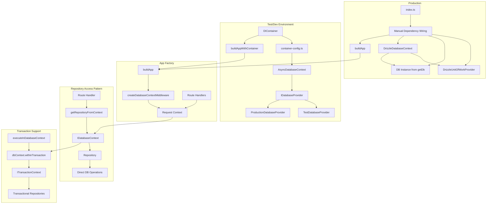
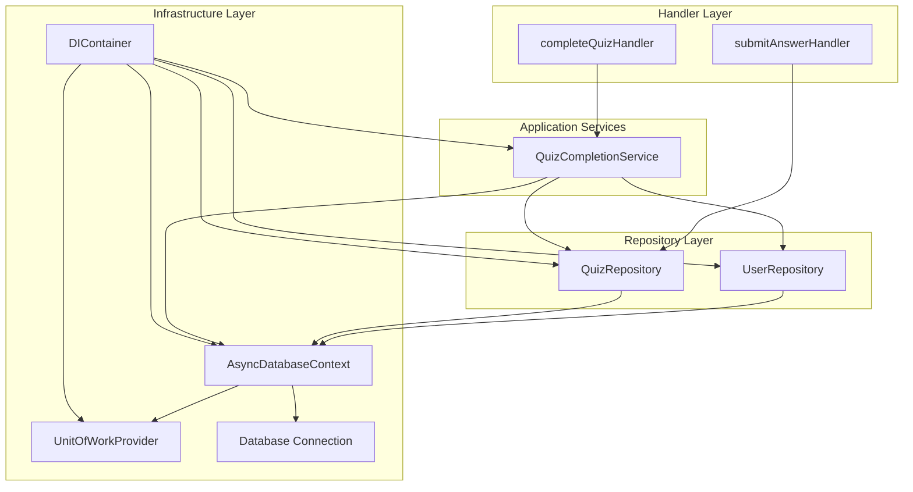
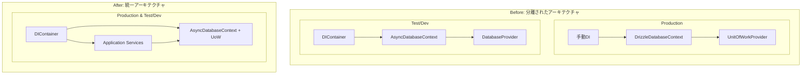
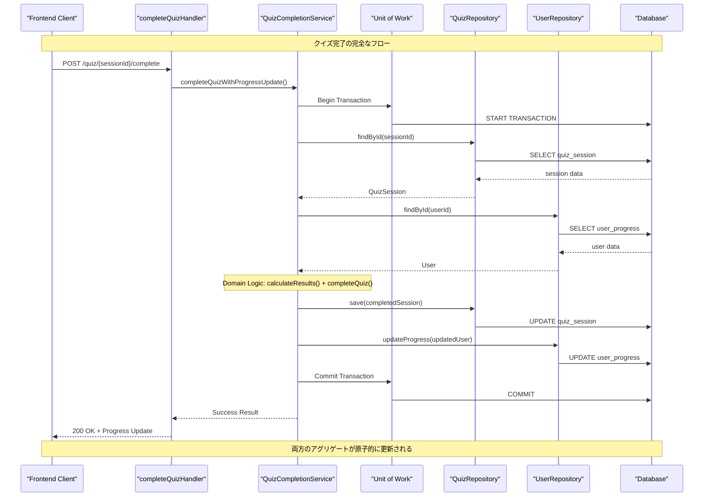

# Database Architecture Analysis

## 実装状況 (2025-08-02)

### 完了したフェーズ
- ✅ **Phase 1**: Production環境のDIContainer化完了 (index.ts)
- ✅ **Phase 2**: QuizCompletionService実装完了 (Unit of Work統合)
- ✅ **Phase 3**: complete-quiz route実装・統合完了
- ✅ **Phase 4**: submit-answer handlerがQuizCompletionServiceを使用
- ✅ **Phase 5**: 
  - DrizzleDatabaseContext削除完了
  - handler-utils.ts, shared/transaction/index.ts削除完了
  - update-progressエンドポイント削除完了

### 達成された目標
- ✅ アーキテクチャ統一: Production/Test環境で同じDIContainer + AsyncDatabaseContext
- ✅ Unit of Work統合: AsyncDatabaseContextにexecuteWithUnitOfWorkメソッド実装
- ✅ クイズ完了時の原子的なユーザー進捗更新機能実装
- ✅ 不要なコードの削除と複雑性の削減

## 現在のアーキテクチャ分析

### 1. 依存関係グラフ (Mermaid)



### 2. 現在の問題点

#### 2.1 アーキテクチャの不整合
- **Production**: 手動依存性注入 + DrizzleDatabaseContext + UnitOfWorkProvider
- **Test/Dev**: DIContainer + AsyncDatabaseContext + DatabaseProvider
- 同じインターフェース（IDatabaseContext）を実装しているが、内部実装が大きく異なる

#### 2.2 UnitOfWorkパターンの未使用
- 現在のハンドラー実装でUnitOfWorkやトランザクションを使用している箇所が見つからない
- トランザクションのサポートは実装されているが、実際には使われていない
- テストでのみ`executeInDatabaseContext`が使用されている

#### 2.3 複雑性の増大
- 2つの異なるDatabaseContext実装
- UnitOfWorkProvider → UnitOfWork → TransactionContext という3層構造
- 同じ目的（トランザクション管理）のために複数のパターンが存在

### 3. 現在の使用パターン分析

#### 3.1 実際の使用例

**ルートハンドラーでの使用:**
```typescript
// 現在のパターン - トランザクションなし
const route = createAmbientRoute(
  { /* config */ },
  async (body, deps, context) => {
    // リポジトリを直接取得
    const userRepo = getRepositoryFromContext(c, AUTH_USER_REPO_TOKEN);
    // 単一操作
    const user = await userRepo.findByEmail(email);
    return Result.ok(user);
  }
);
```

**トランザクションが必要な場合（テストでのみ使用）:**
```typescript
await executeInDatabaseContext(dbContext, async (ctx) => {
  const userRepo = ctx.getRepository(USER_REPO_TOKEN);
  const quizRepo = ctx.getRepository(QUIZ_REPO_TOKEN);
  // 複数操作を同一トランザクション内で実行
  await userRepo.save(user);
  await quizRepo.save(quiz);
});
```

### 4. 統合リファクタリング計画

Unit of Work パターンの必要性が確認されたため、アーキテクチャ統一と複雑性解決を両立する包括的なリファクタリング計画を策定します。

## フェーズ1: アーキテクチャ統一 (Production/Test統合)

### 目標
- Production と Test/Dev で同一のアーキテクチャパターンを使用
- DIContainer ベースの統一アプローチを採用
- AsyncDatabaseContext を基盤とした統一実装

### 1.1 Production環境の移行

**変更前 (apps/api/src/index.ts):**
```typescript
// 手動依存性注入
const unitOfWorkProvider = new DrizzleUnitOfWorkProvider(logger);
const db = getDb();
const databaseContext = new DrizzleDatabaseContext(logger, unitOfWorkProvider, db);
const app = buildApp(clock, databaseContext);
```

**変更後 (apps/api/src/index.ts):**
```typescript
// DIContainer統一アプローチ
const container = createConfiguredContainer('production');
const app = await buildAppWithContainer(container);
```

### 1.2 Container Configuration 拡張

**apps/api/src/infra/di/container-config.ts に追加:**
```typescript
// Production環境向けのUnit of Work統合設定
const productionConfig: ContainerConfig = {
  database: {
    provider: new ProductionDatabaseProvider(),
  },
  unitOfWork: new DrizzleUnitOfWorkProvider(logger), // Unit of Work保持
  repositories: {
    // 既存設定
  },
  services: {
    // 新規: クロスアグリゲート操作用サービス
    [QUIZ_COMPLETION_SERVICE_TOKEN]: (container) => 
      new QuizCompletionService(
        container.resolve(DATABASE_CONTEXT_TOKEN),
        container.resolve(UNIT_OF_WORK_TOKEN),
        container.resolve(CLOCK_TOKEN)
      ),
  },
};
```

## フェーズ2: Unit of Work 統合アーキテクチャ

### 2.1 AsyncDatabaseContext への Unit of Work 統合

**apps/api/src/infra/db/AsyncDatabaseContext.ts を拡張:**
```typescript
export class AsyncDatabaseContext implements IDatabaseContext {
  constructor(
    private dbProvider: IDatabaseProvider,
    private unitOfWorkProvider?: IUnitOfWorkProvider // Unit of Work統合
  ) {}

  // 既存機能を保持
  async withinTransaction<T>(operation: (ctx: ITransactionContext) => Promise<T>): Promise<T> {
    // 既存のトランザクション実装
  }

  // Unit of Work統合メソッド
  async executeWithUnitOfWork<T>(
    operation: (unitOfWork: IUnitOfWork) => Promise<T>
  ): Promise<T> {
    if (!this.unitOfWorkProvider) {
      throw new Error('Unit of Work not configured for this context');
    }
    
    const unitOfWork = await this.unitOfWorkProvider.createUnitOfWork();
    try {
      const result = await operation(unitOfWork);
      await unitOfWork.commit();
      return result;
    } catch (error) {
      await unitOfWork.rollback();
      throw error;
    }
  }
}
```

### 2.2 Application Service Layer の導入

**apps/api/src/features/quiz/application/QuizCompletionService.ts (新規):**
```typescript
export class QuizCompletionService {
  constructor(
    private databaseContext: IDatabaseContext,
    private unitOfWorkProvider: IUnitOfWorkProvider,
    private clock: Clock
  ) {}

  async completeQuizWithProgressUpdate(
    sessionId: QuizSessionId,
    userId: UserId
  ): Promise<Result<QuizCompletionResult>> {
    return this.databaseContext.executeWithUnitOfWork(async (unitOfWork) => {
      // 1. Get repositories within Unit of Work
      const quizRepo = unitOfWork.getRepository(QUIZ_REPO_TOKEN);
      const userRepo = unitOfWork.getRepository(USER_REPO_TOKEN);

      // 2. Load aggregates
      const session = await quizRepo.findById(sessionId);
      if (!session) {
        throw new SessionNotFoundError(sessionId);
      }

      const user = await userRepo.findById(userId);
      if (!user) {
        throw new UserNotFoundError(userId.toString());
      }

      // 3. Verify ownership
      if (session.userId !== userId) {
        throw new AuthorizationError('Session belongs to different user');
      }

      // 4. Calculate quiz results
      const results = session.calculateResults();
      
      // 5. Update user progress with domain logic
      const updatedUser = user.completeQuiz({
        correctAnswers: results.correctAnswers,
        totalQuestions: results.totalQuestions,
        category: session.config.category,
        studyTimeMinutes: Math.ceil(results.completionTimeSeconds / 60),
      }, this.clock);

      // 6. Save both aggregates (atomic within Unit of Work)
      await quizRepo.save(session);
      await userRepo.updateProgress(updatedUser);

      // 7. Return completion result
      return {
        sessionId: session.id,
        finalScore: results.score,
        progressUpdate: {
          previousLevel: user.progress.level.value,
          newLevel: updatedUser.progress.level.value,
          experienceGained: updatedUser.progress.experience.value - user.progress.experience.value,
        }
      };
    });
  }
}
```

### 2.3 Service Token 定義

**apps/api/src/shared/types/ServiceToken.ts に追加:**
```typescript
export const QUIZ_COMPLETION_SERVICE_TOKEN = Symbol('QuizCompletionService');
export const UNIT_OF_WORK_TOKEN = Symbol('UnitOfWork');

export interface QuizCompletionResult {
  sessionId: QuizSessionId;
  finalScore: number;
  progressUpdate: {
    previousLevel: number;
    newLevel: number;
    experienceGained: number;
  };
}
```

## フェーズ3: Handler の統合

### 3.1 新しい Quiz Completion Handler

**apps/api/src/features/quiz/complete-quiz/handler.ts (新規):**
```typescript
export async function completeQuizHandler(
  sessionId: QuizSessionId,
  userId: UserId,
  quizCompletionService: QuizCompletionService
): Promise<Result<CompleteQuizResponse>> {
  try {
    const result = await quizCompletionService.completeQuizWithProgressUpdate(
      sessionId,
      userId
    );

    if (!result.success) {
      return Result.fail(result.error);
    }

    return Result.ok({
      sessionId: result.data.sessionId,
      finalScore: result.data.finalScore,
      progressUpdate: result.data.progressUpdate,
      completedAt: new Date(),
    });
  } catch (error) {
    return Result.fail(error instanceof Error ? error : new Error('Unknown error'));
  }
}
```

### 3.2 Route の更新

**apps/api/src/features/quiz/complete-quiz/route.ts (新規):**
```typescript
export function completeQuizRoute(clock: Clock) {
  return new Hono<{
    Variables: { user: AuthUser } & LoggerVariables & DatabaseContextVariables;
  }>().post('/:sessionId/complete', (c) => {
    const route = createAmbientRoute<
      never, // No body required
      CompleteQuizResponse,
      {
        quizCompletionService: QuizCompletionService;
      },
      { user: AuthUser } & LoggerVariables & DatabaseContextVariables
    >(
      {
        operation: 'complete',
        resource: 'quiz',
        requiresAuth: true,
        successStatusCode: 200,
      },
      async (body, routeDeps, context) => {
        const sessionId = QuizSessionId.of(c.req.param('sessionId'));
        const user = context.get('user') as AuthUser;
        const userId = UserId.of(user.sub);

        return completeQuizHandler(
          sessionId,
          userId,
          routeDeps.quizCompletionService
        );
      }
    );

    return route(c, {
      quizCompletionService: getServiceFromContext(c, QUIZ_COMPLETION_SERVICE_TOKEN),
    });
  });
}
```

## フェーズ4: 既存Handler の調整

### 4.1 Submit Answer Handler の簡素化

**apps/api/src/features/quiz/submit-answer/handler.ts を更新:**
```typescript
export async function submitAnswerHandler(
  // ... existing parameters
): Promise<Result<SubmitAnswerResponse>> {
  try {
    // ... existing validation logic

    // Submit answer (auto-completion logic preserved)
    const submitResult = await submitAnswerToSession(/*...*/);
    if (!submitResult.success) {
      return Result.fail(submitResult.error);
    }

    // Save session (no user progress update here)
    const persistResult = await persistSessionChanges(session, quizRepository);
    if (!persistResult.success) {
      return Result.fail(persistResult.error);
    }

    // Check if quiz was auto-completed
    const response = buildSubmitAnswerResponse(session, questionId, selectedOptionIds, clock);
    
    // If auto-completed, provide completion endpoint URL
    if (session.state === QuizState.Completed) {
      response.data.nextAction = {
        type: 'complete_quiz',
        url: `/quiz/${sessionId}/complete`,
        method: 'POST'
      };
    }

    return response;
  } catch (error) {
    return Result.fail(error instanceof Error ? error : new Error('Unknown error'));
  }
}
```

## フェーズ5: 削除対象ファイル

### 5.1 削除完了 (2025-08-02)
```typescript
// ✅ 削除完了
- apps/api/src/infra/db/DrizzleDatabaseContext.ts ✓
- apps/api/src/infra/db/DrizzleDatabaseContext.test.ts ✓
- apps/api/src/shared/transaction/handler-utils.ts ✓
- apps/api/src/shared/transaction/index.ts ✓
- apps/api/src/shared/transaction/ (ディレクトリ) ✓

// ✅ 統合後削除完了
- apps/api/src/features/user/update-progress/* ✓ (QuizCompletionServiceに統合済み)
```

### 5.2 保持・統合対象
```typescript
// ✅ 保持・統合
- apps/api/src/infra/db/unit-of-work/* (AsyncDatabaseContextに統合)
- apps/api/src/infra/db/AsyncDatabaseContext.ts (Unit of Work機能追加)
```

## フェーズ6: 段階的移行戦略

### Step 1: Service Layer 構築
1. QuizCompletionService 実装
2. Container configuration 更新
3. Unit tests 作成

### Step 2: Handler 統合
1. complete-quiz handler/route 実装
2. submit-answer handler 調整
3. Integration tests 更新

### Step 3: Architecture 統一
1. Production環境をDIContainer化
2. DrizzleDatabaseContext 削除
3. End-to-end tests 実行

### Step 4: クリーンアップ
1. 未使用ファイル削除
2. Documentation 更新
3. Performance testing

## 実装後のアーキテクチャ (現在の状態)

### 統一後の構成


### リファクタリング前後の比較図


### Unit of Work フロー図


### 解決される問題

#### ✅ 2.1 アーキテクチャの不整合 → 解決
- **統一前**: Production (手動DI) vs Test/Dev (DIContainer)
- **統一後**: 両環境でDIContainer + AsyncDatabaseContext + UnitOfWork

#### ✅ 2.3 複雑性の増大 → 解決
- **統一前**: 2つのDatabaseContext実装 + 3層UnitOfWork構造
- **統一後**: 1つのAsyncDatabaseContext + 統合UnitOfWork

#### ✅ 重要な業務機能 → 実装
- **統一前**: クイズ完了時にユーザー進捗更新されない
- **統一後**: QuizCompletionServiceによる原子的な両アグリゲート更新

### リファクタリング効果

#### アーキテクチャ統一
- Production/Test環境の設定方法が統一
- DIContainerによる依存性管理の一貫性
- 新しい開発者のオンボーディング容易化

#### 複雑性削減
- DatabaseContextの実装が1つに統一
- UnitOfWorkがAsyncDatabaseContextに統合
- レイヤー数削減（3層→2層構造）

#### 業務機能の改善
- クイズ完了時の自動進捗更新
- データ整合性の保証
- ユーザー体験の向上

### 5. 推奨事項

1. **段階的アプローチ**: 一度にすべてを削除するのではなく、段階的に移行
2. **トランザクション機能の保持**: AsyncDatabaseContextのwithinTransactionは保持
3. **将来の拡張性**: 複雑なトランザクションが必要になった場合の準備

### 6. リスク評価

**低リスク**:
- DrizzleDatabaseContextの削除（AsyncDatabaseContextで完全に代替可能）
- index.tsのDIコンテナ化（既存パターンの適用）

**中リスク**:
- UnitOfWorkパターンの削除（将来の要件が不明）
- 本番環境での動作確認が必要

### 7. Unit of Work パターンが必要な箇所の分析

Unit of Work パターンの説明に基づいて現在の実装を検証した結果、以下の重要な発見がありました：

#### 7.1 現在の実装状況

**✅ 正しく実装されている箇所：**
- **ユーザー登録**: `DrizzleUserRepository.create()` は `withTransaction` を使用し、`auth_user` と `user_progress` テーブルへの挿入を原子的に実行
  ```typescript
  // apps/api/src/features/user/infrastructure/drizzle/DrizzleUserRepository.ts:275-348
  await this.withTransaction(async (txRepo) => {
    await txRepo.conn.insert(authUser).values(authRow);
    await txRepo.conn.insert(userProgress).values(progressRow);
  });
  ```

**❌ 重大な問題：Quiz完了時のユーザー進捗更新の欠如**

現在のクイズ完了フローには重大な設計上の問題があります：

1. **Quiz完了イベント**: `QuizSession` で `QuizCompletedEvent` が発行される
2. **保存処理**: `submitAnswerHandler` は quiz session のみ保存
3. **❌ 欠落**: クイズ完了時にユーザー進捗が更新されない

```typescript
// apps/api/src/features/quiz/submit-answer/handler.ts:144
await quizRepository.save(session); // クイズセッションのみ保存
// ❌ ユーザー進捗の更新が欠如
```

#### 7.2 Unit of Work が必要な業務要件

**クイズ完了時の処理**では以下が原子的に実行されるべき：
1. クイズセッションの完了状態を保存
2. クイズ結果に基づいてユーザー進捗を更新（レベル、経験値、正答数、カテゴリ統計など）
3. 両方の操作は同一トランザクション内で実行されるべき（一方が失敗した場合、両方ロールバック）

#### 7.3 現在の分離された実装

```typescript
// ❌ 現在: 分離された2つのエンドポイント
// 1. POST /quiz/:sessionId/submit-answer (quiz session 更新のみ)
// 2. POST /user/update-progress (user progress 更新のみ)

// ✅ あるべき姿: 単一トランザクション
// quiz完了 → quiz session保存 + user progress更新
```

#### 7.4 具体的な実装提案

**Option 1: Application Service + Unit of Work**
```typescript
class QuizCompletionService {
  async completeQuiz(sessionId: QuizSessionId, userId: UserId): Promise<Result<void>> {
    return this.unitOfWork.execute(async (uow) => {
      const quizRepo = uow.getRepository(QUIZ_REPO_TOKEN);
      const userRepo = uow.getRepository(USER_REPO_TOKEN);
      
      const session = await quizRepo.findById(sessionId);
      const user = await userRepo.findById(userId);
      
      // Domain logic for quiz completion
      const results = session.calculateResults();
      const updatedUser = user.completeQuiz(results, clock);
      
      await quizRepo.save(session);
      await userRepo.updateProgress(updatedUser);
    });
  }
}
```

**Option 2: Domain Event Handler**
```typescript
class QuizCompletedEventHandler {
  async handle(event: QuizCompletedEvent): Promise<void> {
    // Process quiz completion event and update user progress
  }
}
```

### 8. 修正された結論

**UnitOfWorkパターンの必要性：**
- 現在の実装では **重要な業務要件** (クイズ完了時のユーザー進捗更新) が **完全に欠落**
- この問題はデータ整合性とユーザー体験に直接影響する **重大な欠陥**
- Unit of Work パターンは、このような **クロスアグリゲート操作** に対して必要不可欠

**推奨アプローチ：**
1. **段階的移行**: AsyncDatabaseContext への統一は継続
2. **Unit of Work保持**: クイズ完了処理のために Unit of Work パターンを維持
3. **緊急対応**: クイズ完了時のユーザー進捗更新機能を実装

UnitOfWorkパターンは単なる「使われていない機能」ではなく、**現在欠落している重要な業務機能** を正しく実装するために必要なパターンです。