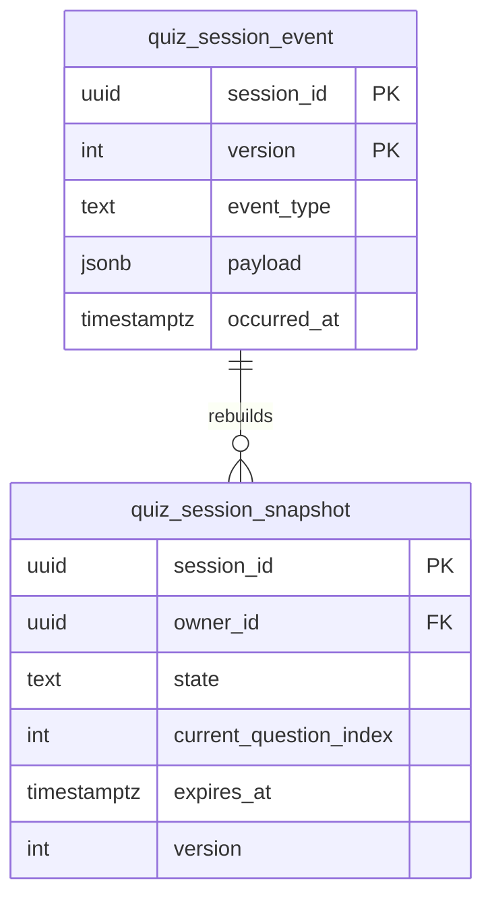

# Database Schema v2 - Event Sourcing + VSA Architecture

## Purpose & Scope

This document covers the **physical PostgreSQL schema** that persists the CertQuiz domain using event sourcing for the Quiz bounded context, plus supporting read-model tables and KeyCloak user integration. The schema is organized around Domain-Driven Design principles with Vertical Slice Architecture.

## Conventions & Notation

### Naming Rules
- **Tables**: `snake_case` (e.g., `quiz_session_event`)
- **Columns**: `camelCase` for domain properties, `snake_case` for infrastructure (e.g., `questionCount` vs `created_at`)
- **Indexes**: `ix_[table]_[purpose]` (e.g., `ix_session_active`)
- **Constraints**: `ck_[table]_[field]` for CHECK, `fk_[table]_[ref]` for foreign keys

### Type Mapping
| TypeScript (Domain) | PostgreSQL | Notes |
|---------------------|------------|-------|
| `QuizSessionId` | `uuid` | Branded string type |
| `UserId` | `uuid` | Internal application-specific user ID |
| `QuestionId` | `uuid` | Branded string type |
| `OptionId` | `uuid` | Branded string type |
| `AnswerId` | `uuid` | Branded string type |
| `Date` | `timestamptz` | Always UTC timezone |
| `QuizConfig` | `jsonb` | Serialized value object |
| `QuestionOrder` | `uuid[]` | Array of question IDs |

### Schema Organization
```
apps/api/src/infra/db/schema/
├── enums.ts           # PostgreSQL enums for type safety
├── user.ts            # User bounded context (KeyCloak integration)
├── quiz.ts            # Quiz bounded context (event sourcing)
├── question.ts        # Question bounded context (versioned catalog)
├── system.ts          # System tables (webhooks, migrations)
└── index.ts           # Barrel exports for Drizzle
```

## Quiz Bounded Context (Event Sourcing)

### High-Level Architecture



### Tables & Columns

#### Event Store (Write-Side)

```sql
-- Append-only event store for QuizSession aggregate
CREATE TABLE quiz_session_event (
    session_id uuid NOT NULL,
    version int NOT NULL,              -- starts at 1, increments per command
    event_type text NOT NULL,          -- 'quiz.started' | 'quiz.answer_submitted' | 'quiz.completed' | 'quiz.expired'
    payload jsonb NOT NULL,            -- Domain event payload
    occurred_at timestamptz NOT NULL DEFAULT now(),
    event_sequence int NOT NULL,       -- Sequence within version (multiple events per command)
    PRIMARY KEY (session_id, version, event_sequence)
) PARTITION BY HASH (session_id);

-- Create initial partitions
CREATE TABLE quiz_session_event_0 PARTITION OF quiz_session_event
    FOR VALUES WITH (modulus 4, remainder 0);
CREATE TABLE quiz_session_event_1 PARTITION OF quiz_session_event
    FOR VALUES WITH (modulus 4, remainder 1);
CREATE TABLE quiz_session_event_2 PARTITION OF quiz_session_event
    FOR VALUES WITH (modulus 4, remainder 2);
CREATE TABLE quiz_session_event_3 PARTITION OF quiz_session_event
    FOR VALUES WITH (modulus 4, remainder 3);
```

#### Snapshot Store (Read-Side)

```sql
-- Current materialized state for fast queries
CREATE TABLE quiz_session_snapshot (
    session_id uuid PRIMARY KEY,
    owner_id uuid NOT NULL,            -- References auth_user.user_id
    state text NOT NULL,               -- 'IN_PROGRESS' | 'COMPLETED' | 'EXPIRED'
    question_count int NOT NULL,
    current_question_index int NOT NULL DEFAULT 0,
    started_at timestamptz NOT NULL,
    expires_at timestamptz,            -- NULL for sessions without time limit
    completed_at timestamptz,
    version int NOT NULL,              -- Mirrors last applied event version
    
    -- Serialized domain objects for performance
    config jsonb NOT NULL,             -- QuizConfig value object
    question_order uuid[] NOT NULL,    -- Ordered question IDs
    answers jsonb,                     -- Map<QuestionId, Answer>
    
    -- Metadata
    updated_at timestamptz NOT NULL DEFAULT now(),
    
    CONSTRAINT ck_session_state CHECK (state IN ('IN_PROGRESS', 'COMPLETED', 'EXPIRED')),
    CONSTRAINT ck_in_progress_has_expiry CHECK (
        state <> 'IN_PROGRESS' OR expires_at IS NOT NULL
    ),
    CONSTRAINT ck_completed_states CHECK (
        (state = 'COMPLETED' AND completed_at IS NOT NULL) OR
        (state = 'EXPIRED' AND completed_at IS NOT NULL) OR
        state = 'IN_PROGRESS'
    )
);
```

### Indexes & Constraints

```sql
-- Event store indexes
CREATE INDEX CONCURRENTLY ix_quiz_event_session_version 
    ON quiz_session_event (session_id, version DESC);
CREATE INDEX CONCURRENTLY ix_quiz_event_occurred 
    ON quiz_session_event (occurred_at DESC);
CREATE INDEX CONCURRENTLY ix_quiz_event_type 
    ON quiz_session_event USING GIN (event_type, payload);

-- Snapshot indexes for common queries
CREATE UNIQUE INDEX CONCURRENTLY ix_snapshot_active_user
    ON quiz_session_snapshot (owner_id)
    WHERE state = 'IN_PROGRESS';

CREATE INDEX CONCURRENTLY ix_snapshot_owner_started
    ON quiz_session_snapshot (owner_id, started_at DESC);

CREATE INDEX CONCURRENTLY ix_snapshot_state_started
    ON quiz_session_snapshot (state, started_at DESC);

-- Partial index for expired session cleanup
CREATE INDEX CONCURRENTLY ix_snapshot_expired_cleanup
    ON quiz_session_snapshot (completed_at)
    WHERE state IN ('COMPLETED', 'EXPIRED');
```

### Optimistic Locking Strategy

The event store uses composite primary key `(session_id, version, event_sequence)` for optimistic locking:

```sql
-- Repository save operation uses optimistic locking
INSERT INTO quiz_session_event (session_id, version, event_sequence, event_type, payload, occurred_at)
VALUES 
    ($1, $2, 1, 'quiz.started', $3, $4),
    ($1, $2, 2, 'quiz.answer_submitted', $5, $4)
ON CONFLICT (session_id, version, event_sequence) DO NOTHING;

-- Check affected rows = expected count to detect conflicts
-- If conflict detected, throw OptimisticLockError
```

### Event Stream & Snapshot Rules

1. **Version Strategy**: One command = one version increment, multiple events may share same version
2. **Snapshot Rebuild**: Triggered by event count threshold (every 10 events) or explicit command
3. **Snapshot Consistency**: Always rebuilt from event stream, never directly updated
4. **Event Retention**: Keep events indefinitely for audit trail, compress old partitions

## User Bounded Context (Identity Provider Integration)

### Tables & Columns

```sql
-- Local user table synchronized with identity provider
CREATE TABLE auth_user (
    user_id uuid PRIMARY KEY,          -- Internal user ID
    email text NOT NULL UNIQUE,
    username text NOT NULL UNIQUE,
    identity_provider_id text UNIQUE,  -- External identity provider reference
    role text NOT NULL DEFAULT 'user', -- 'guest' | 'user' | 'premium' | 'admin'
    is_active boolean NOT NULL DEFAULT true,
    created_at timestamptz NOT NULL DEFAULT now(),
    updated_at timestamptz NOT NULL DEFAULT now(),
    
    CONSTRAINT ck_user_role CHECK (role IN ('guest', 'user', 'premium', 'admin'))
);

-- User progress tracking (separate from auth for performance)
CREATE TABLE user_progress (
    user_id uuid PRIMARY KEY REFERENCES auth_user(user_id) ON DELETE CASCADE,
    level int NOT NULL DEFAULT 1,
    experience int NOT NULL DEFAULT 0,
    total_questions int NOT NULL DEFAULT 0,
    correct_answers int NOT NULL DEFAULT 0,
    accuracy decimal(5,2) NOT NULL DEFAULT 0.00,
    study_time_minutes int NOT NULL DEFAULT 0,
    current_streak int NOT NULL DEFAULT 0,
    last_study_date timestamptz,
    
    -- JSONB for flexible category-specific stats
    category_stats jsonb NOT NULL DEFAULT '{"version": 1}'::jsonb,
    
    updated_at timestamptz NOT NULL DEFAULT now(),
    
    CONSTRAINT ck_progress_accuracy CHECK (accuracy >= 0 AND accuracy <= 100),
    CONSTRAINT ck_progress_non_negative CHECK (
        level >= 1 AND experience >= 0 AND 
        total_questions >= 0 AND correct_answers >= 0 AND
        study_time_minutes >= 0 AND current_streak >= 0
    )
);
```

### Indexes

```sql
-- User lookup indexes
CREATE INDEX CONCURRENTLY ix_user_email ON auth_user (email);
CREATE INDEX CONCURRENTLY ix_user_identity_provider ON auth_user (identity_provider_id);
CREATE INDEX CONCURRENTLY ix_user_role_active ON auth_user (role, is_active);

-- Progress query indexes
CREATE INDEX CONCURRENTLY ix_progress_experience ON user_progress (experience DESC);
CREATE INDEX CONCURRENTLY ix_progress_last_study ON user_progress (last_study_date DESC NULLS LAST);
```

## Question Bounded Context (Versioned Catalog)

### Tables & Columns

```sql
-- Question master table
CREATE TABLE question (
    question_id uuid PRIMARY KEY,
    current_version int NOT NULL DEFAULT 1,
    created_by_id uuid NOT NULL REFERENCES auth_user(user_id),
    is_user_generated boolean NOT NULL DEFAULT false,
    is_premium boolean NOT NULL DEFAULT false,
    status text NOT NULL DEFAULT 'active',
    created_at timestamptz NOT NULL DEFAULT now(),
    updated_at timestamptz NOT NULL DEFAULT now(),
    
    CONSTRAINT ck_question_status CHECK (status IN ('draft', 'active', 'archived'))
);

-- Question versions for immutability
CREATE TABLE question_version (
    question_id uuid NOT NULL REFERENCES question(question_id) ON DELETE CASCADE,
    version int NOT NULL,
    question_text text NOT NULL,
    question_type text NOT NULL,        -- 'single' | 'multiple'
    explanation text NOT NULL,
    detailed_explanation text,
    images text[] DEFAULT '{}',
    tags text[] NOT NULL DEFAULT '{}',
    
    -- JSONB for options to avoid separate table
    options jsonb NOT NULL,             -- [{"id": "uuid", "text": "...", "isCorrect": true}]
    
    -- Exam/category associations
    exam_types text[] NOT NULL DEFAULT '{}',
    categories text[] NOT NULL DEFAULT '{}',
    difficulty text NOT NULL DEFAULT 'Mixed',
    
    created_at timestamptz NOT NULL DEFAULT now(),
    
    PRIMARY KEY (question_id, version),
    
    CONSTRAINT ck_question_type CHECK (question_type IN ('single', 'multiple')),
    CONSTRAINT ck_difficulty CHECK (difficulty IN ('Beginner', 'Intermediate', 'Advanced', 'Expert', 'Mixed')),
    CONSTRAINT ck_options_not_empty CHECK (jsonb_array_length(options) >= 2),
    CONSTRAINT ck_has_correct_option CHECK (
        EXISTS (
            SELECT 1 FROM jsonb_array_elements(options) AS option
            WHERE (option->>'isCorrect')::boolean = true
        )
    )
);
```

### Indexes

```sql
-- Question discovery indexes
CREATE INDEX CONCURRENTLY ix_question_status_active
    ON question (status, updated_at DESC)
    WHERE status = 'active';

CREATE INDEX CONCURRENTLY ix_question_created_by
    ON question (created_by_id, created_at DESC);

CREATE INDEX CONCURRENTLY ix_question_premium
    ON question (is_premium, status);

-- Version-specific indexes
CREATE INDEX CONCURRENTLY ix_question_version_current
    ON question_version (question_id, version DESC);

-- Full-text search on question content
CREATE INDEX CONCURRENTLY ix_question_text_search
    ON question_version USING GIN (to_tsvector('english', question_text));

-- Tag and category searches
CREATE INDEX CONCURRENTLY ix_question_tags
    ON question_version USING GIN (tags);

CREATE INDEX CONCURRENTLY ix_question_exam_types
    ON question_version USING GIN (exam_types);

CREATE INDEX CONCURRENTLY ix_question_categories
    ON question_version USING GIN (categories);
```

## System Tables

### Tables & Columns

```sql
-- Migration tracking (used by Drizzle)
CREATE TABLE drizzle_migrations (
    id serial PRIMARY KEY,
    hash text NOT NULL,
    created_at timestamptz NOT NULL DEFAULT now()
);

-- Webhook events for external integrations
CREATE TABLE webhook_event (
    event_id uuid PRIMARY KEY DEFAULT gen_random_uuid(),
    event_type text NOT NULL,
    payload jsonb NOT NULL,
    status text NOT NULL DEFAULT 'pending',
    retry_count int NOT NULL DEFAULT 0,
    max_retries int NOT NULL DEFAULT 3,
    scheduled_at timestamptz NOT NULL DEFAULT now(),
    processed_at timestamptz,
    error_message text,
    
    CONSTRAINT ck_webhook_status CHECK (status IN ('pending', 'processing', 'completed', 'failed'))
);
```

## Row-Level Security

```sql
-- Enable RLS for multi-tenant security
ALTER TABLE quiz_session_snapshot ENABLE ROW LEVEL SECURITY;
ALTER TABLE user_progress ENABLE ROW LEVEL SECURITY;

-- Policies for quiz session access
CREATE POLICY quiz_owner_access ON quiz_session_snapshot
    FOR ALL
    USING (owner_id = current_setting('app.user_id', true)::uuid);

-- Policies for user progress access
CREATE POLICY progress_owner_access ON user_progress
    FOR ALL
    USING (user_id = current_setting('app.user_id', true)::uuid);

-- Admin bypass policy
CREATE POLICY admin_full_access ON quiz_session_snapshot
    FOR ALL
    TO admin_role
    USING (true);
```

## Performance & Operations

### Recommended PostgreSQL Settings

```sql
-- Event sourcing optimizations
SET wal_compression = on;
SET max_wal_size = '2GB';
SET checkpoint_completion_target = 0.9;

-- JSONB performance
SET default_statistics_target = 1000;

-- Connection pooling
SET max_connections = 200;
SET shared_buffers = '256MB';
SET effective_cache_size = '1GB';
```

### Monitoring Queries

```sql
-- Check event store growth
SELECT 
    schemaname, tablename, 
    pg_size_pretty(pg_total_relation_size(schemaname||'.'||tablename)) as size
FROM pg_tables 
WHERE tablename LIKE 'quiz_session_event%'
ORDER BY pg_total_relation_size(schemaname||'.'||tablename) DESC;

-- Find long-running transactions
SELECT 
    pid, now() - pg_stat_activity.query_start AS duration, query 
FROM pg_stat_activity 
WHERE (now() - pg_stat_activity.query_start) > interval '5 minutes';

-- Check snapshot rebuild lag
SELECT 
    s.session_id,
    s.version as snapshot_version,
    MAX(e.version) as latest_event_version,
    MAX(e.version) - s.version as lag
FROM quiz_session_snapshot s
LEFT JOIN quiz_session_event e ON e.session_id = s.session_id
GROUP BY s.session_id, s.version
HAVING MAX(e.version) - s.version > 5
ORDER BY lag DESC;
```

### Maintenance Operations

```sql
-- Vacuum event store partitions
VACUUM ANALYZE quiz_session_event;

-- Rebuild stale snapshots
UPDATE quiz_session_snapshot 
SET version = 0 
WHERE session_id IN (
    SELECT session_id FROM quiz_session_snapshot s
    WHERE s.version < (
        SELECT MAX(version) FROM quiz_session_event e 
        WHERE e.session_id = s.session_id
    )
);

-- Clean up old webhook events
DELETE FROM webhook_event 
WHERE status = 'completed' 
AND processed_at < now() - interval '30 days';
```

## Migration Notes

1. **Event Store Setup**: Create partitions before inserting events to avoid lock contention
2. **Snapshot Initialization**: Rebuild all snapshots from events after schema changes
3. **Index Creation**: Always use `CONCURRENTLY` to avoid blocking writes
4. **Version Upgrades**: Test event replay performance with production data volumes

## Key Design Decisions

1. **Event Sourcing**: Quiz domain uses full event sourcing for audit trail and temporal queries
2. **CQRS**: Separate write (events) and read (snapshots) models for optimal performance
3. **Partitioning**: Event tables partitioned by session_id for horizontal scaling
4. **Optimistic Locking**: Version-based concurrency control prevents data races
5. **RLS Security**: Row-level security ensures data isolation between users
6. **JSONB Storage**: Flexible schema evolution for domain objects and configurations

This schema supports both high-throughput quiz taking and complex analytical queries while maintaining strong consistency and audit capabilities.