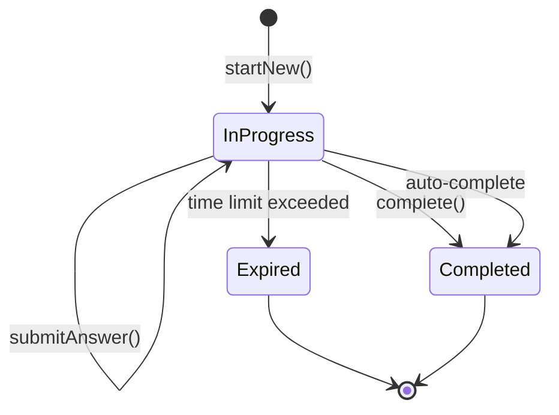

# Quiz Domain Model Design v2

## Overview

Domain model for the Quiz bounded context implementing DDD principles with a single aggregate root (QuizSession) that maintains quiz-taking invariants while delegating question storage to a separate read model.

## Core Design Decisions

### 1. Aggregate Boundaries
- **QuizSession**: Tracks answer progress and enforces business rules
- **Questions**: Stored separately as read-only reference data
- **Rationale**: Prevents memory bloat and lock contention

### 2. Versioning Policy
- **One Command = One Version**: Each command increments version once
- **Multiple events may share the same version number**
- **Failure Policy**: Commands that fail validation return error WITHOUT modifying state or emitting events

### 3. Domain Invariants
- No duplicate answers
- Sequential answering (if configured)
- Time limit enforcement
- Option validity
- Completion rules (requireAllAnswers logic)
- Answer immutability (v1 constraint)

## State Model




## Core Domain Model

### QuizSession Aggregate

```typescript
// domain/aggregates/QuizSession.ts
export class QuizSession extends AggregateRoot<QuizSessionId, QuizStartedPayload | AnswerSubmittedPayload | QuizCompletedPayload | QuizExpiredPayload> {
  private _questionOrder: QuestionOrder; // Value object for persistent ordering
  private readonly _answers: Map<QuestionId, Answer>;
  private _startedAt: Date;
  private _state: QuizState;
  private _completedAt?: Date;
  
  public readonly userId: UserId;
  private _config: QuizConfig;
  
  get config(): QuizConfig {
    return this._config;
  }
  
  // Static factory for new sessions
  static startNew(
    userId: UserId,
    config: QuizConfig,
    questionIds: QuestionId[],
    clock: Clock
  ): Result<QuizSession> {
    // Validate invariants
    if (questionIds.length !== config.questionCount) {
      return Result.fail(new QuestionCountMismatchError(config.questionCount, questionIds.length));
    }
    
    // Check for duplicates
    const uniqueIds = new Set(questionIds.map(id => id.toString()));
    if (uniqueIds.size !== questionIds.length) {
      return Result.fail(new DuplicateQuestionError());
    }
    
    // Enforce maximum size limit
    if (questionIds.length > QuizConfig.MAX_QUESTION_COUNT) {
      return Result.fail(new InvalidQuestionCountError(
        `Question count exceeds maximum limit of ${QuizConfig.MAX_QUESTION_COUNT}`
      ));
    }
    
    // Build question order value object for persistence
    const questionOrder = QuestionOrder.create(questionIds);
    
    const session = new QuizSession(
      QuizSessionId.generate(),
      userId,
      config,
      questionOrder,
      clock.now()
    );
    
    // Raise event with single version increment
    const version = session.incrementVersion();
    session.addEvent(new QuizStartedEvent({
      aggregateId: session.id,
      version,
      payload: { 
        userId: userId, 
        questionCount: questionIds.length,
        questionIds: questionIds,
        configSnapshot: config.toDTO()
      }
    }));
    return Result.ok(session);
  }
  
  submitAnswer(
    questionId: QuestionId,
    selectedOptionIds: OptionId[],
    questionRef: QuestionReference,
    clock: Clock
  ): Result<void, QuizDomainError> {
    // Check state invariants
    if (this._state !== QuizState.InProgress) {
      return Result.fail(new QuizNotInProgressError());
    }
    
    // Check time limit - fail without side effects
    if (this.isExpired(clock.now())) {
      return Result.fail(new QuizExpiredError());
    }
    
    // Validate question belongs to quiz
    if (!this._questionOrder.has(questionId)) {
      return Result.fail(new QuestionNotFoundError());
    }
    
    // Validate QuestionReference matches the questionId
    if (questionRef.id !== questionId) {
      return Result.fail(new InvalidQuestionReferenceError());
    }
    
    // Prevent duplicate answers
    if (this._answers.has(questionId)) {
      return Result.fail(new QuestionAlreadyAnsweredError());
    }
    
    // Validate selected options belong to the question
    const invalidOptions = selectedOptionIds.filter(
      optionId => !questionRef.hasOption(optionId)
    );
    if (invalidOptions.length > 0) {
      return Result.fail(new InvalidOptionsError(invalidOptions));
    }
    
    // Check sequential ordering if required
    if (this.config.enforceSequentialAnswering) {
      const expectedIndex = this._answers.size;
      const questionIndex = this.getQuestionIndex(questionId);
      if (questionIndex === -1) {
        // This should never happen as we already validated above, but adding safety check
        return Result.fail(new QuestionNotFoundError());
      }
      if (questionIndex !== expectedIndex) {
        return Result.fail(new OutOfOrderAnswerError(expectedIndex, questionIndex));
      }
    }
    
    // Create answer with validation
    const answerResult = Answer.create(questionId, selectedOptionIds, clock.now());
    if (!answerResult.success) {
      return Result.fail(answerResult.error);
    }
    this._answers.set(questionId, answerResult.data);
    
    // Auto-complete if all answered and autoCompleteWhenAllAnswered is enabled
    if (this.config.autoCompleteWhenAllAnswered && 
        this._answers.size === this._questionOrder.size) {
      this._state = QuizState.Completed;
      this._completedAt = clock.now();
    }
    
    // Raise events with single version increment
    const version = this.incrementVersion();
    this.addEvent(new AnswerSubmittedEvent({
      aggregateId: this.id,
      version,
      payload: { 
        answerId: answerResult.data.id,
        questionId: questionId,
        selectedOptionIds,
        answeredAt: answerResult.data.answeredAt
      }
    }));
    
    if (this._state === QuizState.Completed) {
      this.addEvent(new QuizCompletedEvent({
        aggregateId: this.id,
        version, // Same version as answer event
        payload: { 
          answeredCount: this._answers.size,
          totalCount: this._questionOrder.size 
        }
      }));
    }
    
    return Result.ok();
  }
  
  complete(clock: Clock): Result<void, QuizDomainError> {
    if (this._state !== QuizState.InProgress) {
      return Result.fail(new QuizNotInProgressError());
    }
    
    // Check time limit - fail without side effects
    if (this.isExpired(clock.now())) {
      return Result.fail(new QuizExpiredError());
    }
    
    // Check requireAllAnswers constraint
    if (this.config.requireAllAnswers) {
      const unanswered = this._questionOrder.size - this._answers.size;
      if (unanswered > 0) {
        return Result.fail(new IncompleteQuizError(unanswered));
      }
    }
    
    this._state = QuizState.Completed;
    this._completedAt = clock.now();
    
    const version = this.incrementVersion();
    this.addEvent(new QuizCompletedEvent({
      aggregateId: this.id,
      version,
      payload: {
        answeredCount: this._answers.size,
        totalCount: this._questionOrder.size
      }
    }));
    
    return Result.ok();
  }
  
  // Expire command for scheduled jobs or self-healing
  expire(clock: Clock): Result<void> {
    if (this._state !== QuizState.InProgress) {
      return Result.ok(); // Already terminated
    }
    
    if (!this.isExpired(clock.now())) {
      return Result.fail(new QuizNotExpiredError());
    }
    
    this.performExpiration(clock);
    return Result.ok();
  }
  
  // Check and expire if time limit exceeded - explicit state change
  checkAndExpire(clock: Clock): Result<boolean> {
    if (this._state !== QuizState.InProgress) {
      return Result.ok(false); // Already terminated
    }
    
    if (!this.isExpired(clock.now())) {
      return Result.ok(false); // Not expired
    }
    
    this.performExpiration(clock);
    return Result.ok(true); // State changed to expired
  }
  
  // Private helper to consolidate expiration logic
  private performExpiration(clock: Clock): void {
    const now = clock.now();
    this._state = QuizState.Expired;
    this._completedAt = now;
    
    const version = this.incrementVersion();
    this.addEvent(new QuizExpiredEvent({
      aggregateId: this.id,
      version,
      payload: { expiredAt: now }
    }));
  }
  
  // Private helper to get question index - O(1) lookup
  private getQuestionIndex(questionId: QuestionId): number {
    return this._questionOrder.getIndex(questionId);
  }
  
  // Event sourcing reconstruction
  protected apply(event: DomainEvent<QuizSessionId, QuizStartedPayload | AnswerSubmittedPayload | QuizCompletedPayload | QuizExpiredPayload>): void {
    switch (event.eventType) {
      case 'quiz.started':
        const startPayload = event.payload as QuizStartedPayload;
        // Reconstruct internal state from event
        this._questionOrder = QuestionOrder.fromPersistence(startPayload.questionIds);
        this._config = QuizConfig.fromDTO(startPayload.configSnapshot);
        this._startedAt = event.occurredAt;
        // Note: _startedAt is only set here and never overwritten by other events
        break;
        
      case 'quiz.answer_submitted':
        const answerPayload = event.payload as AnswerSubmittedPayload;
        this._answers.set(
          answerPayload.questionId,
          Answer.fromEventReplay(
            answerPayload.answerId,
            answerPayload.questionId,
            answerPayload.selectedOptionIds,
            answerPayload.answeredAt
          )
        );
        
        // Re-evaluate auto-complete during replay
        if (this._config.autoCompleteWhenAllAnswered && 
            this._answers.size === this._questionOrder.size) {
          this._state = QuizState.Completed;
          this._completedAt = event.occurredAt;
        }
        break;
        
      case 'quiz.completed':
        this._state = QuizState.Completed;
        this._completedAt = event.occurredAt;
        break;
        
      case 'quiz.expired':
        this._state = QuizState.Expired;
        this._completedAt = event.occurredAt;
        break;
    }
  }
  
  // Check expiry
  private isExpired(now: Date): boolean {
    const elapsed = now.getTime() - this._startedAt.getTime();
    
    if (this.config.timeLimit) {
      return elapsed >= this.config.timeLimit * 1000; // >= for explicit boundary handling
    }
    
    // Use configured fallback limit for sessions without explicit time limit
    return elapsed >= this.config.fallbackLimitSeconds * 1000;
  }
  
  // Public getter for question IDs (used by application services)
  getQuestionIds(): QuestionId[] {
    return this._questionOrder.getAllIds();
  }
  
  // Private constructor enforces factory method usage
  private constructor(
    id: QuizSessionId,
    userId: UserId,
    config: QuizConfig,
    questionOrder: QuestionOrder,
    startedAt: Date
  ) {
    super(id);
    this.userId = userId;
    this._config = config;
    this._questionOrder = questionOrder;
    this._answers = new Map();
    this._startedAt = startedAt;
    this._state = QuizState.InProgress;
  }
  
  // Required for event sourcing reconstruction
  static createForReplay(
    id: QuizSessionId,
    userId: UserId
  ): QuizSession {
    // Create minimal instance for event replay
    return new QuizSession(
      id,
      userId,
      {} as QuizConfig, // Will be set by first event
      QuestionOrder.create([]), // Will be set by first event
      new Date() // Will be overwritten by first event
    );
  }
}
```

### Supporting Types

```typescript
// domain/value-objects/QuizState.ts
export enum QuizState {
  InProgress = 'IN_PROGRESS',
  Completed = 'COMPLETED',
  Expired = 'EXPIRED'
}
```

### Value Objects

```typescript
// domain/value-objects/QuizConfig.ts
// DTO for event storage
export interface QuizConfigDTO {
  examType: string;
  category: string | null;
  questionCount: number;
  timeLimit: number | null;
  difficulty: string;
  enforceSequentialAnswering: boolean;
  requireAllAnswers: boolean;
  autoCompleteWhenAllAnswered: boolean;
  fallbackLimitSeconds: number;
}

export class QuizConfig {
  static readonly MAX_QUESTION_COUNT = 100;
  static readonly DEFAULT_FALLBACK_LIMIT_SECONDS = 4 * 60 * 60; // 4 hours default
  
  private constructor(
    public readonly examType: ExamType,
    public readonly category: Category | null,
    public readonly questionCount: number,
    public readonly timeLimit: number | null, // seconds
    public readonly difficulty: Difficulty,
    public readonly enforceSequentialAnswering: boolean,
    public readonly requireAllAnswers: boolean,
    public readonly autoCompleteWhenAllAnswered: boolean,
    public readonly fallbackLimitSeconds: number // Safety net for sessions without time limit
  ) {}
  
  static create(props: {
    examType: ExamType;
    category?: Category;
    questionCount: number;
    timeLimit?: number;
    difficulty?: Difficulty; // Defaults to Difficulty.Mixed
    enforceSequentialAnswering?: boolean; // Defaults to false
    requireAllAnswers?: boolean; // Defaults to false
    autoCompleteWhenAllAnswered?: boolean; // Defaults to true
    fallbackLimitSeconds?: number; // Defaults to DEFAULT_FALLBACK_LIMIT_SECONDS
  }): Result<QuizConfig> {
    // Validate constraints
    if (props.questionCount < 1 || props.questionCount > QuizConfig.MAX_QUESTION_COUNT) {
      return Result.fail(new InvalidQuestionCountError());
    }
    
    if (props.timeLimit && props.timeLimit < 60) {
      return Result.fail(new InvalidTimeLimitError());
    }
    
    return Result.ok(new QuizConfig(
      props.examType,
      props.category || null,
      props.questionCount,
      props.timeLimit || null,
      props.difficulty || Difficulty.Mixed,
      props.enforceSequentialAnswering ?? false,
      props.requireAllAnswers ?? false,
      props.autoCompleteWhenAllAnswered ?? true,
      props.fallbackLimitSeconds ?? QuizConfig.DEFAULT_FALLBACK_LIMIT_SECONDS
    ));
  }
  
  toDTO(): QuizConfigDTO {
    return {
      examType: this.examType,
      category: this.category,
      questionCount: this.questionCount,
      timeLimit: this.timeLimit,
      difficulty: this.difficulty,
      enforceSequentialAnswering: this.enforceSequentialAnswering,
      requireAllAnswers: this.requireAllAnswers,
      autoCompleteWhenAllAnswered: this.autoCompleteWhenAllAnswered,
      fallbackLimitSeconds: this.fallbackLimitSeconds
    };
  }
  
  static fromDTO(dto: QuizConfigDTO): QuizConfig {
    return new QuizConfig(
      dto.examType as ExamType,
      dto.category as Category | null,
      dto.questionCount,
      dto.timeLimit,
      dto.difficulty as Difficulty,
      dto.enforceSequentialAnswering,
      dto.requireAllAnswers,
      dto.autoCompleteWhenAllAnswered,
      dto.fallbackLimitSeconds
    );
  }
}

// domain/entities/Answer.ts (Child Entity)
export class Answer {
  private constructor(
    public readonly id: AnswerId,
    public readonly questionId: QuestionId,
    public readonly selectedOptionIds: readonly OptionId[],
    public readonly answeredAt: Date
  ) {}
  
  // Factory method for safe construction with Result type
  static create(
    questionId: QuestionId,
    selectedOptionIds: OptionId[],
    answeredAt: Date
  ): Result<Answer> {
    // Validate no empty answers
    if (selectedOptionIds.length === 0) {
      return Result.fail(new InvalidAnswerError('Answer must include at least one option'));
    }
    
    // Validate no duplicates
    const uniqueOptions = new Set(selectedOptionIds);
    if (uniqueOptions.size !== selectedOptionIds.length) {
      return Result.fail(new InvalidAnswerError('Answer contains duplicate option selections'));
    }
    
    return Result.ok(new Answer(
      AnswerId.generate(),
      questionId, 
      selectedOptionIds, 
      answeredAt
    ));
  }
  
  // Internal factory for event sourcing reconstruction (skip validation)
  static fromEventReplay(
    answerId: AnswerId,
    questionId: QuestionId,
    selectedOptionIds: OptionId[],
    answeredAt: Date
  ): Answer {
    return new Answer(answerId, questionId, selectedOptionIds, answeredAt);
  }
}

// domain/value-objects/QuestionReference.ts
export class QuestionReference {
  constructor(
    public readonly id: QuestionId,
    public readonly validOptionIds: ReadonlySet<OptionId>
  ) {}
  
  hasOption(optionId: OptionId): boolean {
    return this.validOptionIds.has(optionId);
  }
}

// domain/value-objects/QuestionOrder.ts
export class QuestionOrder {
  private readonly _orderMap: Map<QuestionId, number>;
  private readonly _orderedIds: QuestionId[];
  
  private constructor(questionIds: QuestionId[]) {
    this._orderedIds = [...questionIds];
    this._orderMap = new Map();
    questionIds.forEach((id, index) => {
      this._orderMap.set(id, index);
    });
  }
  
  static create(questionIds: QuestionId[]): QuestionOrder {
    return new QuestionOrder(questionIds);
  }
  
  static fromPersistence(questionIds: QuestionId[]): QuestionOrder {
    return new QuestionOrder(questionIds);
  }
  
  toPersistence(): QuestionId[] {
    return [...this._orderedIds];
  }
  
  has(questionId: QuestionId): boolean {
    return this._orderMap.has(questionId);
  }
  
  getIndex(questionId: QuestionId): number {
    return this._orderMap.get(questionId) ?? -1;
  }
  
  getAllIds(): QuestionId[] {
    return [...this._orderedIds];
  }
  
  get size(): number {
    return this._orderedIds.length;
  }
}
```

### Domain Events

```typescript
// domain/events/QuizEvents.ts
abstract class DomainEvent<TAggregateId, TPayload extends object = object> {
  public readonly eventId: string;
  public readonly aggregateId: TAggregateId;
  public readonly version: number;
  public readonly eventType: string;
  public readonly payload: TPayload;
  public readonly occurredAt: Date;
  public eventSequence: number; // Set by AggregateRoot
  
  constructor(props: {
    aggregateId: TAggregateId;
    version: number;
    eventType: string;
    payload: TPayload;
  }) {
    this.eventId = generateId(); // Implement based on your ID strategy
    this.aggregateId = props.aggregateId;
    this.version = props.version;
    this.eventType = props.eventType;
    this.payload = props.payload;
    this.occurredAt = new Date();
    this.eventSequence = 0;
  }
}

interface QuizStartedPayload {
  userId: UserId;
  questionCount: number;
  questionIds: QuestionId[]; // Added for event replay
  configSnapshot: QuizConfigDTO; // Added for state reconstruction
  questionSnapshots?: QuestionSnapshot[]; // Optional immutable snapshot for audit trail
}

// Question snapshot for immutability
interface QuestionSnapshot {
  id: QuestionId;
  version: number; // Track question revision
  text: string;
  optionIds: OptionId[];
}

export class QuizStartedEvent extends DomainEvent<QuizSessionId, QuizStartedPayload> {
  constructor(props: {
    aggregateId: QuizSessionId;
    version: number;
    payload: QuizStartedPayload;
  }) {
    super({ ...props, eventType: 'quiz.started' });
  }
}

interface AnswerSubmittedPayload {
  answerId: AnswerId;
  questionId: QuestionId;
  selectedOptionIds: OptionId[];
  answeredAt: Date;
}

export class AnswerSubmittedEvent extends DomainEvent<QuizSessionId, AnswerSubmittedPayload> {
  constructor(props: {
    aggregateId: QuizSessionId;
    version: number;
    payload: AnswerSubmittedPayload;
  }) {
    super({ ...props, eventType: 'quiz.answer_submitted' });
  }
}

interface QuizCompletedPayload {
  answeredCount: number;
  totalCount: number;
}

export class QuizCompletedEvent extends DomainEvent<QuizSessionId, QuizCompletedPayload> {
  constructor(props: {
    aggregateId: QuizSessionId;
    version: number;
    payload: QuizCompletedPayload;
  }) {
    super({ ...props, eventType: 'quiz.completed' });
  }
}

interface QuizExpiredPayload {
  expiredAt: Date;
}

export class QuizExpiredEvent extends DomainEvent<QuizSessionId, QuizExpiredPayload> {
  constructor(props: {
    aggregateId: QuizSessionId;
    version: number;
    payload: QuizExpiredPayload;
  }) {
    super({ ...props, eventType: 'quiz.expired' });
  }
}
```

### Domain Errors

```typescript
// domain/errors/QuizErrors.ts
export enum QuizErrorCode {
  // State errors
  QUIZ_NOT_IN_PROGRESS = 'QUIZ_NOT_IN_PROGRESS',
  QUIZ_EXPIRED = 'QUIZ_EXPIRED',
  QUIZ_NOT_EXPIRED = 'QUIZ_NOT_EXPIRED',
  
  // Answer errors  
  QUESTION_NOT_FOUND = 'QUESTION_NOT_FOUND',
  QUESTION_NOT_IN_QUIZ = 'QUESTION_NOT_IN_QUIZ',
  QUESTION_ALREADY_ANSWERED = 'QUESTION_ALREADY_ANSWERED',
  INVALID_OPTIONS = 'INVALID_OPTIONS',
  INVALID_ANSWER = 'INVALID_ANSWER',
  INVALID_QUESTION_REFERENCE = 'INVALID_QUESTION_REFERENCE',
  OUT_OF_ORDER_ANSWER = 'OUT_OF_ORDER_ANSWER',
  
  // Completion errors
  INCOMPLETE_QUIZ = 'INCOMPLETE_QUIZ',
  
  // Configuration errors
  INVALID_QUESTION_COUNT = 'INVALID_QUESTION_COUNT',
  QUESTION_COUNT_MISMATCH = 'QUESTION_COUNT_MISMATCH',
  DUPLICATE_QUESTION = 'DUPLICATE_QUESTION',
  INVALID_TIME_LIMIT = 'INVALID_TIME_LIMIT'
}

export abstract class QuizDomainError extends Error {
  constructor(message: string, public readonly code: QuizErrorCode) {
    super(message);
  }
}

// Concrete error implementations
export class InvalidQuestionCountError extends QuizDomainError {
  constructor(message?: string) {
    super(message || 'Invalid question count', QuizErrorCode.INVALID_QUESTION_COUNT);
  }
}

export class QuestionCountMismatchError extends QuizDomainError {
  constructor(expected: number, actual: number) {
    super(
      `Question count mismatch: expected ${expected}, got ${actual}`,
      QuizErrorCode.QUESTION_COUNT_MISMATCH
    );
  }
}

export class DuplicateQuestionError extends QuizDomainError {
  constructor() {
    super('Duplicate question detected', QuizErrorCode.DUPLICATE_QUESTION);
  }
}

export class InvalidOptionsError extends QuizDomainError {
  constructor(public readonly invalidOptions: OptionId[]) {
    super(
      `Invalid options: ${invalidOptions.join(', ')}`,
      QuizErrorCode.INVALID_OPTIONS
    );
  }
}

export class IncompleteQuizError extends QuizDomainError {
  constructor(public readonly unansweredCount: number) {
    super(
      `Cannot complete quiz with ${unansweredCount} unanswered questions`,
      QuizErrorCode.INCOMPLETE_QUIZ
    );
  }
}

export class QuizNotInProgressError extends QuizDomainError {
  constructor() {
    super('Quiz is not in progress', QuizErrorCode.QUIZ_NOT_IN_PROGRESS);
  }
}

export class QuizExpiredError extends QuizDomainError {
  constructor() {
    super('Quiz has expired', QuizErrorCode.QUIZ_EXPIRED);
  }
}

export class QuizNotExpiredError extends QuizDomainError {
  constructor() {
    super('Quiz has not expired yet', QuizErrorCode.QUIZ_NOT_EXPIRED);
  }
}

export class QuestionNotFoundError extends QuizDomainError {
  constructor() {
    super('Question not found in quiz', QuizErrorCode.QUESTION_NOT_FOUND);
  }
}

export class QuestionAlreadyAnsweredError extends QuizDomainError {
  constructor() {
    super('Question already answered', QuizErrorCode.QUESTION_ALREADY_ANSWERED);
  }
}

export class InvalidTimeLimitError extends QuizDomainError {
  constructor() {
    super('Time limit must be at least 60 seconds', QuizErrorCode.INVALID_TIME_LIMIT);
  }
}

export class OutOfOrderAnswerError extends QuizDomainError {
  constructor(public readonly expectedIndex: number, public readonly actualIndex: number) {
    super(
      `Expected question at index ${expectedIndex}, got ${actualIndex}`,
      QuizErrorCode.OUT_OF_ORDER_ANSWER
    );
  }
}

export class InvalidAnswerError extends QuizDomainError {
  constructor(details: string) {
    super(
      `Invalid answer: ${details}`,
      QuizErrorCode.INVALID_ANSWER
    );
  }
}

export class InvalidQuestionReferenceError extends QuizDomainError {
  constructor() {
    super(
      'Question reference does not match the question ID',
      QuizErrorCode.INVALID_QUESTION_REFERENCE
    );
  }
}

export class QuestionNotInQuizError extends QuizDomainError {
  constructor(message?: string) {
    super(
      message || 'Question is not part of this quiz',
      QuizErrorCode.QUESTION_NOT_IN_QUIZ
    );
  }
}

// Infrastructure errors
export class OptimisticLockError extends Error {
  constructor(message: string) {
    super(message);
    this.name = 'OptimisticLockError';
  }
}

export class ConcurrencyError extends Error {
  constructor(message: string) {
    super(message);
    this.name = 'ConcurrencyError';
  }
}
```

### Type Safety

```typescript
// Branded types with factory functions for proper type safety
export type QuestionId = string & { readonly __brand: 'QuestionId' };
export type OptionId = string & { readonly __brand: 'OptionId' };
export type UserId = string & { readonly __brand: 'UserId' };
export type QuizSessionId = string & { readonly __brand: 'QuizSessionId' };
export type AnswerId = string & { readonly __brand: 'AnswerId' };

// Factory functions ensure proper type creation
export const QuestionId = {
  of: (value: string): QuestionId => value as QuestionId,
  generate: (): QuestionId => generateId() as QuestionId,
  equals: (a: QuestionId, b: QuestionId): boolean => a === b,
  toString: (id: QuestionId): string => id
};

export const OptionId = {
  of: (value: string): OptionId => value as OptionId,
  generate: (): OptionId => generateId() as OptionId
};

export const UserId = {
  of: (value: string): UserId => value as UserId,
  generate: (): UserId => generateId() as UserId
};

export const QuizSessionId = {
  of: (value: string): QuizSessionId => value as QuizSessionId,
  generate: (): QuizSessionId => generateId() as QuizSessionId
};

export const AnswerId = {
  of: (value: string): AnswerId => value as AnswerId,
  generate: (): AnswerId => generateId() as AnswerId
};

// ID Generation
function generateId(): string {
  return crypto.randomUUID();
}
```

### AggregateRoot Base Class Implementation

```typescript
// domain/base/AggregateRoot.ts
export abstract class AggregateRoot<TId, TEventPayloads = any> {
  private _version: number = 0;
  private _uncommittedEvents: DomainEvent<TId, TEventPayloads>[] = [];
  private _eventSequenceCounter: number = 1;

  constructor(public readonly id: TId) {}

  get version(): number {
    return this._version;
  }

  protected incrementVersion(): number {
    this._version++;
    this._eventSequenceCounter = 1; // Reset sequence to 1 for new version
    return this._version;
  }

  protected addEvent<TPayload extends TEventPayloads>(event: DomainEvent<TId, TPayload>): void {
    // Auto-assign sequence number within version
    event.eventSequence = this._eventSequenceCounter++;
    this._uncommittedEvents.push(event as DomainEvent<TId, TEventPayloads>);
  }

  hasUncommittedEvents(): boolean {
    return this._uncommittedEvents.length > 0;
  }

  pullUncommittedEvents(): ReadonlyArray<DomainEvent<TId, TEventPayloads>> {
    const events = [...this._uncommittedEvents];
    this._uncommittedEvents = [];
    return events;
  }

  markChangesAsCommitted(): void {
    this._uncommittedEvents = [];
  }

  // For event sourcing reconstruction
  loadFromHistory(events: DomainEvent<TId, TEventPayloads>[]): void {
    let currentVersion = -1;
    let maxSeq = 0;
    
    for (const event of events) {
      // Reset sequence counter when version changes
      if (event.version !== currentVersion) {
        currentVersion = event.version;
        maxSeq = 0;
      }
      
      // Track max sequence within current version
      maxSeq = Math.max(maxSeq, event.eventSequence);
      
      this.apply(event);
      this._version = event.version;
    }
    
    // Set sequence counter to continue from the last event
    this._eventSequenceCounter = maxSeq + 1;
    this.markChangesAsCommitted();
  }

  protected abstract apply(event: DomainEvent<TId, TEventPayloads>): void;
}
```

## Application Service Integration

### Command Handlers

```typescript
// application/handlers/ExpireQuizSessionsHandler.ts
export class ExpireQuizSessionsHandler {
  constructor(
    private quizRepo: IQuizRepository,
    private clock: Clock
  ) {}
  
  async handle(command: ExpireQuizSessionsCommand): Promise<Result<number>> {
    const expiredSessions = await this.quizRepo.findExpiredSessions(
      this.clock.now(),
      command.batchSize
    );
    
    let expiredCount = 0;
    for (const session of expiredSessions) {
      const result = session.expire(this.clock);
      if (result.success) {
        await this.quizRepo.save(session);
        expiredCount++;
      }
    }
    
    return Result.ok(expiredCount);
  }
}

// application/handlers/SubmitAnswerHandler.ts
export class SubmitAnswerHandler {
  constructor(
    private quizRepo: IQuizRepository,
    private questionRepo: IQuestionRepository,
    private clock: Clock
  ) {}
  
  async handle(command: SubmitAnswerCommand): Promise<Result<void>> {
    // Load aggregate
    const quiz = await this.quizRepo.findById(command.sessionId);
    if (!quiz) return Result.fail(new QuizNotFoundError());
    
    // Check and handle expiration explicitly before processing answer
    const expiredResult = quiz.checkAndExpire(this.clock);
    if (expiredResult.success && expiredResult.data) {
      // Quiz expired and state changed - save and return error
      await this.quizRepo.save(quiz);
      return Result.fail(new QuizExpiredError());
    }
    
    // Validate question exists and belongs to quiz
    const validationResult = await this.validateQuestion(
      command.questionId,
      quiz.getQuestionIds()
    );
    if (!validationResult.success) {
      return Result.fail(validationResult.error);
    }
    
    // Submit answer with domain validation
    const result = quiz.submitAnswer(
      command.questionId,
      command.selectedOptionIds.map(OptionId.of),
      validationResult.data,
      this.clock
    );
    
    // Save if any state changes occurred
    if (quiz.hasUncommittedEvents()) {
      await this.quizRepo.save(quiz);
    }
    
    return result;
  }
  
  // Extracted helper for cleaner boundary checking
  private async validateQuestion(
    questionId: QuestionId,
    quizQuestionIds: QuestionId[]
  ): Promise<Result<QuestionReference, QuizDomainError>> {
    // First check if question belongs to quiz
    if (!quizQuestionIds.some(id => id === questionId)) {
      return Result.fail(new QuestionNotInQuizError());
    }
    
    // Then fetch from repository
    const question = await this.questionRepo.findById(questionId);
    if (!question) {
      return Result.fail(new QuestionNotFoundError());
    }
    
    // Create reference for domain validation
    return Result.ok(new QuestionReference(
      questionId,
      new Set(question.options.map(o => OptionId.of(o.id)))
    ));
  }
}
```

### Repository Pattern

```typescript
// domain/repositories/IQuizRepository.ts
export interface IQuizRepository {
  findById(id: QuizSessionId): Promise<QuizSession | null>;
  save(session: QuizSession): Promise<void>;
  // Optional: Find expired sessions for scheduled cleanup
  findExpiredSessions(now: Date, limit: number): Promise<QuizSession[]>;
}

// infrastructure/repositories/QuizRepository.ts
// IMPORTANT: Database must have UNIQUE INDEX on (id, version) for optimistic locking
export class QuizRepository implements IQuizRepository {
  async findById(id: QuizSessionId): Promise<QuizSession | null> {
    const row = await this.db.selectFrom('quiz_sessions')
      .selectAll()
      .where('id', '=', id)
      .executeTakeFirst();
      
    if (!row) return null;
    
    // Pure load - no side effects
    return this.fromRow(row);
  }
  
  async findExpiredSessions(now: Date, limit: number): Promise<QuizSession[]> {
    // Query uses config-stored fallback limit from each session
    const rows = await this.db.selectFrom('quiz_sessions')
      .selectAll()
      .where('state', '=', QuizState.InProgress)
      .where((eb) => 
        eb.or([
          // Sessions with time limit: started_at + time_limit < now
          eb('started_at', '+', eb.ref('time_limit'), '<', now),
          // Sessions without time limit: use config's fallback
          eb.and([
            eb('time_limit', 'is', null),
            // Extract fallback from JSONB config
            eb.sql`started_at + INTERVAL '1 second' * (config->>'fallbackLimitSeconds')::int < ${now}`
          ])
        ])
      )
      .limit(limit)
      .execute();
      
    return rows.map(row => this.fromRow(row));
  }
  
  async save(session: QuizSession): Promise<void> {
    const events = session.pullUncommittedEvents();
    
    await this.db.transaction(async tx => {
      // Save events first (outbox pattern)
      if (events.length > 0) {
        await tx.insertInto('domain_events')
          .values(events.map((e, index) => ({
            event_id: e.eventId,
            aggregate_id: e.aggregateId,
            event_type: e.eventType,
            payload: JSON.stringify(e.payload),
            version: e.version,
            event_sequence: e.eventSequence,
            occurred_at: e.occurredAt
          })))
          .execute();
      }
      
      // Use UPSERT pattern with optimistic locking
      const row = this.toRow(session);
      
      // First attempt: UPDATE with optimistic lock (most common case)
      const updateResult = await tx
        .updateTable('quiz_sessions')
        .set(row)
        .where('id', '=', session.id)
        .where('version', '=', session.version - 1)
        .executeTakeFirst();
      
      if (!updateResult || updateResult.numUpdatedRows === 0) {
        // UPDATE failed - check if row exists to determine the reason
        const existing = await tx.selectFrom('quiz_sessions')
          .select(['id', 'version'])
          .where('id', '=', session.id)
          .executeTakeFirst();
        
        if (!existing) {
          // Row doesn't exist - this is a new aggregate, try INSERT
          try {
            await tx.insertInto('quiz_sessions')
              .values(row)
              .execute();
          } catch (e: any) {
            // INSERT failed with unique constraint = concurrent creation
            if (this.isUniqueConstraintViolation(e)) {
              throw new ConcurrencyError('Quiz session was created concurrently');
            }
            throw e;
          }
        } else {
          // Row exists but version mismatch = optimistic lock failure
          if (existing.version >= session.version) {
            throw new OptimisticLockError(
              `Version conflict: expected ${session.version - 1}, found ${existing.version}`
            );
          }
          // This should not happen in normal operation
          throw new ConcurrencyError('Unexpected version state');
        }
      }
    });
    
    session.markChangesAsCommitted();
  }
  
  // Database-agnostic unique constraint violation detection
  private isUniqueConstraintViolation(error: any): boolean {
    // PostgreSQL: UNIQUE_VIOLATION
    if (error.code === '23505') return true;
    
    // MySQL: ER_DUP_ENTRY
    if (error.code === 'ER_DUP_ENTRY' || error.errno === 1062) return true;
    
    // SQLite: SQLITE_CONSTRAINT_UNIQUE
    if (error.code === 'SQLITE_CONSTRAINT_UNIQUE') return true;
    
    // Generic message-based detection (last resort)
    const message = error.message?.toLowerCase() || '';
    return message.includes('unique') || message.includes('duplicate');
  }
}
```

## Testing Example

```typescript
describe('QuizSession', () => {
  it('should increment version once per command', () => {
    const session = QuizSession.startNew(/*...*/).data!;
    expect(session.version).toBe(1); // After startNew
    
    session.submitAnswer(/*...*/); // Submits last answer
    expect(session.version).toBe(2); // Only one increment
    
    const events = session.pullUncommittedEvents();
    expect(events).toHaveLength(3); // Started, Submitted, Completed
    expect(events[1].version).toBe(2); // Answer event
    expect(events[2].version).toBe(2); // Completion event (same version)
  });
  
  it('should handle concurrent modifications', async () => {
    // Test optimistic locking
    const session1 = await repo.findById(sessionId);
    const session2 = await repo.findById(sessionId);
    
    session1.submitAnswer(/*...*/);
    await repo.save(session1); // Success
    
    session2.submitAnswer(/*...*/);
    await expect(repo.save(session2))
      .rejects.toThrow(OptimisticLockError);
  });
  
  it('should handle expiration without side effects in submitAnswer', () => {
    const futureTime = new Date(clock.now().getTime() + 3601000); // 1 hour + 1 sec
    const futureClock = { now: () => futureTime };
    
    const result = session.submitAnswer(questionId1, /*...*/, futureClock);
    
    expect(result.success).toBe(false);
    expect(result.error).toBeInstanceOf(QuizExpiredError);
    expect(session.state).toBe(QuizState.InProgress); // State unchanged
    
    const events = session.pullUncommittedEvents();
    expect(events).toHaveLength(0); // No events emitted
  });
  
  it('should explicitly expire quiz using checkAndExpire', () => {
    const futureTime = new Date(clock.now().getTime() + 3601000); // 1 hour + 1 sec
    const futureClock = { now: () => futureTime };
    
    const result = session.checkAndExpire(futureClock);
    
    expect(result.success).toBe(true);
    expect(result.data).toBe(true); // State changed
    expect(session.state).toBe(QuizState.Expired);
    
    const events = session.pullUncommittedEvents();
    expect(events).toContainEqual(expect.objectContaining({ eventType: 'quiz.expired' }));
  });
  
  // Event sourcing reconstruction test
  it('should reconstruct state from event history', () => {
    const aggregateId = QuizSessionId.generate();
    const events = [
      new QuizStartedEvent({ 
        aggregateId,
        version: 1,
        payload: { 
          userId: UserId.of('user1'), 
          questionCount: 2,
          questionIds: [QuestionId.of('q1'), QuestionId.of('q2')],
          configSnapshot: {
            examType: 'CCNA',
            category: null,
            questionCount: 2,
            timeLimit: 3600,
            difficulty: 'Mixed',
            enforceSequentialAnswering: false,
            requireAllAnswers: false,
            autoCompleteWhenAllAnswered: true,
            fallbackLimitSeconds: 14400
          }
        }
      }),
      new AnswerSubmittedEvent({ 
        aggregateId,
        version: 2,
        payload: { 
          answerId: AnswerId.of('answer1'),
          questionId: QuestionId.of('q1'),
          selectedOptionIds: [OptionId.of('opt1')],
          answeredAt: new Date()
        }
      }),
      new QuizCompletedEvent({ 
        aggregateId,
        version: 3,
        payload: { answeredCount: 2, totalCount: 2 }
      })
    ];
    
    // Events will get sequence numbers automatically during loadFromHistory
    
    const session = QuizSession.createForReplay(
      aggregateId,
      UserId.of('user1')
    );
    session.loadFromHistory(events);
    
    expect(session.state).toBe(QuizState.Completed);
    expect(session.version).toBe(3);
  });
});
```

## Future Extensibility

### Answer Modification
When answer updates are introduced:
- Replace `Map<QuestionId, Answer>` with `Map<QuestionId, Answer[]>` to track history
- Consider Answer as child entity with AnswerId to manage event proliferation
- New events: `AnswerUpdatedEvent` with proper versioning

### Cross-Context ID References
- Implement soft-delete for questions with versioned references
- Policy: Deleted questions remain valid for existing sessions
- Consider eventual consistency patterns for question catalog updates

## Database Schema

```sql
-- Quiz session aggregate root with optimistic locking
CREATE TABLE quiz_sessions (
  id UUID PRIMARY KEY,
  user_id UUID NOT NULL,
  state VARCHAR(20) NOT NULL,
  question_count INTEGER NOT NULL,
  started_at TIMESTAMPTZ NOT NULL,
  completed_at TIMESTAMPTZ,
  version INTEGER NOT NULL DEFAULT 0,
  -- Denormalized data for query performance
  config JSONB NOT NULL,
  question_order UUID[] NOT NULL,
  answers JSONB,
  CONSTRAINT ck_state CHECK (state IN ('IN_PROGRESS', 'COMPLETED', 'EXPIRED'))
);

-- Alternative: Normalized answers table for better query performance
-- Use this approach if you need frequent answer analysis or when answer history is required
CREATE TABLE quiz_answers (
  quiz_session_id UUID NOT NULL REFERENCES quiz_sessions(id) ON DELETE CASCADE,
  question_id UUID NOT NULL,
  answer_id UUID NOT NULL,
  selected_option_ids UUID[] NOT NULL,
  answered_at TIMESTAMPTZ NOT NULL,
  PRIMARY KEY (quiz_session_id, question_id)
);

-- Unique index for optimistic locking
CREATE UNIQUE INDEX idx_quiz_sessions_id_version ON quiz_sessions (id, version);

-- Performance indexes
CREATE INDEX idx_quiz_sessions_user_id ON quiz_sessions (user_id);
CREATE INDEX idx_quiz_sessions_state ON quiz_sessions (state);
CREATE INDEX idx_quiz_sessions_started_at ON quiz_sessions (started_at);

-- If using normalized answers table
CREATE INDEX idx_quiz_answers_session_id ON quiz_answers (quiz_session_id);
CREATE INDEX idx_quiz_answers_answered_at ON quiz_answers (answered_at);

-- Domain events for event sourcing
CREATE TABLE domain_events (
  event_id UUID PRIMARY KEY,
  aggregate_id UUID NOT NULL,
  event_type VARCHAR(50) NOT NULL,
  payload JSONB NOT NULL,
  version INTEGER NOT NULL,
  event_sequence INTEGER NOT NULL,
  occurred_at TIMESTAMPTZ NOT NULL,
  CONSTRAINT ck_event_type CHECK (event_type IN ('quiz.started', 'quiz.answer_submitted', 'quiz.completed', 'quiz.expired'))
);

-- Composite unique constraint for event ordering
CREATE UNIQUE INDEX idx_domain_events_ordering ON domain_events (aggregate_id, version, event_sequence);

-- Performance indexes for event queries
CREATE INDEX idx_domain_events_aggregate_id ON domain_events (aggregate_id);
CREATE INDEX idx_domain_events_occurred_at ON domain_events (occurred_at);
```