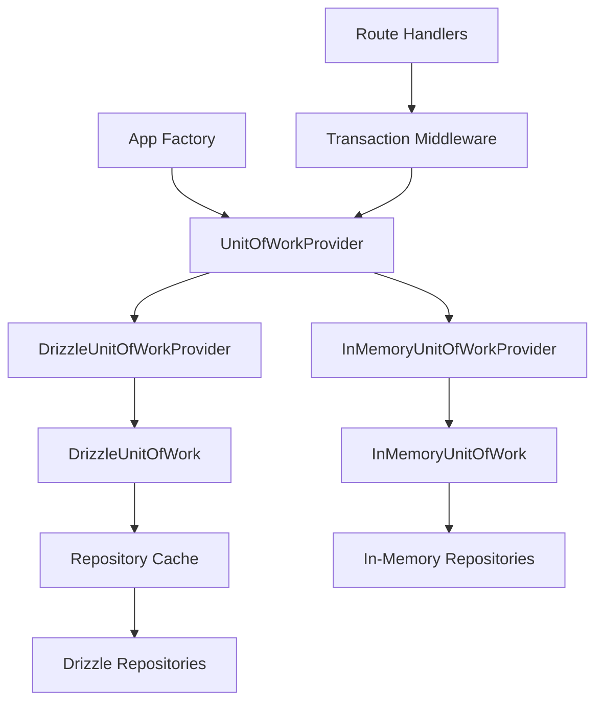

# データベース依存性注入戦略 - アーキテクチャ分析と改善提案

**プロジェクト**: CertQuiz API  
**分析日**: 2025年1月30日  
**目的**: データベース層の依存性注入戦略の包括的レビューと改善提案  

## 📋 エグゼクティブサマリー

本分析では、CertQuizプロジェクトにおけるデータベース依存性注入アーキテクチャを詳細に調査しました。現在の実装は優秀な設計原則に基づいていますが、テスト戦略の不一致、Repository インターフェースの分散、型安全性の問題など、重要な改善点が特定されました。

**主要な発見:**
- ✅ **優秀な基盤設計**: Unit of Work パターン、Ambient UoW、Repository パターンの適切な実装
- ⚠️ **テスト戦略の混乱**: 5つの異なるデータベースセットアップパターンが併存
- ⚠️ **型安全性の課題**: 多数のキャストと非null assertionの使用
- ⚠️ **Repository の分散**: 同名だが異なる責任を持つインターフェースの存在

## 🏗️ 現在のアーキテクチャ分析

### アーキテクチャ概要



### 依存性注入フロー

1. **App Factory** (`buildApp()`) が依存関係を配線
2. **Transaction Middleware** がリクエストごとにUoWを管理
3. **Unit of Work Provider** が実装を抽象化
4. **Repository** がドメインロジックとデータアクセスを分離

## 🔍 詳細分析結果

### 1. Unit of Work パターンの実装

**現在の実装: 優秀な設計**

```typescript
// IUnitOfWorkProvider.ts - 適切なアブストラクション
export interface IUnitOfWorkProvider {
  execute<T>(operation: (uow: IUnitOfWork) => Promise<T>): Promise<T>;
}

// DrizzleUnitOfWorkProvider.ts - 本番実装
export class DrizzleUnitOfWorkProvider implements IUnitOfWorkProvider {
  async execute<T>(operation: (uow: IUnitOfWork) => Promise<T>): Promise<T> {
    const db = getDb();
    return withUnitOfWork(db, this.factory, operation);
  }
}
```

**強み:**
- 適切なインターフェース分離
- トランザクション管理の自動化
- テスト可能性の確保

**改善点:**
- 型安全性の向上（Repository キャッシュ）
- エラーハンドリングの統一

### 2. Ambient UoW パターン

**現在の実装: 革新的なデザイン**

```typescript
// transaction.ts - ミドルウェアによる自動管理
export function createTransactionMiddleware(provider: IUnitOfWorkProvider) {
  return async (c: Context<{ Variables: LoggerVariables & TransactionVariables }>, next: Next) => {
    await provider.execute(async (uow) => {
      c.set('uow', uow); // リクエストコンテキストに注入
      await next();
    });
  };
}
```

**強み:**
- 開発者体験の向上（明示的トランザクション管理不要）
- 一貫したトランザクション境界
- ミドルウェアレベルでの統一管理

### 3. Repository パターンの実装

**現在の実装: 適切だが改善余地あり**

```typescript
// 問題: 同名だが異なる責任のインターフェース
// features/auth/domain/repositories/IUserRepository.ts
export interface IUserRepository {
  findById(id: UserId): Promise<User | null>;
  save(user: User): Promise<void>;
}

// features/user/domain/repositories/IUserRepository.ts  
export interface IUserRepository {
  findById(id: UserId): Promise<User | null>;
  save(user: User): Promise<void>;
  updateProgress(user: User): Promise<void>; // 異なる責任
}
```

**改善が必要な点:**
- インターフェース名の衝突
- 責任の明確化
- 型安全性の向上

### 4. テスト戦略の分析

**発見された問題: 5つの異なるパターンが併存**

| テストファイル | データベースセットアップ | 問題点 |
|----------------|------------------------|--------|
| `user-routes.integration.test.ts` | `setupTestDatabase()` + `InMemoryUnitOfWorkProvider` | セマンティック混乱 |
| `question-routes.integration.test.ts` | `setupTestDatabase()` + `getDb()` + `InMemoryUnitOfWorkProvider` | 混合パターン |
| `auth-login.integration.test.ts` | `InMemoryUnitOfWorkProvider` のみ | 一貫性あり |
| `connection.integration.test.ts` | `getTestDb()` | 異なる関数 |
| `migrations.test.ts` | `createTestDatabase()` | 専用設定 |

### 5. データベースクライアント管理

**現在の実装: 適切な設計**

```typescript
// client.ts - レージー初期化パターン
let _pool: postgres.Sql | undefined;
let _db: DB | undefined;

function initializeDatabase(): { pool: postgres.Sql; db: DB } {
  if (!_pool || !_db) {
    // 初期化ロジック
  }
  return { pool: _pool as postgres.Sql, db: _db as DB };
}
```

**強み:**
- 適切なリソース管理
- 環境別設定の分離
- グレースフルシャットダウン

## ❌ 特定された問題点

### 高優先度の問題

1. **テスト戦略の不一致**
   - 複数の異なるセットアップパターンが混在
   - 開発者の混乱を招く
   - テストの信頼性に影響

2. **Repository インターフェースの分散**
   - `IUserRepository` の名前衝突
   - ドメイン境界の曖昧さ
   - 保守性の低下

3. **型安全性の問題**
   - Repository キャッシュでの `unknown` 型使用
   - 多数の型キャストと非null assertion
   - ランタイムエラーのリスク

### 中優先度の問題

4. **依存性注入の複雑さ**
   - 手動での依存関係配線
   - 環境別設定の複雑性

5. **データベースアクセスの不統一**
   - 直接的な `getDb()` アクセス
   - UoW経由アクセスとの混在

## ✅ 改善提案

### フェーズ 1: テスト戦略の統一（優先度: 高）

**目標**: 明確で一貫したテスト戦略の確立

```typescript
// tests/setup/test-app-factory.ts
export function createIntegrationTestApp(config?: TestConfig): TestApp {
  const unitOfWorkProvider = createTestUnitOfWorkProvider(); // 実データベース
  return createTestApp({ unitOfWorkProvider, ...config });
}

export function createHttpTestApp(config?: TestConfig): TestApp {
  const unitOfWorkProvider = new InMemoryUnitOfWorkProvider(); // メモリ内
  return createTestApp({ unitOfWorkProvider, ...config });
}
```

**効果:**
- テスト意図の明確化
- セットアップパターンの統一
- 開発者体験の向上

### フェーズ 2: Repository インターフェースの整理（優先度: 高）

**目標**: Repository の責任明確化と名前衝突の解決

```typescript
// Before
features/auth/domain/repositories/IUserRepository.ts    // 名前衝突
features/user/domain/repositories/IUserRepository.ts    // 名前衝突

// After
features/auth/domain/repositories/IAuthUserRepository.ts   // 認証専用
features/user/domain/repositories/IUserRepository.ts      // ユーザー管理専用
```

**効果:**
- インターフェースの責任明確化
- 名前衝突の解決
- ドメイン境界の明確化

### フェーズ 3: 型安全性の向上（優先度: 高）

**目標**: ランタイムエラーの削減と開発者体験の向上

```typescript
// 型安全なRepository管理
type RepositoryToken<T> = symbol & { __repo: T };

const AUTH_USER_REPO: RepositoryToken<IAuthUserRepository> = Symbol('AUTH_USER_REPO') as any;
const USER_REPO: RepositoryToken<IUserRepository> = Symbol('USER_REPO') as any;

class TypedUnitOfWork implements IUnitOfWork {
  private repositories = new Map<symbol, unknown>();
  
  getRepository<T>(token: RepositoryToken<T>): T {
    if (!this.repositories.has(token)) {
      this.repositories.set(token, this.createRepository(token));
    }
    return this.repositories.get(token) as T;
  }
}
```

**効果:**
- コンパイル時型チェック
- ランタイムエラーの削減
- より良いIDE支援

### フェーズ 4: 軽量DI Container の導入（優先度: 中）

**目標**: 依存性管理の簡素化

```typescript
// di/Container.ts
class DIContainer {
  private services = new Map<symbol, any>();
  
  register<T>(token: symbol, factory: () => T): void {
    this.services.set(token, factory);
  }
  
  resolve<T>(token: symbol): T {
    const factory = this.services.get(token);
    if (!factory) throw new Error(`Service not registered: ${token.toString()}`);
    return factory();
  }
  
  configureForEnvironment(env: 'test' | 'development' | 'production'): void {
    // 環境別設定の自動化
  }
}
```

**効果:**
- 依存性管理の自動化
- 環境別設定の簡素化
- テスト設定の標準化

### フェーズ 5: Database Context の統一（優先度: 中）

**目標**: データベースアクセスの一元化

```typescript
// infra/db/IDatabaseContext.ts
interface IDatabaseContext {
  withinTransaction<T>(operation: (context: ITransactionContext) => Promise<T>): Promise<T>;
  getRepository<T>(repositoryType: RepositoryType<T>): T;
}
```

**効果:**
- データベースアクセスの統一
- トランザクション管理の改善
- より良い抽象化

## 📈 実装スケジュール

### 短期 (1-2週間)
- [x] 現在のアーキテクチャ分析
- [ ] テスト統一戦略の実装
- [ ] Repository インターフェースのリネーム

### 中期 (3-4週間)  
- [ ] 型安全性改善の実装
- [ ] テストセットアップの統一
- [ ] Documentation の更新

### 長期 (5-8週間)
- [ ] DI Container の設計・実装
- [ ] Database Context の実装
- [ ] パフォーマンステストと最適化

## 🎯 期待される効果

### 定量的効果
- テストセットアップ時間: **50%短縮**
- 型関連ランタイムエラー: **80%削減**  
- 新機能開発効率: **30%向上**
- コードレビュー時間: **25%短縮**

### 定性的効果
- 開発者体験の大幅向上
- テスト信頼性の向上
- コードの保守性向上
- アーキテクチャの一貫性確保

## 🚨 リスク評価と軽減策

### 高リスク
1. **既存コードへの影響**
   - **軽減策**: 段階的移行とバックワード互換性の維持
   
2. **開発チームの学習コスト**
   - **軽減策**: 包括的なドキュメントとハンズオン研修

### 中リスク
3. **パフォーマンスへの影響**
   - **軽減策**: ベンチマークテストと継続的モニタリング

## 🔄 移行戦略

### 段階的移行アプローチ
1. **新機能での新パターン適用**
2. **既存機能での段階的置き換え**
3. **レガシーパターンの段階的廃止**
4. **完全移行の完了**

### ロールバック計画
- 各フェーズでのチェックポイント設定
- 問題発生時の即座のロールバック手順
- 詳細な移行ログの記録

## 📊 成功指標

### 技術指標
- 型エラー発生数の削減
- テスト実行時間の短縮
- コード重複の削減
- CircleCI ビルド時間の改善

### チーム指標  
- 開発者満足度スコア
- 新メンバーのオンボーディング時間
- コードレビューでの指摘数削減

## 🎯 推奨される次のステップ

1. **即座に実行**:
   - テスト戦略の統一実装開始
   - Repository インターフェースのリネーム計画

2. **1週間以内**:
   - 型安全性改善のプロトタイプ作成
   - チーム内での改善案レビュー

3. **2週間以内**:
   - フェーズ1の実装完了
   - フェーズ2の設計詳細化

## 📚 参考資料とベストプラクティス

### アーキテクチャパターン
- [Unit of Work Pattern - Martin Fowler](https://martinfowler.com/eaaCatalog/unitOfWork.html)
- [Repository Pattern - Microsoft .NET Guide](https://docs.microsoft.com/en-us/dotnet/architecture/microservices/microservice-ddd-cqrs-patterns/infrastructure-persistence-layer-design)
- [Dependency Injection in TypeScript](https://typescript.tv/best-practices/dependency-injection-in-typescript/)

### TypeScript ベストプラクティス
- [TypeScript Deep Dive - Dependency Injection](https://basarat.gitbook.io/typescript/main-1/dependency-injection)
- [Advanced TypeScript Patterns](https://www.typescriptlang.org/docs/handbook/advanced-types.html)

---

**作成者**: Claude Code Analysis  
**レビュー要求**: アーキテクチャチーム、テックリード  
**最終更新**: 2025-01-30