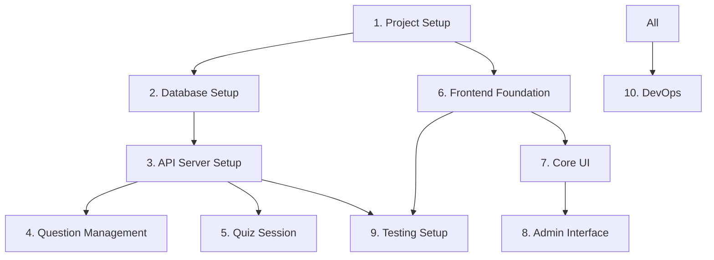

# Implementation Task List - Phase 1

## Overview

This document breaks down Phase 1 implementation into manageable tasks. Each task should be completed with tests before moving to the next.

**Phase 1 Goal**: Basic quiz functionality with authentication and admin features.

## Task Organization

- 🔴 **Blocker**: Must be completed before dependent tasks
- 🟡 **High Priority**: Core functionality
- 🟢 **Normal Priority**: Can be done in parallel
- ⏱️ **Estimated Time**: Rough estimate for completion

## 1. Project Setup Tasks 🔴

### 1.1 Initialize Monorepo Structure
**Time**: 30 minutes
```bash
# Tasks:
- Create directory structure as per ./project-setup.md
- Initialize Bun workspaces
- Setup package.json files for each workspace
- Configure TypeScript paths
- Test: `bun install` should work without errors
```

### 1.2 Setup Docker Environment
**Time**: 20 minutes
```bash
# Tasks:
- Create docker-compose.yml
- Add PostgreSQL and KeyCloak services
- Create initialization scripts
- Test: `docker-compose up` should start both services
```

### 1.3 Configure Environment Variables
**Time**: 10 minutes
```bash
# Tasks:
- Create .env.example with all required variables
- Create .env with local development values
- Add .env to .gitignore
- Test: Environment variables accessible in code
```

## 2. Database Setup Tasks 🔴

### 2.1 Setup Drizzle ORM
**Time**: 30 minutes
```typescript
// Tasks:
- Install Drizzle dependencies
- Create drizzle.config.ts
- Setup database connection in src/db/index.ts
- Test: Connection to PostgreSQL works
```

### 2.2 Implement Core Schema
**Time**: 1 hour
```typescript
// Tasks:
- Create schema.ts with users, questions, questionOptions tables
- Create relations.ts with table relationships
- Generate initial migration
- Test: `bun run db:generate` creates migration files
```

### 2.3 Run Migrations and Seed Data
**Time**: 30 minutes
```typescript
// Tasks:
- Create migrate.ts script
- Run migrations on database
- Create seed.ts with sample questions
- Test: Tables exist in database with sample data
```

## 3. API Server Setup Tasks 🟡

### 3.1 Initialize Elysia Server
**Time**: 30 minutes
```typescript
// apps/api/src/index.ts
// Tasks:
- Setup basic Elysia server
- Configure CORS
- Add health check endpoint
- Setup error handling
- Test: Server starts on port 4000
```

### 3.2 Setup Authentication Middleware
**Time**: 1 hour
```typescript
// apps/api/src/middleware/auth.ts
// Tasks:
- Create JWT validation middleware
- Create user context decorator
- Add role-based access control
- Test: Protected routes require valid JWT
```

### 3.3 Implement Auth Endpoints
**Time**: 2 hours
```typescript
// apps/api/src/routes/auth.ts
// Tasks:
- POST /auth/login (mock KeyCloak for now)
- POST /auth/refresh
- GET /auth/me
- Test: Can login and get user profile
```

## 4. Question Management Tasks 🟡

### 4.1 Question Query Endpoints
**Time**: 2 hours
```typescript
// apps/api/src/routes/questions.ts
// Tasks:
- GET /questions with pagination
- GET /questions/:id
- Add filtering by examType, category
- Apply role-based filtering (guest vs premium)
- Test: Returns questions with options
```

### 4.2 Question CRUD for Admin
**Time**: 2 hours
```typescript
// Tasks:
- POST /questions (admin only)
- PUT /questions/:id (admin only)
- DELETE /questions/:id (soft delete)
- Test: Admin can create/update questions
```

### 4.3 Question Service Layer
**Time**: 1 hour
```typescript
// apps/api/src/services/questions.ts
// Tasks:
- Extract business logic from routes
- Add validation functions
- Add question randomization logic
- Test: Service functions work correctly
```

## 5. Quiz Session Tasks 🟡

### 5.1 Session Management
**Time**: 2 hours
```typescript
// apps/api/src/routes/quiz.ts
// Tasks:
- POST /quiz/start
- POST /quiz/:sessionId/answer
- GET /quiz/:sessionId/current
- GET /quiz/:sessionId/results
- Test: Complete quiz flow works
```

### 5.2 Progress Tracking
**Time**: 1 hour
```typescript
// Tasks:
- Update user progress after each answer
- Calculate accuracy per category
- Track study time
- Test: Progress updates correctly
```

## 6. Frontend Foundation Tasks 🟢

### 6.1 Setup SvelteKit Project
**Time**: 30 minutes
```bash
# Tasks:
- Initialize SvelteKit with TypeScript
- Configure TailwindCSS
- Setup routing structure
- Test: Dev server starts, TailwindCSS works
```

### 6.2 Create Layout Components
**Time**: 1 hour
```svelte
<!-- Tasks: -->
- Root layout with navigation
- Dark/light theme toggle
- Responsive mobile menu
- Test: Layout responsive on all screen sizes
```

### 6.3 Setup API Client
**Time**: 1 hour
```typescript
// apps/web/src/lib/api/client.ts
// Tasks:
- Create typed API client using shared types
- Add authentication header injection
- Add error handling
- Test: Can make API calls from frontend
```

## 7. Core UI Implementation Tasks 🟢

### 7.1 Authentication Flow
**Time**: 2 hours
```svelte
<!-- Tasks: -->
- Login page
- Registration page (if needed)
- Auth state management (stores)
- Protected route handling
- Test: Can login and access protected pages
```

### 7.2 Quiz Interface
**Time**: 3 hours
```svelte
<!-- Tasks: -->
- Quiz start page (select question count)
- Question display component
- Answer selection (radio/checkbox)
- Submit answer and show feedback
- Results page
- Test: Complete quiz flow in UI
```

### 7.3 Question List Page
**Time**: 2 hours
```svelte
<!-- Tasks: -->
- Questions grid/list view
- Pagination component
- Filter by exam type and category
- Search functionality
- Test: Can browse and filter questions
```

## 8. Admin Interface Tasks 🟢

### 8.1 Admin Dashboard
**Time**: 1 hour
```svelte
<!-- Tasks: -->
- Admin layout
- Navigation menu
- Basic statistics display
- Test: Admin can access dashboard
```

### 8.2 Question Management UI
**Time**: 3 hours
```svelte
<!-- Tasks: -->
- Question list with actions
- Create question form
- Edit question form
- Markdown preview
- Test: Admin can CRUD questions
```

### 8.3 Bulk Import
**Time**: 2 hours
```svelte
<!-- Tasks: -->
- CSV upload component
- Import preview
- Validation display
- Test: Can import questions from CSV
```

## 9. Testing Setup Tasks 🟡

### 9.1 Unit Test Configuration
**Time**: 1 hour
```typescript
// Tasks:
- Setup Vitest for both apps
- Configure test utilities
- Add example tests
- Test: `bun test` runs successfully
```

### 9.2 API Integration Tests
**Time**: 2 hours
```typescript
// Tasks:
- Setup test database
- Test auth endpoints
- Test question endpoints
- Test quiz flow
- Test: All API endpoints have tests
```

### 9.3 Component Tests
**Time**: 2 hours
```typescript
// Tasks:
- Setup Testing Library
- Test key components
- Test form validation
- Test: UI components have tests
```

## 10. DevOps Tasks 🟢

### 10.1 CI/CD Pipeline
**Time**: 1 hour
```yaml
# .github/workflows/ci.yml
# Tasks:
- Setup GitHub Actions
- Run tests on PR
- Type checking
- Linting
- Test: CI runs on push
```

### 10.2 Dockerfile Creation
**Time**: 1 hour
```dockerfile
# Tasks:
- Create Dockerfile for API
- Create Dockerfile for Web
- Optimize for production
- Test: Containers build successfully
```

### 10.3 K8s Manifests (Basic)
**Time**: 1 hour
```yaml
# Tasks:
- Deployment for API
- Deployment for Web
- Services
- Ingress
- Test: Can deploy to local K8s
```

## Task Dependencies



## Definition of Done

Each task is complete when:
1. ✅ Code is implemented
2. ✅ Tests are written and passing
3. ✅ TypeScript has no errors
4. ✅ Code follows project conventions
5. ✅ Feature works end-to-end

## Daily Workflow

1. Pick next task from list
2. Write tests first (TDD)
3. Implement feature
4. Verify tests pass
5. Test manually
6. Commit with descriptive message
7. Update task status

## Estimated Timeline

- **Week 1**: Tasks 1-3 (Setup & Foundation)
- **Week 2**: Tasks 4-5 (Core API Features)
- **Week 3**: Tasks 6-7 (Frontend Implementation)
- **Week 4**: Tasks 8-10 (Admin & Polish)

Total estimate: ~60-80 hours of development time

## Next Steps After Phase 1

Once all Phase 1 tasks are complete:
1. Deploy to production K8s cluster
2. User testing and feedback
3. Plan Phase 2 features (community, gamification, payments)