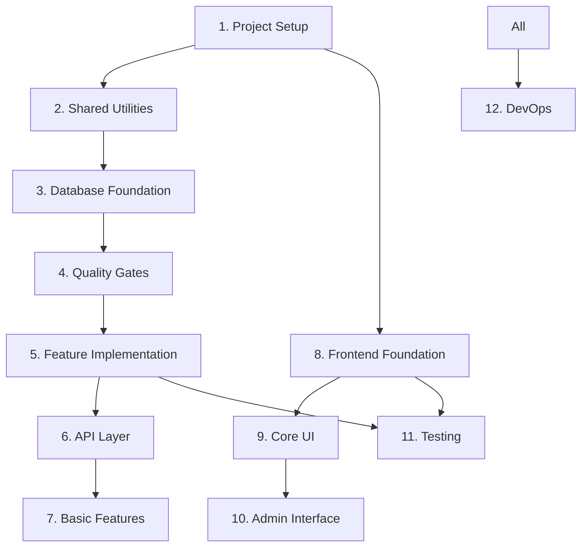

# Implementation Task List - Phase 1 (Vertical Slice Architecture)

## Overview

This document breaks down Phase 1 implementation into manageable tasks using Vertical Slice Architecture (VSA) with Domain-Driven Design (DDD) principles. Each task should be completed with tests before moving to the next.

**Phase 1 Goal**: Basic quiz functionality with authentication and admin features using VSA, where each feature is organized as a complete vertical slice containing all layers.

## Task Organization

- 🔴 **Blocker**: Must be completed before dependent tasks
- 🟡 **High Priority**: Core functionality
- 🟢 **Normal Priority**: Can be done in parallel
- ⏱️ **Estimated Time**: Rough estimate for completion
- ✅ **Completed**: Task finished

## 1. Core Project Setup Tasks ✅
**Status**: COMPLETED  
**Total Time**: ~17 hours (1.5 planned + 15.5 additional)  
**Completion Date**: June 29, 2025  

### Summary
All foundational setup tasks completed, including:
- ✅ **Monorepo Structure**: Bun workspaces with TypeScript
- ✅ **Docker Environment**: PostgreSQL, KeyCloak, Redis configured
- ✅ **Framework Stack**: Migrated to Hono + node-redis for stability
- ✅ **Code Quality**: Biome 2.x for linting/formatting
- ✅ **CI/CD Pipeline**: GitHub Actions with <5min PR feedback
- ✅ **Branch Protection**: GitHub Rulesets enabled
- ✅ **Test Infrastructure**: 61 tests passing consistently

**Key Achievements**:
- Resolved all technical debt from initial setup
- Established solid foundation for Phase 1 development
- Optimized developer experience with modern tooling

> 📁 **Detailed task breakdown**: [docs/completed/01-core-setup-tasks.md](./completed/01-core-setup-tasks.md)

## 2. Shared Utilities & Configuration ✅
**Status**: COMPLETED  
**Total Time**: ~1.5 hours (1.5 planned + 0 additional)  
**Completion Date**: June 29, 2025  

### Summary
All shared infrastructure components completed, including:
- ✅ **Logger System**: Pino-based structured logging with request correlation
- ✅ **Cache Abstraction**: Redis/Memory dual-mode caching with fallback
- ✅ **Result Types**: Type-safe error handling with Result<T, E> pattern
- ✅ **Error Classes**: Structured error hierarchy with HTTP status codes
- ✅ **Configuration**: Zod-based environment validation with type safety
- ✅ **Test Coverage**: 86 utilities tests + 25 configuration tests = 111 total tests

**Key Achievements**:
- Established robust foundation for database and API layers
- Implemented production-ready caching with graceful degradation
- Created type-safe configuration management with runtime validation

> 📁 **Detailed task breakdown**: [docs/completed/02-shared-utilities-configuration.md](./completed/02-shared-utilities-configuration.md)

## 2.1 Remove Cache Infrastructure ✅
**Status**: COMPLETED
**Time**: 1.5 hours (actual: ~1 hour)
**Priority**: HIGH
**Reason**: Using Neon database which provides built-in connection pooling and scaling

### Completed Tasks:
```typescript
// Redis/Cache Removal:
✅ Remove Redis from docker-compose.yml
✅ Delete apps/api/src/shared/cache.ts and cache.test.ts
✅ Remove cache references from shared utilities
✅ Update environment variables (remove REDIS_URL)

// Module Updates:
✅ Remove caching from quiz.service.ts (Task 7.1)
✅ Remove caching from question retrieval (Task 5.4)
✅ Remove session caching references
✅ Update all import statements

// Documentation Updates:
✅ Update CLAUDE.md to reflect Neon usage
✅ Update project-structure.md
✅ Update coding-standards.md
✅ Remove cache-related patterns

// Test Updates:
✅ Remove all cache-related tests
✅ Update integration tests to not expect caching
✅ Verify all tests pass without Redis (157 tests passing)
```

### Rationale:
- **Neon provides connection pooling**: Built-in multiplexing eliminates traditional RDB connection bottlenecks
- **PostgreSQL has native caching**: Shared buffers and OS cache handle repeated queries efficiently
- **Drizzle ORM is cache-free by design**: Keeps code simple and maintainable
- **Premature caching adds complexity**: Cache invalidation and fallback logic increase operational overhead

## 3. Database Foundation 🔴

### 3.1 Setup Drizzle ORM ✅
**Time**: 30 minutes
**Status**: COMPLETED
```typescript
// Tasks:
- Install Drizzle dependencies
- Create drizzle.config.ts
- Setup database connection pool configuration
- Configure connection pooling options
- Test: Drizzle ORM installed and configured
```

### 3.2 Create Database Connection Wrapper ✅
**Time**: 30 minutes
**Status**: COMPLETED
```typescript
// Tasks:
- Create shared/database.ts with DB connection wrapper
- Setup Drizzle client instantiation
- Add connection pooling configuration
- Add graceful shutdown handling
- Test: Database connection works with Drizzle
```

**Key Achievements**:
- ✅ **Environment-aware Connection Pooling**: Test (1), Dev (5), Prod (20) connections
- ✅ **Graceful Shutdown**: SIGTERM/SIGINT handlers with 5-second timeout
- ✅ **Health Check**: Simple ping() method using `SELECT 1`
- ✅ **Production Ready**: Singleton pattern, proper error handling
- ✅ **Library Update**: postgres v3.4.0 → v3.4.7 (fixed sql.end() issues)
- ✅ **Test Coverage**: 19 test cases covering all functionality
- ✅ **Code Quality**: Passes `bun run check` with Biome 2.x standards

**Technical Details**:
- Type-safe Database interface wrapping Drizzle ORM
- Connection validation with meaningful error messages
- Environment-specific pool configuration
- Automatic cleanup on process signals
- TDD implementation with comprehensive test suite

### 3.3 Review and Improve Database Schema ✅
**Time**: 30 minutes
**Status**: COMPLETED
```typescript
// Tasks:
- Review schema with o3-high for simplicity and extensibility
- Update database-schema.md documentation
- Test: Schema review feedback implemented
```

### 3.4 Implement Core Schema ✅
**Time**: 1 hour  
**Status**: COMPLETED
```typescript
// Tasks:
- Create schema.ts with all tables from database-schema.md
- Create relations.ts with table relationships
- Add proper indexes
- Generate initial migration
- Test: `bun run db:generate` creates migration files
```

**Key Achievements**:
- ✅ **Complete Schema Implementation**: 10 modular schema files (enums, user, exam, question, quiz, community, system, meta)
- ✅ **Full Table Structure**: 18 tables with proper relationships and constraints
- ✅ **Advanced Indexing**: GIN indexes, partial indexes, and composite indexes
- ✅ **Database Migration**: Generated migration with 25+ database objects
- ✅ **Comprehensive Testing**: 11 integration tests covering schema validation, constraints, and performance
- ✅ **PostgreSQL Features**: Enums, JSONB, arrays, foreign key cascades, unique constraints

**Technical Details**:
- Modular schema organization for maintainability
- Production-ready indexing strategy
- Type-safe Drizzle ORM integration
- Full test coverage with transaction isolation

### 3.4a VSA + Repository Pattern Migration Plan ✅
**Time**: 30 minutes
**Status**: COMPLETED
**Priority**: BLOCKER
```typescript
// Tasks:
✅ Review planning/vsa-implementation-plan.md document
✅ Create legacy-module-arch branch for backup
✅ Push legacy branch to remote
✅ Document migration checkpoints
✅ Create migration-checkpoints.md tracking document
```

**Key Achievements**:
- Legacy branch `legacy-module-arch` created and pushed to remote
- Migration checkpoints documented in `planning/migration-checkpoints.md`
- Clean-slate approach confirmed per VSA implementation plan
- Ready to proceed with architecture reset

### 3.5 Clean-Slate Architecture Reset ✅
**Time**: 1 hour (actual: ~45 minutes)
**Status**: COMPLETED
**Priority**: BLOCKER
```bash
# Tasks:
✅ Backup current code: git checkout -b legacy-module-arch
✅ Delete module-based architecture:
  - rm -rf apps/api/src/modules/
  - rm -rf apps/api/src/services/
  - rm -rf apps/api/src/repositories/
✅ Create new VSA directory structure:
  - mkdir -p src/features/{quiz,user,auth,question}/domain/{entities,value-objects,aggregates,repositories}
  - mkdir -p src/system/health
  - mkdir -p src/infra/{db,events}
  - mkdir src/shared
✅ Move database files to infra/db/
✅ Clean up old config/, types/, and test files
✅ Create basic index.ts with Hono setup
✅ Create unit-of-work.ts helper
```

**Key Achievements**:
- Clean VSA directory structure created
- Database files moved to infra/db/client.ts
- Unit-of-work pattern helper implemented
- Old confusing files removed
- Basic Hono server structure ready

### 3.6 Implement Infrastructure Foundation ✅
**Time**: 2 hours (actual: ~1.5 hours)
**Status**: COMPLETED
**Priority**: BLOCKER
```typescript
// Tasks:
✅ Create infra/db/client.ts (postgres -> drizzle wrapper) - Already existed
✅ Create infra/unit-of-work.ts with transaction helper:
  export const withTransaction = db.transaction;
✅ Setup centralized error handling middleware
✅ Add request-ID and logging middleware
✅ Configure CORS and security headers
✅ Test: Infrastructure layer operational
```

**Key Achievements**:
- Implemented all middleware following o3's best practices advice
- Request ID middleware for request correlation
- Pino logger with child loggers per request
- Security middleware with CORS and security headers
- Global error handler with proper error type handling
- Proper middleware ordering in index.ts
- All linting issues resolved

### 3.7 Create First Vertical Slice (Health) ✅
**Time**: 1.5 hours (actual: ~30 minutes)
**Status**: COMPLETED
**Priority**: HIGH
```typescript
// Tasks:
✅ Create system/health/handler.ts
✅ Create system/health/handler.test.ts (TDD first!)
✅ Create system/health/route.ts
✅ Wire up in src/index.ts (main app)
✅ Validate middleware chain works
✅ Test: Health endpoint returns 200 with new architecture
```

**Key Achievements**:
- First vertical slice implemented with TDD
- Health handler returns system status, version, memory usage
- Route properly integrated with logging middleware
- Middleware chain validated (requestId, logger, security all working)
- 5 tests passing for handler functionality
- Health endpoint accessible at `/health`

### 3.8 Automate Test Database Setup with Testcontainers ✅
**Time**: 1 hour (actual: ~1.5 hours)
**Status**: COMPLETED
**Priority**: HIGH
```typescript
// Completed Tasks:
✅ Modified existing @testcontainers/postgresql implementation
✅ Configured for Bun compatibility:
  - Disable Ryuk via isBun() runtime detection
  - Container reuse with .withReuse() for performance
✅ Created test database helpers with auto-migration support
✅ Implemented transaction-based test isolation (withRollback)
✅ Created modular test support structure (tests/support/)
✅ Test: Integration tests demonstrate container usage and isolation
```

**Key Achievements**:
- Enhanced existing PostgresSingleton with getPostgres() function
- Transaction isolation via savepoints for fast test execution <!-- cspell:ignore savepoints -->
- Seed data helpers for users (extensible for other entities)
- Temporary test schema until actual schema is implemented
- Full compatibility with both Bun and Node.js runtimes

### 3.9 Establish Migration Rollback Convention 🔴
**Time**: 30 minutes
**Status**: NEW
**Priority**: HIGH
```typescript
// Tasks:
- Configure drizzle-kit to generate reversible migrations (--sql flag)
- Add migrate:up/down scripts to package.json
- Document rollback procedure in CONTRIBUTING.md
- Create CI job for migration reversibility testing
- Test: Can rollback migrations safely
```

## 4. Quality Gates 🟡

### 4.1 Setup CodeQL Security Scanning
**Time**: 30 minutes
**Status**: PLANNED
**Reason**: Add static security analysis after implementing business logic
```yaml
# Tasks:
- Create .github/workflows/codeql.yml with minimal configuration
- Configure for JavaScript/TypeScript analysis
- Set up push (main) and weekly schedule triggers only
- Exclude test files and generated code
- Test: CodeQL runs successfully without impacting PR feedback time
```
**Timing**: Implement after database foundation when actual business logic exists to scan.

## 5. Feature Implementation (VSA + Repository Pattern) 🟡

### 5.1 Implement Quiz Domain & Repository 🟡
**Time**: 4 hours
**Priority**: HIGH
```typescript
// Tasks:
- Create features/quiz/domain/:
  - entities/Quiz.ts, Question.ts
  - value-objects/QuizId.ts, Score.ts
  - aggregates/QuizSession.ts
  - repositories/IQuizRepository.ts (interface)
  - repositories/DrizzleQuizRepository.ts (implementation)
- Write domain unit tests (90% coverage target)
- Test: Domain model works with repository pattern
```

### 5.2 Implement Auth Slice with Repository Pattern 🔴
**Time**: 3 hours
**Status**: NEW
**Priority**: HIGH
**Note**: Moved from 3.8 - implement after domain design
```typescript
// Tasks:
- Create minimal User aggregate (id, email, passwordHash)
- Create features/auth/login/ use case:
  - handler.ts with withTransaction wrapper
  - handler.test.ts (TDD!)
  - dto.ts, validation.ts, route.ts
- Create features/auth/domain/repositories/IUserRepository.ts (interface)
- Create features/auth/domain/repositories/DrizzleUserRepository.ts (implementation)
- Integrate KeyCloak authentication
- Test: Login flow works with repository pattern
```

### 5.3 Run Migrations and Seed Data 🟡
**Time**: 30 minutes
**Status**: PENDING
**Note**: Moved from 3.9 - run after domain models are defined
```typescript
// Tasks:
- Create migrate.ts script
- Run existing migrations on database
- Create comprehensive seed data for testing
- Add badges and initial questions
- Test: Database populated with test data
```

### 5.4 Implement Quiz Feature Slices 🟡
**Time**: 5 hours
```typescript
// Tasks:
- Create features/quiz/start-quiz/:
  - handler.ts with withTransaction wrapper
  - handler.test.ts (TDD!)
  - dto.ts, validation.ts, route.ts
- Create features/quiz/submit-answer/ (same structure)
- Create features/quiz/get-results/ (same structure)
- Test: Complete quiz flow with repository pattern
```

### 5.5 Implement User Domain & Features 🟢
**Time**: 3 hours
```typescript
// Tasks:
- Evolve User aggregate with full domain model
- Create features/user/domain/:
  - entities/User.ts
  - value-objects/UserId.ts, Email.ts
  - repositories/IUserRepository.ts
  - repositories/DrizzleUserRepository.ts
- Create features/user/register/ use case
- Create features/user/update-progress/ use case
- Create features/user/get-profile/ use case
- Test: User operations with repository pattern
```

### 5.6 Implement Question Features 🟢
**Time**: 2 hours
```typescript
// Tasks:
- Create features/question/domain/:
  - Use existing Quiz domain entities
  - repositories/IQuestionRepository.ts
  - repositories/DrizzleQuestionRepository.ts
- Create features/question/list-questions/ use case
- Create features/question/get-question/ use case
- Create features/question/create-question/ use case (admin)
- Test: Question operations tested
```

## 6. API Layer Implementation 🟡

### 6.1 Initialize Hono Server
**Time**: 30 minutes
```typescript
// Tasks:
- Setup basic Hono server with proper structure
- Configure CORS and security headers
- Add health check endpoint
- Setup global error handling
- Test: Server starts on port 4000
```

### 6.2 Implement Core Middleware
**Time**: 1.5 hours
```typescript
// Tasks:
- Create authentication middleware
- Implement rate limiting (user and IP based)
- Add request validation middleware
- Implement request logging
- Test: Middleware chain works correctly
```

### 6.3 Create Route Composition
**Time**: 1 hour
```typescript
// Tasks:
- Create src/routes.ts as composition root
- Import and mount auth feature routes
- Import and mount quiz feature routes
- Import and mount user feature routes
- Import and mount question feature routes
- Mount system/health route
- Test: All endpoints return expected responses
```

### 6.4 Add Admin Module (Optional)
**Time**: 2 hours
**DEFER TO PHASE 2**
```typescript
// Tasks:
- Create modules/admin/admin.routes.ts
- Add basic admin endpoints
- Implement authorization checks
- Test: Admin endpoints protected
```

## 7. Basic Features Implementation 🟢

### 7.1 ~~Add Caching Layer~~ (REMOVED)
**Time**: ~~1 hour~~ 0 hours
**Status**: REMOVED - Using Neon database instead
```typescript
// Removed Tasks:
- ~~Implement caching in quiz.service.ts~~
- ~~Cache question lists~~
- ~~Cache user sessions~~
- ~~Add cache invalidation~~
- ~~Test: Caching improves performance~~

// Reason: Neon provides built-in connection pooling and PostgreSQL
// has native caching through shared buffers. Adding application-level
// caching would introduce unnecessary complexity.
```

### 7.2 Add Basic Gamification
**Time**: 1.5 hours
```typescript
// Tasks:
- Implement streak tracking
- Add basic badge unlocking
- Update user progress after quizzes
- Test: Gamification features work
```

## 8. Frontend Foundation Tasks 🟢

### 8.1 Setup SvelteKit Project
**Time**: 30 minutes
```bash
# Tasks:
- Initialize SvelteKit with TypeScript
- Configure TailwindCSS
- Setup routing structure
- Configure API client
- Test: Dev server starts, TailwindCSS works
```

### 8.2 Create Layout Components
**Time**: 1 hour
```svelte
<!-- Tasks: -->
- Root layout with navigation
- Dark/light theme toggle
- Responsive mobile menu
- Loading states
- Test: Layout responsive on all screen sizes
```

### 8.3 Setup State Management
**Time**: 1 hour
**REVISED TASK**
```typescript
// Tasks:
- Create typed Svelte stores
- Implement auth store ~~with caching~~ (store in memory only)
- Add quiz session store
- Create progress store
- Test: State management works correctly
```

### 8.4 Implement API Client
**Time**: 1.5 hours
**REVISED TASK**
```typescript
// Tasks:
- Create typed API client using shared types
- Add automatic retry logic
- Implement request/response interceptors
- Add offline queue
- Test: API calls work with proper error handling
```

## 9. Core UI Implementation Tasks 🟢

### 9.1 Authentication Flow
**Time**: 2 hours
```svelte
<!-- Tasks: -->
- Login page with KeyCloak integration
- Token refresh handling
- Protected route guards
- Logout functionality
- Test: Complete auth flow works
```

### 9.2 Quiz Interface
**Time**: 3 hours
```svelte
<!-- Tasks: -->
- Quiz configuration page
- Question display with images
- Answer selection components
- Real-time progress display
- Results page with statistics
- Test: Complete quiz flow in UI
```

### 9.3 Question Browser
**Time**: 2 hours
```svelte
<!-- Tasks: -->
- Question grid/list view
- Advanced filtering
- Pagination ~~with caching~~ (server-side only)
- Search functionality
- Bookmark feature
- Test: Browsing and filtering work smoothly
```

## 10. Admin Interface Tasks 🟢

### 10.1 Admin Dashboard
**Time**: 1 hour
```svelte
<!-- Tasks: -->
- Admin layout and navigation
- Statistics overview
- Recent activity feed
- System health indicators
- Test: Dashboard displays real data
```

### 10.2 Question Management
**Time**: 3 hours
```svelte
<!-- Tasks: -->
- Question CRUD interface
- Rich text editor
- Image upload
- Bulk operations
- Version history viewer
- Test: All admin operations work
```

### 10.3 User Management
**Time**: 2 hours
**NEW TASK**
```svelte
<!-- Tasks: -->
- User list with filters
- Role management
- Subscription management
- Activity monitoring
- Test: User management features work
```

## 11. Testing & Quality Tasks 🟡

### 11.1 Unit Test Setup
**Time**: 1 hour
```typescript
// Tasks:
- Configure Vitest for monorepo
- Setup test utilities
- Create test factories
- Add coverage reporting
- Test: `bun test` runs all tests
```

### 11.2 Integration Test Suite
**Time**: 3 hours
```typescript
// Tasks:
- Setup test database
- Test all service methods
- Test repository operations
- Test API endpoints
- Test: Integration tests pass
```

### 11.3 E2E Test Suite
**Time**: 2 hours
```typescript
// Tasks:
- Setup Playwright
- Test authentication flow
- Test complete quiz flow
- Test admin operations
- Test: E2E tests pass
```

### 11.4 Performance Testing
**Time**: 2 hours
**NEW TASK**
```typescript
// Tasks:
- Setup k6 for load testing
- Test API endpoints under load
- Measure response times
- Identify bottlenecks
- Test: Meets performance targets
```

## 12. DevOps & Deployment Tasks 🟢

### 12.1 CI/CD Pipeline
**Time**: 2 hours
```yaml
# Tasks:
- Setup GitHub Actions
- Configure test matrix
- Add build verification
- Setup deployment stages
- Test: CI runs on every push
```

### 12.2 Container Optimization
**Time**: 2 hours
```dockerfile
# Tasks:
- Create multi-stage Dockerfiles
- Optimize image sizes
- Add health checks
- Configure for production
- Test: Containers run efficiently
```

### 12.3 Kubernetes Deployment
**Time**: 2 hours
```yaml
# Tasks:
- Create K8s manifests
- Add ConfigMaps for config
- Setup Secrets management
- Configure autoscaling
- Test: Deploys to local K8s
```

### 12.4 Monitoring Setup
**Time**: 2 hours
**NEW TASK**
```yaml
# Tasks:
- Deploy Prometheus
- Configure Grafana dashboards
- Setup alerts
- Add log aggregation
- Test: Metrics and logs collected
```

## Task Dependencies



## Definition of Done

Each task is complete when:
1. ✅ Code is implemented following architecture patterns
2. ✅ Tests are written and passing (minimum 80% coverage)
3. ✅ TypeScript has no errors
4. ✅ Code follows project conventions
5. ✅ Performance targets are met
6. ✅ Documentation is updated
7. ✅ Feature works end-to-end

## Revised Timeline (VSA + Repository Pattern)

**Note**: Timeline updated to reflect VSA + Repository Pattern architecture with clean-slate rewrite and reordered tasks.

- **Week 1**: Tasks 1 + 2 (Core Setup + Shared Utilities) ✅
- **Week 2**: Tasks 3.1-3.7 (Database Foundation + VSA Migration)
  - Day 1-2: Clean-slate reset & infrastructure foundation ✅
  - Day 3-4: First vertical slice (Health) ✅
  - Day 5: Quality Gates setup
- **Week 3**: Tasks 4 + 5.1-5.3 (Quality Gates + Domain Design + Auth + Migrations)
  - Day 1: Quality Gates
  - Day 2-3: Quiz domain model & repository
  - Day 4: Auth slice with minimal User aggregate
  - Day 5: Migrations and seed data
- **Week 4**: Tasks 5.4-6 (Quiz Features + User/Question Features + API Layer)
  - Day 1-2: Quiz feature slices with TDD
  - Day 3: User domain evolution & features
  - Day 4: Question features
  - Day 5: API layer completion
- **Week 5**: Tasks 7-9 (Basic Features + Frontend Foundation + Core UI)
- **Week 6**: Tasks 10-12 (Admin Interface + Testing + DevOps)

**Architecture Migration Summary**:
- Clean-slate approach (no gradual migration)
- Repository pattern for persistence isolation
- Unit-of-Work via Drizzle transactions
- Domain-first development with 90% coverage target
- Vertical slices with co-located tests

Total estimate: ~100-120 hours of development time (includes repository pattern overhead but cleaner architecture)

## Critical Path

The following tasks are on the critical path and block other work:
1. Shared Utilities (blocks feature development) ✅
2. Database Foundation (blocks all data operations) ✅
3. Clean-Slate Architecture Reset (blocks VSA implementation) ✅
4. Infrastructure Foundation (blocks all features) ✅
5. First Vertical Slice (validates architecture) ✅
6. Quality Gates (establishes code quality standards) 🟡
7. Domain/Repository Implementation (blocks business logic) 🟡
8. API Layer (blocks frontend integration) 🟡

## Risk Mitigation

- **Performance Risk**: Repository pattern adds minimal overhead, mitigated by Drizzle's efficiency
- **Complexity Risk**: Start with simple domain models, evolve as business rules emerge
- **Testing Risk**: 90% domain coverage enforced from day one
- **Migration Risk**: Clean-slate approach with legacy branch backup
- **Team Risk**: Kick-off workshop + code review templates for VSA understanding

## VSA Implementation Notes

### Repository Pattern Guidelines
1. **Interface in domain layer**: `features/[bc]/domain/repositories/I[Entity]Repository.ts`
2. **Implementation alongside**: `features/[bc]/domain/repositories/Drizzle[Entity]Repository.ts`
3. **Transaction via closure**: All handlers use `withTransaction(async trx => {...})`
4. **No cross-slice imports**: ESLint boundaries enforced

### Testing Strategy
1. **Domain tests**: Pure unit tests, no DB, 90% coverage
2. **Repository tests**: SQLite in-memory adapter
3. **Handler tests**: Mock repositories, test business flow
4. **Contract tests**: Full HTTP tests with real DB

### Development Flow
1. Write failing handler test
2. Create domain entities/VOs as needed
3. Define repository interface
4. Implement repository with Drizzle
5. Wire up handler with transaction
6. Create route with validation
7. Run contract test end-to-end