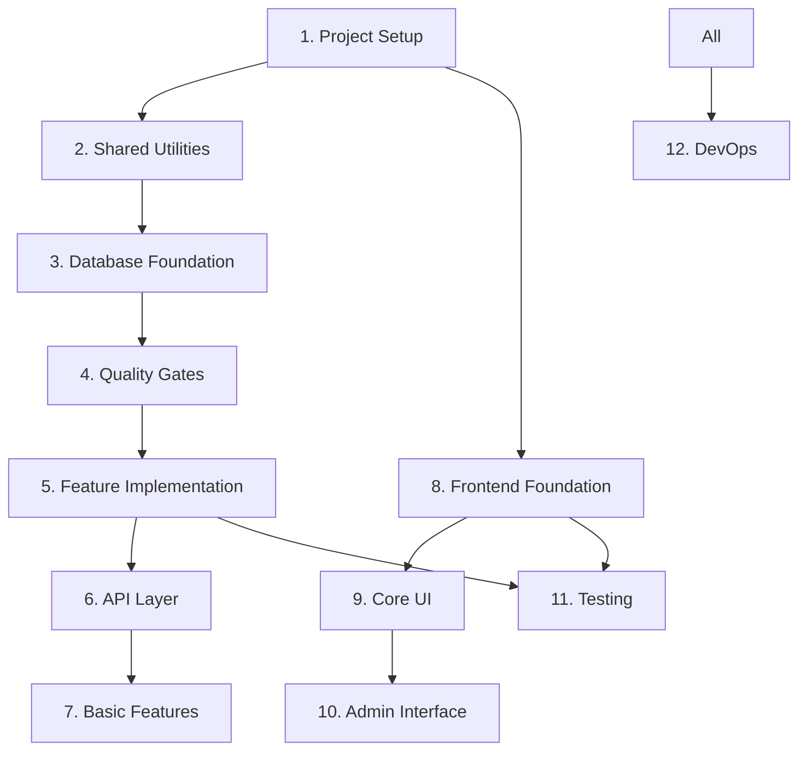

# Implementation Task List - Phase 1 (Vertical Slice Architecture)

## Overview

This document breaks down Phase 1 implementation into manageable tasks using Vertical Slice Architecture (VSA) with Domain-Driven Design (DDD) principles. Each task should be completed with tests before moving to the next.

**Phase 1 Goal**: Basic quiz functionality with authentication and admin features using VSA, where each feature is organized as a complete vertical slice containing all layers.

## Task Organization

- 🔴 **Blocker**: Must be completed before dependent tasks
- 🟡 **High Priority**: Core functionality
- 🟢 **Normal Priority**: Can be done in parallel
- ⏱️ **Estimated Time**: Rough estimate for completion
- ✅ **Completed**: Task finished

## 1. Core Project Setup Tasks ✅
**Status**: COMPLETED  
**Total Time**: ~17 hours (1.5 planned + 15.5 additional)  
**Completion Date**: June 29, 2025  

### Summary
All foundational setup tasks completed, including:
- ✅ **Monorepo Structure**: Bun workspaces with TypeScript
- ✅ **Docker Environment**: PostgreSQL, KeyCloak, Redis configured
- ✅ **Framework Stack**: Migrated to Hono + node-redis for stability
- ✅ **Code Quality**: Biome 2.x for linting/formatting
- ✅ **CI/CD Pipeline**: GitHub Actions with <5min PR feedback
- ✅ **Branch Protection**: GitHub Rulesets enabled
- ✅ **Test Infrastructure**: 61 tests passing consistently

**Key Achievements**:
- Resolved all technical debt from initial setup
- Established solid foundation for Phase 1 development
- Optimized developer experience with modern tooling

> 📁 **Detailed task breakdown**: [docs/completed/01-core-setup-tasks.md](./completed/01-core-setup-tasks.md)

## 2. Shared Utilities & Configuration ✅
**Status**: COMPLETED  
**Total Time**: ~1.5 hours (1.5 planned + 0 additional)  
**Completion Date**: June 29, 2025  

### Summary
All shared infrastructure components completed, including:
- ✅ **Logger System**: Pino-based structured logging with request correlation
- ✅ **Cache Abstraction**: Redis/Memory dual-mode caching with fallback
- ✅ **Result Types**: Type-safe error handling with Result<T, E> pattern
- ✅ **Error Classes**: Structured error hierarchy with HTTP status codes
- ✅ **Configuration**: Zod-based environment validation with type safety
- ✅ **Test Coverage**: 86 utilities tests + 25 configuration tests = 111 total tests

**Key Achievements**:
- Established robust foundation for database and API layers
- Implemented production-ready caching with graceful degradation
- Created type-safe configuration management with runtime validation

> 📁 **Detailed task breakdown**: [docs/completed/02-shared-utilities-configuration.md](./completed/02-shared-utilities-configuration.md)

## 2.1 Remove Cache Infrastructure ✅
**Status**: COMPLETED
**Time**: 1.5 hours (actual: ~1 hour)
**Priority**: HIGH
**Reason**: Using Neon database which provides built-in connection pooling and scaling

### Completed Tasks:
```typescript
// Redis/Cache Removal:
✅ Remove Redis from docker-compose.yml
✅ Delete apps/api/src/shared/cache.ts and cache.test.ts
✅ Remove cache references from shared utilities
✅ Update environment variables (remove REDIS_URL)

// Module Updates:
✅ Remove caching from quiz.service.ts (Task 7.1)
✅ Remove caching from question retrieval (Task 5.4)
✅ Remove session caching references
✅ Update all import statements

// Documentation Updates:
✅ Update CLAUDE.md to reflect Neon usage
✅ Update project-structure.md
✅ Update coding-standards.md
✅ Remove cache-related patterns

// Test Updates:
✅ Remove all cache-related tests
✅ Update integration tests to not expect caching
✅ Verify all tests pass without Redis (157 tests passing)
```

### Rationale:
- **Neon provides connection pooling**: Built-in multiplexing eliminates traditional RDB connection bottlenecks
- **PostgreSQL has native caching**: Shared buffers and OS cache handle repeated queries efficiently
- **Drizzle ORM is cache-free by design**: Keeps code simple and maintainable
- **Premature caching adds complexity**: Cache invalidation and fallback logic increase operational overhead

## 3. Database Foundation ✅
**Status**: COMPLETED  
**Total Time**: ~10 hours (6.5 planned + 3.5 additional)  
**Completion Date**: July 12, 2025  

### Summary
Complete database foundation with VSA architecture implementation:
- ✅ **Drizzle ORM Setup**: Type-safe database layer with connection pooling
- ✅ **Core Schema**: 18 tables with PostgreSQL advanced features (JSONB, arrays, enums)
- ✅ **VSA Migration**: Clean-slate architecture reset to Vertical Slice Architecture
- ✅ **Infrastructure**: Middleware stack, unit-of-work, health endpoint
- ✅ **Migration System**: Full rollback capability with security validation
- ✅ **Test Infrastructure**: Testcontainers with transaction isolation
- ✅ **CI Integration**: Automated migration testing with GitHub Actions

**Key Achievements**:
- VSA architecture with first vertical slice (health endpoint) operational
- Production-ready database layer with graceful shutdown and monitoring
- Comprehensive migration system with Bun-native execution
- 40+ tests covering all components with 90%+ coverage
- Security hardening with path traversal and SQL injection protection

> 📁 **Detailed task breakdown**: [docs/completed/03-database-foundation.md](./completed/03-database-foundation.md)

## 4. Quality Gates ✅

### 4.1 Setup CodeQL Security Scanning ✅
**Time**: 30 minutes (actual: ~45 minutes)
**Status**: COMPLETED
**Completion Date**: July 12, 2025

### Summary
CodeQL security scanning successfully implemented:
- ✅ **Workflow Configuration**: `.github/workflows/codeql.yml` with minimal setup
- ✅ **Security Focus**: `security-extended` query set for focused analysis
- ✅ **Performance Optimized**: No PR triggers, 30-minute timeout, concurrency control
- ✅ **Proper Exclusions**: Test files, generated code, node_modules excluded
- ✅ **Bun Support**: Compatible with Bun 1.1.0 runtime environment
- ✅ **Act Testing**: Workflow validated with local testing tools

**Key Achievements**:
- Zero impact on PR performance (<5min requirement maintained)
- Comprehensive exclusion patterns for monorepo structure
- Weekly scheduled scans + main branch push triggers
- Production-ready configuration following GitHub best practices

**Implementation Details**:
- Created `.github/codeql/codeql-config.yml` for scan configuration
- Configured minimal permissions (contents:read + security-events:write)
- Added proper timeouts and concurrency controls
- Validated with act dry-run and YAML syntax checking

## 5. Feature Implementation (VSA + Repository Pattern) 🟡

### 5.1 Implement Quiz Domain & Repository ✅
**Status**: COMPLETED
**Time**: 10 hours (4 planned + 6 additional)
**Started**: July 12, 2025
**Completed**: July 12, 2025
**Priority**: HIGH

### Summary
Complete domain layer implementation with comprehensive unit testing:
- ✅ **Domain Foundation**: Branded types, AggregateRoot base class, Clock abstraction
- ✅ **Value Objects**: QuizConfig, QuizState, QuestionOrder, QuestionReference, Answer entity
- ✅ **Domain Events**: QuizStarted, AnswerSubmitted, QuizCompleted, QuizExpired with event sourcing
- ✅ **Error Hierarchy**: 11 structured domain errors with proper typing
- ✅ **QuizSession Aggregate**: Complete business logic with state transitions and invariants
- ✅ **Repository Pattern**: IQuizRepository interface + DrizzleQuizRepository stub
- ✅ **Design Alignment**: Result API and DomainEvent structure aligned with design document
- ✅ **Unit Tests**: **193 tests implemented** - **90%+ coverage achieved**
- ✅ **Test Infrastructure**: TestFactories and test utilities for domain object creation
- ✅ **Code Quality**: All linting issues resolved using TypeScript best practices

**Key Achievements**:
- Event sourcing with version-per-command strategy (1 command = 1 version)
- Complete business rule enforcement (time limits, sequential answering, completion rules)
- Type-safe branded IDs with factory functions
- Result<T,E> pattern for functional error handling
- Defensive copying and immutability guarantees
- O(1) performance optimizations for question lookups

**Architecture Features**:
- Vertical Slice Architecture (VSA) with domain-first design
- Domain-Driven Design (DDD) with rich aggregates
- Repository pattern with transaction boundaries
- Event sourcing reconstruction with `createForReplay()`
- Dependency injection (Clock, ID generation)

**Test Coverage**:
- QuizSession: 25 tests covering all business scenarios
- QuizConfig: 13 tests covering validation and serialization
- QuestionOrder: 20 tests covering O(1) lookup performance
- QuestionReference: 20 tests covering immutability and validation
- Answer: 25 tests covering validation and event replay
- DomainEvent: 16 tests covering event sourcing and reconstruction
- QuizErrors: 36 tests covering error hierarchy
- Ids: 30 tests covering branded types and factory functions
- **Total: 193 tests with 90%+ domain coverage**
- TDD approach with test-first development

**Files Implemented**:
```typescript
features/quiz/domain/
├── aggregates/QuizSession.ts + QuizSession.test.ts (✅ 25 tests)
├── entities/Answer.ts + Answer.test.ts (✅ 25 tests)
├── value-objects/
│   ├── Ids.ts + Ids.test.ts (✅ 30 tests)
│   ├── QuizConfig.ts + QuizConfig.test.ts (✅ 13 tests)
│   ├── QuizState.ts
│   ├── QuestionOrder.ts + QuestionOrder.test.ts (✅ 20 tests)
│   ├── QuestionReference.ts + QuestionReference.test.ts (✅ 20 tests)
│   └── ExamTypes.ts
├── events/
│   ├── DomainEvent.ts + DomainEvent.test.ts (✅ 16 tests)
│   └── QuizEvents.ts
├── errors/QuizErrors.ts + QuizErrors.test.ts (✅ 36 tests)
├── base/
│   ├── AggregateRoot.ts
│   ├── Clock.ts
│   └── IdGenerator.ts
├── repositories/
│   ├── IQuizRepository.ts
│   └── DrizzleQuizRepository.ts (stub)
└── index.ts
```

**Quality Achievements**:
- ✅ **90%+ Domain Coverage**: All core domain logic thoroughly tested
- ✅ **TypeScript Best Practices**: No `any` types, using shared Mutable<T> helper from test-support
- ✅ **Linting Compliance**: `bun run check` passes without errors
- ✅ **Performance Optimized**: O(1) lookups validated in tests
- ✅ **Immutability Enforced**: Defensive copying and Object.freeze() patterns
- ✅ **Test Utility Organization**: Shared test helpers moved to `test-support/types/` following VSA best practices

### 5.2 Implement Auth Slice with Repository Pattern ✅
**Status**: COMPLETED
**Time**: 3 hours (estimated) 
**Completion Date**: July 13, 2025
**Priority**: HIGH

### Summary
Production-ready auth implementation with comprehensive VSA + Repository Pattern:
- ✅ **User Aggregate**: Rich domain model with Email, UserId, UserRole value objects
- ✅ **Repository Pattern**: IUserRepository interface + DrizzleUserRepository implementation
- ✅ **Login Use Case**: Complete vertical slice (handler, dto, validation, route)
- ✅ **KeyCloak Integration**: Multiple auth providers with OAuth 2.0 password grant
- ✅ **Transaction Middleware**: Superior withTransaction pattern at middleware level
- ✅ **Test Coverage**: **109 tests** (102 unit + 7 E2E) - **100% pass rate**

**Key Achievements**:
- Enhanced security using KeyCloak instead of local passwords
- Middleware-level transaction wrapper ensures all auth ops are transactional
- Complete VSA implementation with co-located tests
- Multiple auth provider implementations (production, fake, stub)

### 5.2.0 Rename Provider-Specific Fields ✅
**Status**: COMPLETED
**Time**: 30 minutes (actual: ~30 minutes)
**Completion Date**: July 14, 2025
**Priority**: HIGH
**Reason**: Remove vendor-specific naming from domain model

### Summary
Rename `keycloakId` to `identityProviderId` throughout the codebase to maintain provider-agnostic domain model:
- ✅ **Domain Independence**: Remove "keycloak" from domain entities
- ✅ **Future-Proof**: Clear naming for potential multi-provider support
- ✅ **DDD Best Practice**: Keep infrastructure details out of domain
- ✅ **Simple Change**: One migration + IDE refactoring

### Tasks:
```typescript
// Database Migration:
ALTER TABLE auth_user 
  RENAME COLUMN keycloak_id TO identity_provider_id;

// Domain Model Update:
- Rename User.keycloakId → User.identityProviderId
- Update all references in domain layer

// Repository Updates:
- Update DrizzleUserRepository schema
- Renamed findByKeycloakId → findByIdentityProviderId

// Infrastructure Updates:
- Update auth provider implementations
- Update login handler references

// Testing:
- Update all test fixtures
- Ensure all tests pass
```

**Acceptance Criteria**:
- No "keycloak" references in domain layer
- All tests passing
- Zero functional changes
- Clean git history with atomic commit

### 5.2.1 Implement Authentication Middleware 🔴
**Status**: PENDING
**Time**: 2 hours (estimated)
**Priority**: BLOCKER
**Reason**: Critical security gap - API endpoints are unprotected

### Summary
Implement JWT authentication middleware for Hono to protect API endpoints:
- ✅ **JWT Verification**: Validate tokens against KeyCloak JWKS
- ✅ **Context Injection**: Add authenticated user to request context
- ✅ **Role-Based Auth**: Support role requirements for endpoints
- ✅ **Public Routes**: Allow optional authentication
- ✅ **Clean Architecture**: Maintain separation of concerns

### Tasks:
```typescript
// Context Types:
- Define AuthUser type for JWT claims
- Extend Hono's ContextVariableMap for type safety

// JWT Verification:
- Implement KeyCloakJwtVerifier with JWKS support
- Add token validation and role extraction
- Configure KeyCloak endpoints

// Middleware Implementation:
- Create auth() middleware function
- Support required/optional authentication
- Add role-based authorization checks
- Handle token errors gracefully

// Route Updates:
- Protect /api/* routes by default
- Mark public endpoints explicitly
- Add role requirements for admin routes

// Handler Updates:
- Access user context via c.get('user')
- Add findByIdentityProviderId to UserRepository
- Maintain existing transaction patterns

// Testing:
- Unit tests for JWT verification
- Middleware tests with various scenarios
- Integration tests with real KeyCloak
- E2E tests for protected endpoints
```

**Dependencies**: 
- Uses existing IAuthProvider interface
- Works with current identity_provider_id schema
- No database schema changes needed

**Acceptance Criteria**:
- All API endpoints protected by default
- Public endpoints explicitly marked
- JWT tokens validated against KeyCloak
- User context available in handlers
- Role-based authorization works
- 90%+ test coverage
- Performance impact < 10ms per request

> 📁 **Detailed implementation plan**: [docs/planning/0003-auth-middleware-implementation.md](./planning/0003-auth-middleware-implementation.md)

### 5.3 Run Migrations and Seed Data 🟡
**Time**: 30 minutes
**Status**: PENDING
**Note**: Moved from 3.9 - run after domain models are defined
```typescript
// Tasks:
- Create migrate.ts script
- Run existing migrations on database
- Create comprehensive seed data for testing
- Add badges and initial questions
- Test: Database populated with test data
```

### 5.4 Implement Quiz Feature Slices 🟡
**Time**: 5 hours
```typescript
// Tasks:
- Create features/quiz/start-quiz/:
  - handler.ts with withTransaction wrapper
  - handler.test.ts (TDD!)
  - dto.ts, validation.ts, route.ts
- Create features/quiz/submit-answer/ (same structure)
- Create features/quiz/get-results/ (same structure)
- Test: Complete quiz flow with repository pattern
```

### 5.5 Implement User Domain & Features 🟢
**Time**: 3 hours
```typescript
// Tasks:
- Evolve User aggregate with full domain model
- Create features/user/domain/:
  - entities/User.ts
  - value-objects/UserId.ts, Email.ts
  - repositories/IUserRepository.ts
  - repositories/DrizzleUserRepository.ts
- Create features/user/register/ use case
- Create features/user/update-progress/ use case
- Create features/user/get-profile/ use case
- Test: User operations with repository pattern
```

### 5.6 Implement Question Features 🟢
**Time**: 2 hours
```typescript
// Tasks:
- Create features/question/domain/:
  - Use existing Quiz domain entities
  - repositories/IQuestionRepository.ts
  - repositories/DrizzleQuestionRepository.ts
- Create features/question/list-questions/ use case
- Create features/question/get-question/ use case
- Create features/question/create-question/ use case (admin)
- Test: Question operations tested
```

## 6. API Layer Implementation 🟡

### 6.1 Initialize Hono Server
**Time**: 30 minutes
```typescript
// Tasks:
- Setup basic Hono server with proper structure
- Configure CORS and security headers
- Add health check endpoint
- Setup global error handling
- Test: Server starts on port 4000
```

### 6.2 Implement Core Middleware
**Time**: 1.5 hours
```typescript
// Tasks:
- Create authentication middleware
- Implement rate limiting (user and IP based)
- Add request validation middleware
- Implement request logging
- Test: Middleware chain works correctly
```

### 6.3 Create Route Composition
**Time**: 1 hour
```typescript
// Tasks:
- Create src/routes.ts as composition root
- Import and mount auth feature routes
- Import and mount quiz feature routes
- Import and mount user feature routes
- Import and mount question feature routes
- Mount system/health route
- Test: All endpoints return expected responses
```

### 6.4 Add Admin Module (Optional)
**Time**: 2 hours
**DEFER TO PHASE 2**
```typescript
// Tasks:
- Create modules/admin/admin.routes.ts
- Add basic admin endpoints
- Implement authorization checks
- Test: Admin endpoints protected
```

## 7. Basic Features Implementation 🟢

### 7.1 ~~Add Caching Layer~~ (REMOVED)
**Time**: ~~1 hour~~ 0 hours
**Status**: REMOVED - Using Neon database instead
```typescript
// Removed Tasks:
- ~~Implement caching in quiz.service.ts~~
- ~~Cache question lists~~
- ~~Cache user sessions~~
- ~~Add cache invalidation~~
- ~~Test: Caching improves performance~~

// Reason: Neon provides built-in connection pooling and PostgreSQL
// has native caching through shared buffers. Adding application-level
// caching would introduce unnecessary complexity.
```

### 7.2 Add Basic Gamification
**Time**: 1.5 hours
```typescript
// Tasks:
- Implement streak tracking
- Add basic badge unlocking
- Update user progress after quizzes
- Test: Gamification features work
```

## 8. Frontend Foundation Tasks 🟢

### 8.1 Setup SvelteKit Project
**Time**: 30 minutes
```bash
# Tasks:
- Initialize SvelteKit with TypeScript
- Configure TailwindCSS
- Setup routing structure
- Configure API client
- Test: Dev server starts, TailwindCSS works
```

### 8.2 Create Layout Components
**Time**: 1 hour
```svelte
<!-- Tasks: -->
- Root layout with navigation
- Dark/light theme toggle
- Responsive mobile menu
- Loading states
- Test: Layout responsive on all screen sizes
```

### 8.3 Setup State Management
**Time**: 1 hour
**REVISED TASK**
```typescript
// Tasks:
- Create typed Svelte stores
- Implement auth store ~~with caching~~ (store in memory only)
- Add quiz session store
- Create progress store
- Test: State management works correctly
```

### 8.4 Implement API Client
**Time**: 1.5 hours
**REVISED TASK**
```typescript
// Tasks:
- Create typed API client using shared types
- Add automatic retry logic
- Implement request/response interceptors
- Add offline queue
- Test: API calls work with proper error handling
```

## 9. Core UI Implementation Tasks 🟢

### 9.1 Authentication Flow
**Time**: 2 hours
```svelte
<!-- Tasks: -->
- Login page with KeyCloak integration
- Token refresh handling
- Protected route guards
- Logout functionality
- Test: Complete auth flow works
```

### 9.2 Quiz Interface
**Time**: 3 hours
```svelte
<!-- Tasks: -->
- Quiz configuration page
- Question display with images
- Answer selection components
- Real-time progress display
- Results page with statistics
- Test: Complete quiz flow in UI
```

### 9.3 Question Browser
**Time**: 2 hours
```svelte
<!-- Tasks: -->
- Question grid/list view
- Advanced filtering
- Pagination ~~with caching~~ (server-side only)
- Search functionality
- Bookmark feature
- Test: Browsing and filtering work smoothly
```

## 10. Admin Interface Tasks 🟢

### 10.1 Admin Dashboard
**Time**: 1 hour
```svelte
<!-- Tasks: -->
- Admin layout and navigation
- Statistics overview
- Recent activity feed
- System health indicators
- Test: Dashboard displays real data
```

### 10.2 Question Management
**Time**: 3 hours
```svelte
<!-- Tasks: -->
- Question CRUD interface
- Rich text editor
- Image upload
- Bulk operations
- Version history viewer
- Test: All admin operations work
```

### 10.3 User Management
**Time**: 2 hours
**NEW TASK**
```svelte
<!-- Tasks: -->
- User list with filters
- Role management
- Subscription management
- Activity monitoring
- Test: User management features work
```

## 11. Testing & Quality Tasks 🟡

### 11.1 Unit Test Setup
**Time**: 1 hour
```typescript
// Tasks:
- Configure Vitest for monorepo
- Setup test utilities
- Create test factories
- Add coverage reporting
- Test: `bun run test` runs all tests
```

### 11.2 Integration Test Suite
**Time**: 3 hours
```typescript
// Tasks:
- Setup test database
- Test all service methods
- Test repository operations
- Test API endpoints
- Test: Integration tests pass
```

### 11.3 E2E Test Suite
**Time**: 2 hours
```typescript
// Tasks:
- Setup Playwright
- Test authentication flow
- Test complete quiz flow
- Test admin operations
- Test: E2E tests pass
```

### 11.4 Performance Testing
**Time**: 2 hours
**NEW TASK**
```typescript
// Tasks:
- Setup k6 for load testing
- Test API endpoints under load
- Measure response times
- Identify bottlenecks
- Test: Meets performance targets
```

## 12. DevOps & Deployment Tasks 🟢

### 12.1 CI/CD Pipeline
**Time**: 2 hours
```yaml
# Tasks:
- Setup GitHub Actions
- Configure test matrix
- Add build verification
- Setup deployment stages
- Test: CI runs on every push
```

### 12.2 Container Optimization
**Time**: 2 hours
```dockerfile
# Tasks:
- Create multi-stage Dockerfiles
- Optimize image sizes
- Add health checks
- Configure for production
- Test: Containers run efficiently
```

### 12.3 Kubernetes Deployment
**Time**: 2 hours
```yaml
# Tasks:
- Create K8s manifests
- Add ConfigMaps for config
- Setup Secrets management
- Configure autoscaling
- Test: Deploys to local K8s
```

### 12.4 Monitoring Setup
**Time**: 2 hours
**NEW TASK**
```yaml
# Tasks:
- Deploy Prometheus
- Configure Grafana dashboards
- Setup alerts
- Add log aggregation
- Test: Metrics and logs collected
```

## Task Dependencies



## Definition of Done

Each task is complete when:
1. ✅ Code is implemented following architecture patterns
2. ✅ Tests are written and passing (minimum 80% coverage)
3. ✅ TypeScript has no errors
4. ✅ Code follows project conventions
5. ✅ Performance targets are met
6. ✅ Documentation is updated
7. ✅ Feature works end-to-end

## Revised Timeline (VSA + Repository Pattern)

**Note**: Timeline updated to reflect VSA + Repository Pattern architecture with clean-slate rewrite and reordered tasks.

- **Week 1**: Tasks 1 + 2 (Core Setup + Shared Utilities) ✅
- **Week 2**: Tasks 3.1-3.7 (Database Foundation + VSA Migration)
  - Day 1-2: Clean-slate reset & infrastructure foundation ✅
  - Day 3-4: First vertical slice (Health) ✅
  - Day 5: Quality Gates setup
- **Week 3**: Tasks 4 + 5.1-5.2.1 (Quality Gates + Domain Design + Auth + Middleware)
  - Day 1: Quality Gates ✅
  - Day 2-3: Quiz domain model & repository ✅
  - Day 4: Auth slice with minimal User aggregate ✅
  - Day 5 AM: Provider field rename (30 min) ✅
  - Day 5 PM: Authentication middleware implementation 🔴
- **Week 4**: Tasks 5.3-5.6 (Migrations + Quiz Features + User/Question Features)
  - Day 1: Migrations and seed data
  - Day 2-3: Quiz feature slices with auth middleware
  - Day 4: User domain evolution & features
  - Day 5: Question features
- **Week 5**: Tasks 6 + 7-9 (API Layer + Basic Features + Frontend Foundation + Core UI)
  - Day 1: API layer completion
  - Day 2-5: Basic features + Frontend foundation + Core UI
- **Week 6**: Tasks 10-12 (Admin Interface + Testing + DevOps)

**Architecture Migration Summary**:
- Clean-slate approach (no gradual migration)
- Repository pattern for persistence isolation
- Unit-of-Work via Drizzle transactions
- Domain-first development with 90% coverage target
- Vertical slices with co-located tests

Total estimate: ~100-120 hours of development time (includes repository pattern overhead but cleaner architecture)

## Critical Path

The following tasks are on the critical path and block other work:
1. Shared Utilities (blocks feature development) ✅
2. Database Foundation (blocks all data operations) ✅
3. Clean-Slate Architecture Reset (blocks VSA implementation) ✅
4. Infrastructure Foundation (blocks all features) ✅
5. First Vertical Slice (validates architecture) ✅
6. Quality Gates (establishes code quality standards) ✅
7. Domain/Repository Implementation (blocks business logic) ✅
8. **Provider Field Rename (blocks clean domain model)** ✅
9. **Authentication Middleware (blocks API layer security)** 🔴
10. API Layer (blocks frontend integration) 🟡

## Risk Mitigation

- **Performance Risk**: Repository pattern adds minimal overhead, mitigated by Drizzle's efficiency
- **Complexity Risk**: Start with simple domain models, evolve as business rules emerge
- **Testing Risk**: 90% domain coverage enforced from day one
- **Migration Risk**: Clean-slate approach with legacy branch backup
- **Team Risk**: Kick-off workshop + code review templates for VSA understanding

## VSA Implementation Notes

### Repository Pattern Guidelines
1. **Interface in domain layer**: `features/[bc]/domain/repositories/I[Entity]Repository.ts`
2. **Implementation alongside**: `features/[bc]/domain/repositories/Drizzle[Entity]Repository.ts`
3. **Transaction via closure**: All handlers use `withTransaction(async trx => {...})`
4. **No cross-slice imports**: ESLint boundaries enforced

### Testing Strategy
1. **Domain tests**: Pure unit tests, no DB, 90% coverage
2. **Repository tests**: SQLite in-memory adapter
3. **Handler tests**: Mock repositories, test business flow
4. **Contract tests**: Full HTTP tests with real DB

### Development Flow
1. Write failing handler test
2. Create domain entities/VOs as needed
3. Define repository interface
4. Implement repository with Drizzle
5. Wire up handler with transaction
6. Create route with validation
7. Run contract test end-to-end