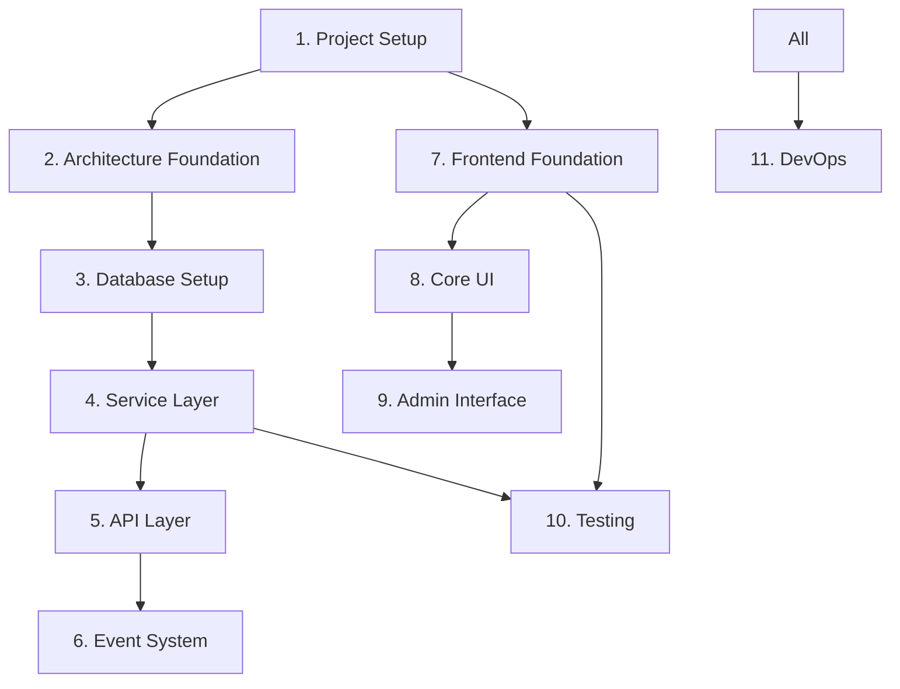

# Implementation Task List - Phase 1 (Revised with Service Layer Architecture)

## Overview

This document breaks down Phase 1 implementation into manageable tasks, incorporating the service layer architecture decisions. Each task should be completed with tests before moving to the next.

**Phase 1 Goal**: Basic quiz functionality with authentication, admin features, and proper architecture foundations.

## Task Organization

- 🔴 **Blocker**: Must be completed before dependent tasks
- 🟡 **High Priority**: Core functionality
- 🟢 **Normal Priority**: Can be done in parallel
- ⏱️ **Estimated Time**: Rough estimate for completion
- ✅ **Completed**: Task finished

## 1. Project Setup Tasks 🔴

### 1.1 Initialize Monorepo Structure ✅
**Time**: 30 minutes
**Status**: COMPLETED
```bash
# Tasks:
- Create directory structure as per ./project-setup.md
- Initialize Bun workspaces
- Setup package.json files for each workspace
- Configure TypeScript paths
- Test: `bun install` should work without errors
```

### 1.2 Setup Docker Environment ✅
**Time**: 20 minutes
**Status**: COMPLETED
```bash
# Tasks:
- Create docker-compose.yml
- Add PostgreSQL and KeyCloak services
- Create initialization scripts
- Test: `docker-compose up` should start both services
```

### 1.3 Configure Environment Variables ✅
**Time**: 10 minutes
**Status**: COMPLETED
```bash
# Tasks:
- Create .env.example with all required variables
- Create .env with local development values
- Add .env to .gitignore
- Test: Environment variables accessible in code
```

### 1.4 Setup Redis for Caching ✅
**Time**: 30 minutes
**Status**: COMPLETED
```bash
# Tasks:
- Add Redis to docker-compose.yml
- Configure Redis connection settings
- Add Redis environment variables
- Test: Redis connection works
```

### 1.5 Rename Project to CertQuiz ✅
**Time**: 15 minutes
**Status**: COMPLETED
```bash
# Tasks:
- Rename project from cisco-quiz-app to CertQuiz
- Update all references in documentation
- Update package.json project names
- Update README.md with new project name
- Test: Project builds and runs with new name
```

### 1.6 Migrate from Elysia to Hono ✅
**Time**: 2 hours
**Status**: COMPLETED
```bash
# Tasks:
- Replace Elysia with Hono in package.json dependencies
- Migrate route definitions from Elysia syntax to Hono syntax
- Update middleware implementations for Hono
- Migrate validation from Elysia's t.Object to Zod schemas
- Update all test files to use Hono test utilities
- Update documentation references from Elysia to Hono
- Test: All routes work with Hono, tests pass
```

### 1.7 Migrate from ioredis to node-redis ✅
**Time**: 2 hours
**Status**: COMPLETED
```bash
# Tasks:
- Replace ioredis with redis package in dependencies
- Update Redis configuration to use node-redis v4 API
- Migrate all Redis commands to new syntax patterns
- Update TypeScript types from Redis to RedisClientType
- Fix integration tests and streamline performance tests
- Test: All Redis functionality works, 77/77 tests pass
```

## 2. Architecture Foundation Tasks 🔴

### 2.1 Create Core Interfaces
**Time**: 1 hour
**NEW TASK**
```typescript
// Tasks:
- Create repository interfaces (base, paginated)
- Create service interfaces (base, context, result)
- Create cache interface
- Create event bus interface
- Test: TypeScript compiles without errors
```

### 2.2 Implement Infrastructure Services
**Time**: 2 hours
**NEW TASK**
```typescript
// Tasks:
- Implement Redis cache service
- Implement event bus (in-memory first, Redis pub/sub later)
- Implement structured logger
- Implement error classes
- Test: Unit tests for each service
```

### 2.3 Setup Monitoring and Observability
**Time**: 1 hour
**NEW TASK**
```typescript
// Tasks:
- Setup OpenTelemetry
- Configure structured logging
- Add request tracing
- Add performance metrics
- Test: Logs and traces are generated
```

## 3. Database Setup Tasks 🔴

### 3.1 Setup Drizzle ORM
**Time**: 30 minutes
```typescript
// Tasks:
- Install Drizzle dependencies
- Create drizzle.config.ts
- Setup database connection pool
- Configure connection pooling
- Test: Connection to PostgreSQL works
```

### 3.2 Implement Core Schema
**Time**: 1 hour
```typescript
// Tasks:
- Create schema.ts with all tables from database-schema.md
- Create relations.ts with table relationships
- Add proper indexes
- Generate initial migration
- Test: `bun run db:generate` creates migration files
```

### 3.3 Implement Base Repository
**Time**: 1 hour
**NEW TASK**
```typescript
// Tasks:
- Create base repository class
- Implement CRUD operations
- Add pagination support
- Add transaction support
- Test: Base repository operations work
```

### 3.4 Implement Domain Repositories
**Time**: 2 hours
**NEW TASK**
```typescript
// Tasks:
- Create UserRepository
- Create QuestionRepository
- Create QuizRepository
- Create ProgressRepository
- Test: All repositories have integration tests
```

### 3.5 Run Migrations and Seed Data
**Time**: 30 minutes
```typescript
// Tasks:
- Create migrate.ts script
- Run migrations on database
- Create comprehensive seed data
- Add badges and initial questions
- Test: Database populated with test data
```

## 4. Service Layer Implementation 🟡

### 4.1 Implement Authentication Service
**Time**: 2 hours
**NEW TASK**
```typescript
// Tasks:
- Create AuthService with KeyCloak integration
- Implement login/logout logic
- Add token validation with caching
- Implement refresh token logic
- Test: Authentication flow works end-to-end
```

### 4.2 Implement Question Service
**Time**: 2 hours
**NEW TASK**
```typescript
// Tasks:
- Create QuestionService
- Implement question retrieval with caching
- Add filtering and pagination
- Implement admin operations
- Test: All question operations tested
```

### 4.3 Implement Quiz Service
**Time**: 3 hours
**NEW TASK**
```typescript
// Tasks:
- Create QuizService
- Implement quiz session management
- Add answer validation logic
- Implement progress tracking
- Emit domain events
- Test: Complete quiz flow tested
```

### 4.4 Implement User Progress Service
**Time**: 2 hours
**NEW TASK**
```typescript
// Tasks:
- Create ProgressService
- Implement badge unlock logic
- Add statistics calculation
- Handle progress events
- Test: Progress tracking works correctly
```

## 5. API Layer Implementation 🟡

### 5.1 Initialize Hono Server
**Time**: 30 minutes
```typescript
// Tasks:
- Setup basic Hono server with proper structure
- Configure CORS and security headers
- Add health check endpoint
- Setup global error handling
- Test: Server starts on port 4000
```

### 5.2 Implement Core Middleware
**Time**: 1.5 hours
```typescript
// Tasks:
- Create authentication middleware
- Implement rate limiting (user and IP based)
- Add request validation middleware
- Implement request logging
- Test: Middleware chain works correctly
```

### 5.3 Implement V1 API Routes
**Time**: 3 hours
```typescript
// Tasks:
- Create /api/v1/auth routes (thin layer)
- Create /api/v1/questions routes
- Create /api/v1/quiz routes
- Create /api/v1/admin routes
- Test: All endpoints return expected responses
```

### 5.4 Implement WebSocket Support
**Time**: 2 hours
**NEW TASK**
```typescript
// Tasks:
- Setup WebSocket server
- Implement real-time quiz updates
- Add progress notifications
- Handle connection management
- Test: WebSocket events work
```

## 6. Event System Implementation 🟢

### 6.1 Define Domain Events
**Time**: 1 hour
**NEW TASK**
```typescript
// Tasks:
- Create event type definitions
- Define quiz events
- Define user events
- Define progress events
- Test: Events are properly typed
```

### 6.2 Implement Event Handlers
**Time**: 2 hours
**NEW TASK**
```typescript
// Tasks:
- Create badge unlock handler
- Create progress update handler
- Create notification handler
- Create audit log handler
- Test: Handlers process events correctly
```

## 7. Frontend Foundation Tasks 🟢

### 7.1 Setup SvelteKit Project
**Time**: 30 minutes
```bash
# Tasks:
- Initialize SvelteKit with TypeScript
- Configure TailwindCSS
- Setup routing structure
- Configure API client
- Test: Dev server starts, TailwindCSS works
```

### 7.2 Create Layout Components
**Time**: 1 hour
```svelte
<!-- Tasks: -->
- Root layout with navigation
- Dark/light theme toggle
- Responsive mobile menu
- Loading states
- Test: Layout responsive on all screen sizes
```

### 7.3 Setup State Management
**Time**: 1 hour
**REVISED TASK**
```typescript
// Tasks:
- Create typed Svelte stores
- Implement auth store with caching
- Add quiz session store
- Create progress store
- Test: State management works correctly
```

### 7.4 Implement API Client
**Time**: 1.5 hours
**REVISED TASK**
```typescript
// Tasks:
- Create typed API client using shared types
- Add automatic retry logic
- Implement request/response interceptors
- Add offline queue
- Test: API calls work with proper error handling
```

## 8. Core UI Implementation Tasks 🟢

### 8.1 Authentication Flow
**Time**: 2 hours
```svelte
<!-- Tasks: -->
- Login page with KeyCloak integration
- Token refresh handling
- Protected route guards
- Logout functionality
- Test: Complete auth flow works
```

### 8.2 Quiz Interface
**Time**: 3 hours
```svelte
<!-- Tasks: -->
- Quiz configuration page
- Question display with images
- Answer selection components
- Real-time progress display
- Results page with statistics
- Test: Complete quiz flow in UI
```

### 8.3 Question Browser
**Time**: 2 hours
```svelte
<!-- Tasks: -->
- Question grid/list view
- Advanced filtering
- Pagination with caching
- Search functionality
- Bookmark feature
- Test: Browsing and filtering work smoothly
```

## 9. Admin Interface Tasks 🟢

### 9.1 Admin Dashboard
**Time**: 1 hour
```svelte
<!-- Tasks: -->
- Admin layout and navigation
- Statistics overview
- Recent activity feed
- System health indicators
- Test: Dashboard displays real data
```

### 9.2 Question Management
**Time**: 3 hours
```svelte
<!-- Tasks: -->
- Question CRUD interface
- Rich text editor
- Image upload
- Bulk operations
- Version history viewer
- Test: All admin operations work
```

### 9.3 User Management
**Time**: 2 hours
**NEW TASK**
```svelte
<!-- Tasks: -->
- User list with filters
- Role management
- Subscription management
- Activity monitoring
- Test: User management features work
```

## 10. Testing & Quality Tasks 🟡

### 10.1 Unit Test Setup
**Time**: 1 hour
```typescript
// Tasks:
- Configure Vitest for monorepo
- Setup test utilities
- Create test factories
- Add coverage reporting
- Test: `bun test` runs all tests
```

### 10.2 Integration Test Suite
**Time**: 3 hours
```typescript
// Tasks:
- Setup test database
- Test all service methods
- Test repository operations
- Test API endpoints
- Test: Integration tests pass
```

### 10.3 E2E Test Suite
**Time**: 2 hours
```typescript
// Tasks:
- Setup Playwright
- Test authentication flow
- Test complete quiz flow
- Test admin operations
- Test: E2E tests pass
```

### 10.4 Performance Testing
**Time**: 2 hours
**NEW TASK**
```typescript
// Tasks:
- Setup k6 for load testing
- Test API endpoints under load
- Measure response times
- Identify bottlenecks
- Test: Meets performance targets
```

## 11. DevOps & Deployment Tasks 🟢

### 11.1 CI/CD Pipeline
**Time**: 2 hours
```yaml
# Tasks:
- Setup GitHub Actions
- Configure test matrix
- Add build verification
- Setup deployment stages
- Test: CI runs on every push
```

### 11.2 Container Optimization
**Time**: 2 hours
```dockerfile
# Tasks:
- Create multi-stage Dockerfiles
- Optimize image sizes
- Add health checks
- Configure for production
- Test: Containers run efficiently
```

### 11.3 Kubernetes Deployment
**Time**: 2 hours
```yaml
# Tasks:
- Create K8s manifests
- Add ConfigMaps for config
- Setup Secrets management
- Configure autoscaling
- Test: Deploys to local K8s
```

### 11.4 Monitoring Setup
**Time**: 2 hours
**NEW TASK**
```yaml
# Tasks:
- Deploy Prometheus
- Configure Grafana dashboards
- Setup alerts
- Add log aggregation
- Test: Metrics and logs collected
```

## Task Dependencies



## Definition of Done

Each task is complete when:
1. ✅ Code is implemented following architecture patterns
2. ✅ Tests are written and passing (minimum 80% coverage)
3. ✅ TypeScript has no errors
4. ✅ Code follows project conventions
5. ✅ Performance targets are met
6. ✅ Documentation is updated
7. ✅ Feature works end-to-end

## Revised Timeline

- **Week 1**: Tasks 1-2 (Setup & Architecture Foundation)
- **Week 2**: Tasks 3-4 (Database & Service Layer)
- **Week 3**: Tasks 5-6 (API & Events)
- **Week 4**: Tasks 7-8 (Frontend Implementation)
- **Week 5**: Tasks 9-10 (Admin & Testing)
- **Week 6**: Task 11 (DevOps & Deployment)

Total estimate: ~120-140 hours of development time (increased due to proper architecture)

## Critical Path

The following tasks are on the critical path and block other work:
1. Architecture Foundation (blocks everything)
2. Database + Repositories (blocks services)
3. Service Layer (blocks API routes)
4. API Routes (blocks frontend integration)

## Risk Mitigation

- **Performance Risk**: Implement caching early
- **Complexity Risk**: Keep services focused and small
- **Integration Risk**: Test service interactions thoroughly
- **Scale Risk**: Design for horizontal scaling from start