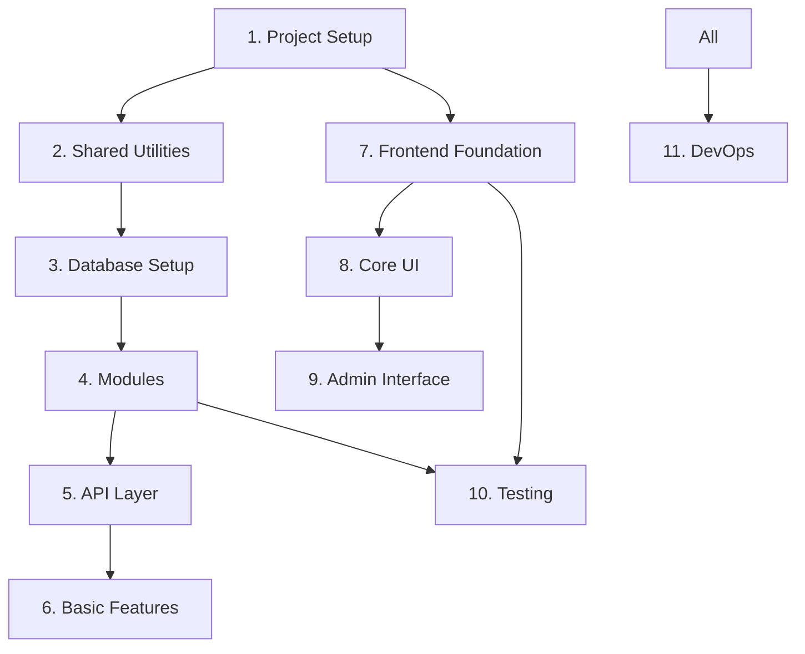

# Implementation Task List - Phase 1 (Simple MVP Architecture)

## Overview

This document breaks down Phase 1 implementation into manageable tasks using a simplified module-based architecture. Each task should be completed with tests before moving to the next.

**Phase 1 Goal**: Basic quiz functionality with authentication and admin features using a simple, module-based structure that can evolve to clean architecture when needed.

## Task Organization

- 🔴 **Blocker**: Must be completed before dependent tasks
- 🟡 **High Priority**: Core functionality
- 🟢 **Normal Priority**: Can be done in parallel
- ⏱️ **Estimated Time**: Rough estimate for completion
- ✅ **Completed**: Task finished

## 1. Core Project Setup Tasks 🔴
*Original planned tasks - completed as designed*

### 1.1 Initialize Monorepo Structure ✅
**Time**: 30 minutes
**Status**: COMPLETED
```bash
# Tasks:
- Create directory structure as per ./project-setup.md
- Initialize Bun workspaces
- Setup package.json files for each workspace
- Configure TypeScript paths
- Test: `bun install` should work without errors
```

### 1.2 Setup Docker Environment ✅
**Time**: 20 minutes
**Status**: COMPLETED
```bash
# Tasks:
- Create docker-compose.yml
- Add PostgreSQL and KeyCloak services
- Create initialization scripts
- Test: `docker-compose up` should start both services
```

### 1.3 Configure Environment Variables ✅
**Time**: 10 minutes
**Status**: COMPLETED
```bash
# Tasks:
- Create .env.example with all required variables
- Create .env with local development values
- Add .env to .gitignore
- Test: Environment variables accessible in code
```

### 1.4 Setup Redis for Caching ✅
**Time**: 30 minutes
**Status**: COMPLETED
```bash
# Tasks:
- Add Redis to docker-compose.yml
- Configure Redis connection settings
- Add Redis environment variables
- Test: Redis connection works
```

---

## 1A. Additional Setup Tasks (Addendum) 🔄
*Unplanned tasks added during implementation - addressing technical debt and tooling improvements*

> **Note**: Tasks 1.5-1.8 and 1A.1 were not in the original Phase 1 plan but became necessary due to:
> - Framework stability concerns (Elysia → Hono migration)
> - Performance optimizations (ioredis → node-redis migration)  
> - Code quality improvements (ESLint/Prettier → Biome 2.x migration)
> - Project rebranding (cisco-quiz-app → CertQuiz)
> - CI/CD foundation setup for development efficiency

### 1.5 Rename Project to CertQuiz ✅
**Time**: 15 minutes
**Status**: COMPLETED  
**Reason**: Project rebranding for clearer scope definition
```bash
# Tasks:
- Rename project from cisco-quiz-app to CertQuiz
- Update all references in documentation
- Update package.json project names
- Update README.md with new project name
- Test: Project builds and runs with new name
```

### 1.6 Migrate from Elysia to Hono ✅
**Time**: 2 hours
**Status**: COMPLETED  
**Reason**: Framework stability and better TypeScript support
```bash
# Tasks:
- Replace Elysia with Hono in package.json dependencies
- Migrate route definitions from Elysia syntax to Hono syntax
- Update middleware implementations for Hono
- Migrate validation from Elysia's t.Object to Zod schemas
- Update all test files to use Hono test utilities
- Update documentation references from Elysia to Hono
- Test: All routes work with Hono, tests pass
```

### 1.7 Migrate from ioredis to node-redis ✅
**Time**: 2 hours
**Status**: COMPLETED  
**Reason**: Performance optimization and reduced dependencies
```bash
# Tasks:
- Replace ioredis with redis package in dependencies
- Update Redis configuration to use node-redis v4 API
- Migrate all Redis commands to new syntax patterns
- Update TypeScript types from Redis to RedisClientType
- Fix integration tests and streamline performance tests
- Test: All Redis functionality works, 77/77 tests pass
```

### 1.8 Migrate to Biome 2.x ✅
**Time**: 1.5 hours
**Status**: COMPLETED  
**Reason**: Unified linting/formatting tool for improved developer experience
```bash
# Tasks:
- Remove ESLint and Prettier dependencies
- Install Biome as dev dependency in root package.json
- Create biome.json with Biome 2.x configuration format
- Update package.json scripts to use Biome commands
- Configure VS Code settings for Biome extension
- Test: All formatting and linting works with Biome
```

### 1A.1 Setup GitHub Actions CI/CD Foundation 🚧
**Time**: 3-4 hours
**Status**: IN PROGRESS  
**Reason**: Early CI/CD setup for development efficiency and quality gates
```yaml
# Tasks:
- Create basic CI workflow (.github/workflows/ci.yml)
- Implement lint + typecheck + unit test pipeline
- Add Docker build and smoke test validation
- Configure branch protection rules (CI green required)
- Setup aggressive caching strategy for <5min PR feedback
- Add basic dependency security scanning
- Test: PR checks complete in under 5 minutes
```

## 2. Shared Utilities Setup 🔴

### 2.1 Create Shared Utilities
**Time**: 1.5 hours
```typescript
// Tasks:
- Create shared/logger.ts with Pino logger
- Create shared/cache.ts with Redis wrapper
- Create shared/database.ts with DB connection
- Create shared/result.ts with Result<T, E> type
- Create shared/errors.ts with error classes
- Test: All utilities work correctly
```

### 2.2 Setup Configuration
**Time**: 30 minutes
```typescript
// Tasks:
- Create config/env.ts with typed env vars
- Validate environment variables on startup
- Move Redis config to shared/cache.ts
- Test: Configuration loads correctly
```

## 3. Database Setup Tasks 🔴

### 3.1 Setup Drizzle ORM
**Time**: 30 minutes
```typescript
// Tasks:
- Install Drizzle dependencies
- Create drizzle.config.ts
- Setup database connection pool
- Configure connection pooling
- Test: Connection to PostgreSQL works
```

### 3.2 Implement Core Schema
**Time**: 1 hour
```typescript
// Tasks:
- Create schema.ts with all tables from database-schema.md
- Create relations.ts with table relationships
- Add proper indexes
- Generate initial migration
- Test: `bun run db:generate` creates migration files
```

### 3.3 Create Database Query Functions
**Time**: 2 hours
```typescript
// Tasks:
- Create modules/user/user.db.ts with user queries
- Create modules/quiz/quiz.db.ts with quiz queries
- Create modules/question/question.db.ts
- Add transaction helpers in shared/database.ts
- Test: All database queries work
```

### 3.5 Run Migrations and Seed Data
**Time**: 30 minutes
```typescript
// Tasks:
- Create migrate.ts script
- Run migrations on database
- Create comprehensive seed data
- Add badges and initial questions
- Test: Database populated with test data
```

## 4. Module Implementation 🟡

### 4.1 Implement Auth Module
**Time**: 2 hours
```typescript
// Tasks:
- Create modules/auth/auth.service.ts with business logic
- Create modules/auth/auth.routes.ts with endpoints
- Create modules/auth/auth.middleware.ts
- Integrate KeyCloak authentication
- Test: Auth flow works end-to-end
```

### 4.2 Implement Quiz Module
**Time**: 3 hours
```typescript
// Tasks:
- Create modules/quiz/quiz.service.ts
- Create modules/quiz/quiz.routes.ts
- Create modules/quiz/quiz.db.ts
- Create modules/quiz/quiz.types.ts
- Test: Complete quiz flow tested
```

### 4.3 Implement User Module
**Time**: 2 hours
```typescript
// Tasks:
- Create modules/user/user.service.ts
- Create modules/user/user.routes.ts
- Create modules/user/user.db.ts
- Add progress tracking logic
- Test: User operations work correctly
```

### 4.4 Implement Question Module
**Time**: 2 hours
```typescript
// Tasks:
- Create modules/question/question.service.ts
- Create modules/question/question.routes.ts
- Create modules/question/question.db.ts
- Add caching for question retrieval
- Test: Question operations tested
```

## 5. API Layer Implementation 🟡

### 5.1 Initialize Hono Server
**Time**: 30 minutes
```typescript
// Tasks:
- Setup basic Hono server with proper structure
- Configure CORS and security headers
- Add health check endpoint
- Setup global error handling
- Test: Server starts on port 4000
```

### 5.2 Implement Core Middleware
**Time**: 1.5 hours
```typescript
// Tasks:
- Create authentication middleware
- Implement rate limiting (user and IP based)
- Add request validation middleware
- Implement request logging
- Test: Middleware chain works correctly
```

### 5.3 Wire Up Module Routes
**Time**: 2 hours
```typescript
// Tasks:
- Mount auth routes at /api/auth
- Mount quiz routes at /api/quiz
- Mount user routes at /api/users
- Mount question routes at /api/questions
- Test: All endpoints return expected responses
```

### 5.4 Add Admin Module (Optional)
**Time**: 2 hours
**DEFER TO PHASE 2**
```typescript
// Tasks:
- Create modules/admin/admin.routes.ts
- Add basic admin endpoints
- Implement authorization checks
- Test: Admin endpoints protected
```

## 6. Basic Features Implementation 🟢

### 6.1 Add Caching Layer
**Time**: 1 hour
```typescript
// Tasks:
- Implement caching in quiz.service.ts
- Cache question lists
- Cache user sessions
- Add cache invalidation
- Test: Caching improves performance
```

### 6.2 Add Basic Gamification
**Time**: 1.5 hours
```typescript
// Tasks:
- Implement streak tracking
- Add basic badge unlocking
- Update user progress after quizzes
- Test: Gamification features work
```

## 7. Frontend Foundation Tasks 🟢

### 7.1 Setup SvelteKit Project
**Time**: 30 minutes
```bash
# Tasks:
- Initialize SvelteKit with TypeScript
- Configure TailwindCSS
- Setup routing structure
- Configure API client
- Test: Dev server starts, TailwindCSS works
```

### 7.2 Create Layout Components
**Time**: 1 hour
```svelte
<!-- Tasks: -->
- Root layout with navigation
- Dark/light theme toggle
- Responsive mobile menu
- Loading states
- Test: Layout responsive on all screen sizes
```

### 7.3 Setup State Management
**Time**: 1 hour
**REVISED TASK**
```typescript
// Tasks:
- Create typed Svelte stores
- Implement auth store with caching
- Add quiz session store
- Create progress store
- Test: State management works correctly
```

### 7.4 Implement API Client
**Time**: 1.5 hours
**REVISED TASK**
```typescript
// Tasks:
- Create typed API client using shared types
- Add automatic retry logic
- Implement request/response interceptors
- Add offline queue
- Test: API calls work with proper error handling
```

## 8. Core UI Implementation Tasks 🟢

### 8.1 Authentication Flow
**Time**: 2 hours
```svelte
<!-- Tasks: -->
- Login page with KeyCloak integration
- Token refresh handling
- Protected route guards
- Logout functionality
- Test: Complete auth flow works
```

### 8.2 Quiz Interface
**Time**: 3 hours
```svelte
<!-- Tasks: -->
- Quiz configuration page
- Question display with images
- Answer selection components
- Real-time progress display
- Results page with statistics
- Test: Complete quiz flow in UI
```

### 8.3 Question Browser
**Time**: 2 hours
```svelte
<!-- Tasks: -->
- Question grid/list view
- Advanced filtering
- Pagination with caching
- Search functionality
- Bookmark feature
- Test: Browsing and filtering work smoothly
```

## 9. Admin Interface Tasks 🟢

### 9.1 Admin Dashboard
**Time**: 1 hour
```svelte
<!-- Tasks: -->
- Admin layout and navigation
- Statistics overview
- Recent activity feed
- System health indicators
- Test: Dashboard displays real data
```

### 9.2 Question Management
**Time**: 3 hours
```svelte
<!-- Tasks: -->
- Question CRUD interface
- Rich text editor
- Image upload
- Bulk operations
- Version history viewer
- Test: All admin operations work
```

### 9.3 User Management
**Time**: 2 hours
**NEW TASK**
```svelte
<!-- Tasks: -->
- User list with filters
- Role management
- Subscription management
- Activity monitoring
- Test: User management features work
```

## 10. Testing & Quality Tasks 🟡

### 10.1 Unit Test Setup
**Time**: 1 hour
```typescript
// Tasks:
- Configure Vitest for monorepo
- Setup test utilities
- Create test factories
- Add coverage reporting
- Test: `bun test` runs all tests
```

### 10.2 Integration Test Suite
**Time**: 3 hours
```typescript
// Tasks:
- Setup test database
- Test all service methods
- Test repository operations
- Test API endpoints
- Test: Integration tests pass
```

### 10.3 E2E Test Suite
**Time**: 2 hours
```typescript
// Tasks:
- Setup Playwright
- Test authentication flow
- Test complete quiz flow
- Test admin operations
- Test: E2E tests pass
```

### 10.4 Performance Testing
**Time**: 2 hours
**NEW TASK**
```typescript
// Tasks:
- Setup k6 for load testing
- Test API endpoints under load
- Measure response times
- Identify bottlenecks
- Test: Meets performance targets
```

## 11. DevOps & Deployment Tasks 🟢

### 11.1 CI/CD Pipeline
**Time**: 2 hours
```yaml
# Tasks:
- Setup GitHub Actions
- Configure test matrix
- Add build verification
- Setup deployment stages
- Test: CI runs on every push
```

### 11.2 Container Optimization
**Time**: 2 hours
```dockerfile
# Tasks:
- Create multi-stage Dockerfiles
- Optimize image sizes
- Add health checks
- Configure for production
- Test: Containers run efficiently
```

### 11.3 Kubernetes Deployment
**Time**: 2 hours
```yaml
# Tasks:
- Create K8s manifests
- Add ConfigMaps for config
- Setup Secrets management
- Configure autoscaling
- Test: Deploys to local K8s
```

### 11.4 Monitoring Setup
**Time**: 2 hours
**NEW TASK**
```yaml
# Tasks:
- Deploy Prometheus
- Configure Grafana dashboards
- Setup alerts
- Add log aggregation
- Test: Metrics and logs collected
```

## Task Dependencies



## Definition of Done

Each task is complete when:
1. ✅ Code is implemented following architecture patterns
2. ✅ Tests are written and passing (minimum 80% coverage)
3. ✅ TypeScript has no errors
4. ✅ Code follows project conventions
5. ✅ Performance targets are met
6. ✅ Documentation is updated
7. ✅ Feature works end-to-end

## Revised Timeline

**Note**: Timeline updated to reflect additional setup tasks (1A series) completed during implementation.

- **Week 1**: Tasks 1 + 1A + 2 (Core Setup + Additional Tasks + Shared Utilities)
- **Week 2**: Tasks 3-4 (Database & Modules)
- **Week 3**: Tasks 5-6 (API & Basic Features)
- **Week 4**: Tasks 7-8 (Frontend Implementation)
- **Week 5**: Tasks 9-10 (Admin & Testing)
- **Week 6**: Task 11 (DevOps & Deployment)

**Actual Setup Phase Summary**:
- Original tasks (1.1-1.4): 1.5 hours (as planned)
- Additional tasks (1.5-1.8 + 1A.1): ~8 hours (unplanned but valuable)
- Total setup time: ~9.5 hours vs planned 1.5 hours

Total estimate: ~90-110 hours of development time (reduced with simpler architecture, but including additional setup tasks)

## Critical Path

The following tasks are on the critical path and block other work:
1. Shared Utilities (blocks module development)
2. Database Setup (blocks all data operations)
3. Module Implementation (blocks API routes)
4. API Routes (blocks frontend integration)

## Risk Mitigation

- **Performance Risk**: Add caching only where needed
- **Complexity Risk**: Keep modules simple and focused
- **Over-engineering Risk**: Follow YAGNI principle
- **Migration Risk**: Maintain clear module boundaries for Phase 2