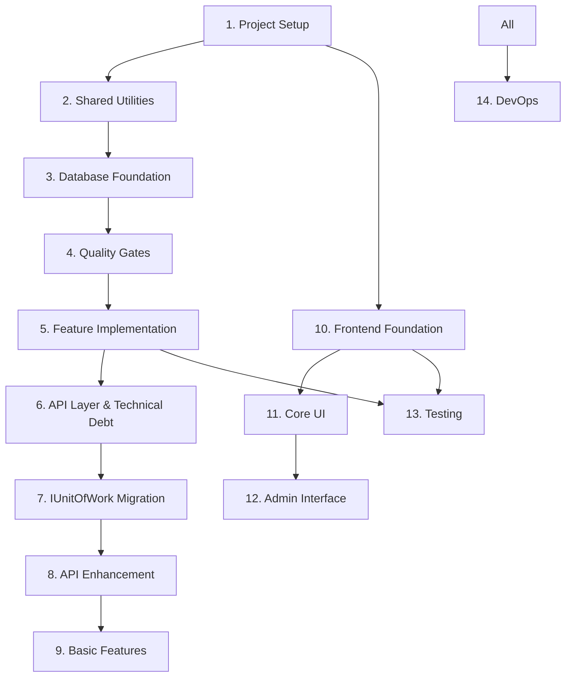

# Implementation Task List - Phase 1 (Vertical Slice Architecture)

## Overview

This document breaks down Phase 1 implementation into manageable tasks using Vertical Slice Architecture (VSA) with Domain-Driven Design (DDD) principles. Each task should be completed with tests before moving to the next.

**Phase 1 Goal**: Basic quiz functionality with authentication and admin features using VSA, where each feature is organized as a complete vertical slice containing all layers.

**Current Status**: Core quiz functionality complete ✅ - All quiz feature slices (start, submit, results) implemented with full test coverage. Ready for user domain evolution and additional features.

## Task Organization

- 🔴 **Blocker**: Must be completed before dependent tasks
- 🟡 **High Priority**: Core functionality
- 🟢 **Normal Priority**: Can be done in parallel
- ⏱️ **Estimated Time**: Rough estimate for completion
- ✅ **Completed**: Task finished

## 1. Core Project Setup Tasks ✅
**Status**: COMPLETED  
**Total Time**: ~17 hours (1.5 planned + 15.5 additional)  
**Completion Date**: June 29, 2025  

### Summary
All foundational setup tasks completed, including:
- ✅ **Monorepo Structure**: Bun workspaces with TypeScript
- ✅ **Docker Environment**: PostgreSQL, KeyCloak, Redis configured
- ✅ **Framework Stack**: Migrated to Hono + node-redis for stability
- ✅ **Code Quality**: Biome 2.x for linting/formatting
- ✅ **CI/CD Pipeline**: GitHub Actions with <5min PR feedback
- ✅ **Branch Protection**: GitHub Rulesets enabled
- ✅ **Test Infrastructure**: 61 tests passing consistently

**Key Achievements**:
- Resolved all technical debt from initial setup
- Established solid foundation for Phase 1 development
- Optimized developer experience with modern tooling

> 📁 **Detailed task breakdown**: [docs/completed/01-core-setup-tasks.md](./completed/01-core-setup-tasks.md)

## 2. Shared Utilities & Configuration ✅
**Status**: COMPLETED  
**Total Time**: ~1.5 hours (1.5 planned + 0 additional)  
**Completion Date**: June 29, 2025  

### Summary
All shared infrastructure components completed, including:
- ✅ **Logger System**: Pino-based structured logging with request correlation
- ✅ **Cache Abstraction**: Redis/Memory dual-mode caching with fallback
- ✅ **Result Types**: Type-safe error handling with Result<T, E> pattern
- ✅ **Error Classes**: Structured error hierarchy with HTTP status codes
- ✅ **Configuration**: Zod-based environment validation with type safety
- ✅ **Test Coverage**: 86 utilities tests + 25 configuration tests = 111 total tests

**Key Achievements**:
- Established robust foundation for database and API layers
- Implemented production-ready caching with graceful degradation
- Created type-safe configuration management with runtime validation

> 📁 **Detailed task breakdown**: [docs/completed/02-shared-utilities-configuration.md](./completed/02-shared-utilities-configuration.md)

## 2.1 Remove Cache Infrastructure ✅
**Status**: COMPLETED
**Time**: 1.5 hours (actual: ~1 hour)
**Priority**: HIGH
**Reason**: Using Neon database which provides built-in connection pooling and scaling

### Completed Tasks:
```typescript
// Redis/Cache Removal:
✅ Remove Redis from docker-compose.yml
✅ Delete apps/api/src/shared/cache.ts and cache.test.ts
✅ Remove cache references from shared utilities
✅ Update environment variables (remove REDIS_URL)

// Module Updates:
✅ Remove caching from quiz.service.ts (Task 7.1)
✅ Remove caching from question retrieval (Task 5.4)
✅ Remove session caching references
✅ Update all import statements

// Documentation Updates:
✅ Update CLAUDE.md to reflect Neon usage
✅ Update project-structure.md
✅ Update coding-standards.md
✅ Remove cache-related patterns

// Test Updates:
✅ Remove all cache-related tests
✅ Update integration tests to not expect caching
✅ Verify all tests pass without Redis (157 tests passing)
```

### Rationale:
- **Neon provides connection pooling**: Built-in multiplexing eliminates traditional RDB connection bottlenecks
- **PostgreSQL has native caching**: Shared buffers and OS cache handle repeated queries efficiently
- **Drizzle ORM is cache-free by design**: Keeps code simple and maintainable
- **Premature caching adds complexity**: Cache invalidation and fallback logic increase operational overhead

## 3. Database Foundation ✅
**Status**: COMPLETED  
**Total Time**: ~10 hours (6.5 planned + 3.5 additional)  
**Completion Date**: July 12, 2025  

### Summary
Complete database foundation with VSA architecture implementation:
- ✅ **Drizzle ORM Setup**: Type-safe database layer with connection pooling
- ✅ **Core Schema**: 18 tables with PostgreSQL advanced features (JSONB, arrays, enums)
- ✅ **VSA Migration**: Clean-slate architecture reset to Vertical Slice Architecture
- ✅ **Infrastructure**: Middleware stack, unit-of-work, health endpoint
- ✅ **Migration System**: Full rollback capability with security validation
- ✅ **Test Infrastructure**: Testcontainers with transaction isolation
- ✅ **CI Integration**: Automated migration testing with GitHub Actions

**Key Achievements**:
- VSA architecture with first vertical slice (health endpoint) operational
- Production-ready database layer with graceful shutdown and monitoring
- Comprehensive migration system with Bun-native execution
- 40+ tests covering all components with 90%+ coverage
- Security hardening with path traversal and SQL injection protection

> 📁 **Detailed task breakdown**: [docs/completed/03-database-foundation.md](./completed/03-database-foundation.md)

## 4. Quality Gates ✅

### 4.1 Setup CodeQL Security Scanning ✅
**Time**: 30 minutes (actual: ~45 minutes)
**Status**: COMPLETED
**Completion Date**: July 12, 2025

### Summary
CodeQL security scanning successfully implemented:
- ✅ **Workflow Configuration**: `.github/workflows/codeql.yml` with minimal setup
- ✅ **Security Focus**: `security-extended` query set for focused analysis
- ✅ **Performance Optimized**: No PR triggers, 30-minute timeout, concurrency control
- ✅ **Proper Exclusions**: Test files, generated code, node_modules excluded
- ✅ **Bun Support**: Compatible with Bun 1.1.0 runtime environment
- ✅ **Act Testing**: Workflow validated with local testing tools

**Key Achievements**:
- Zero impact on PR performance (<5min requirement maintained)
- Comprehensive exclusion patterns for monorepo structure
- Weekly scheduled scans + main branch push triggers
- Production-ready configuration following GitHub best practices

**Implementation Details**:
- Created `.github/codeql/codeql-config.yml` for scan configuration
- Configured minimal permissions (contents:read + security-events:write)
- Added proper timeouts and concurrency controls
- Validated with act dry-run and YAML syntax checking

## 5. Feature Implementation (VSA + Repository Pattern) ✅
**Status**: COMPLETED  
**Total Time**: ~39.5 hours (17.5 planned + 22 additional)  
**Completion Date**: July 22, 2025  

### Summary
Complete implementation of all core features using Vertical Slice Architecture (VSA) with Domain-Driven Design (DDD) and Repository Pattern:
- ✅ **Quiz Domain**: Complete event-sourced aggregate with 193 domain tests
- ✅ **Auth System**: KeyCloak integration with JWT middleware and role-based access
- ✅ **User Features**: Registration, progress tracking, and profile management
- ✅ **Question Management**: Full CRUD with admin features and secure shuffling
- ✅ **Infrastructure**: Logging, authentication, migrations, and seed data
- ✅ **Test Coverage**: 1000+ tests across all features with 90%+ domain coverage

**Key Achievements**:
- VSA architecture with co-located tests and clean separation of concerns
- Production-ready infrastructure with enterprise-grade patterns
- Comprehensive security implementation with JWT authentication
- Event sourcing for quiz domain with full business rule enforcement
- Type-safe error handling with Result<T,E> pattern throughout

> 📁 **Detailed task breakdown**: [docs/completed/05-feature-implementation.md](./completed/05-feature-implementation.md)

## 6. API Layer Implementation & Technical Debt ✅
**Status**: PARTIALLY COMPLETED
**Completion Date**: July 22, 2025 (API initialization)

### 6.1 Initialize Hono Server ✅
**Time**: 30 minutes (actual: ~2 hours)
**Status**: COMPLETED

**Summary**: Initialized Hono server with proper structure and middleware:
```typescript
// Completed Tasks:
✅ Setup basic Hono server with proper structure
✅ Configure CORS and security headers (already existed)
✅ Add health check endpoint (already existed)
✅ Setup global error handling (already existed)
✅ Test: Server starts on port 4000
```

**Key Achievements**:
- Created central route composition in `routes.ts` following VSA principles
- Improved app factory with better documentation and middleware ordering
- Added comprehensive tests for server initialization (app-factory.test.ts)
- Added tests verifying server starts on port 4000 (index.test.ts)
- Maintained existing VSA architecture while incorporating o3's Hono best practices

### Technical Debt Reduction Overview
The following technical debt items need immediate attention to enable proper testing without database dependencies.

## 7. Migrate from withTransaction to IUnitOfWork Pattern ✅

### 7.1 Core Migration ✅
**Time**: 4 days (actual: ~3.5 days)
**Priority**: HIGH
**Status**: COMPLETED
**Completion Date**: July 23, 2025
```typescript
// Migration completed successfully:
// - All routes now use IUnitOfWork pattern from middleware
// - Tests run without database dependencies
// - Legacy TxRunner code removed

// Tasks:
- Step 0: Implement TxRunner shim for immediate test fixes (0.5 day) ✅
  ✅ Create TxRunner interface with run method
  ✅ Implement DrizzleTxRunner using withTransaction
  ✅ Implement NoopTxRunner for tests
  ✅ Update routes to use TxRunner instead of direct withTransaction
  ✅ Verify all tests pass without database

- Step 1: Introduce UnitOfWorkProvider middleware (1 day) ✅
  ✅ Create middleware that provides IUnitOfWork to context
  ✅ Implement factory for real/fake UoW based on environment
  ✅ Test middleware with both implementations

- Step 2: Slice-by-slice migration (2-3 days) ✅
  ✅ Migrate user routes from repositories to IUnitOfWork
  ✅ Migrate question routes from repositories to IUnitOfWork
  ✅ Migrate quiz routes from repositories to IUnitOfWork
  ✅ Migrate auth routes from repositories to IUnitOfWork
  ✅ Remove legacy repository-setting middleware from each slice
  ✅ Fix domain entity separation (auth vs user domains)
  ✅ Create FakeAuthUserRepository for testing
  ✅ Update IUnitOfWork with getAuthUserRepository() method

- Step 3: Remove legacy code (0.5 day) ✅
  ✅ Delete TxRunner shim (106 lines removed)
  ✅ Remove withTransaction imports from routes
  ✅ Clean up unused legacy code
  ✅ Update coding standards to warn against withTransaction in routes
  ✅ Add warnings to infra/db/index.ts

✅ Test: All routes use IUnitOfWork, no direct transaction usage
✅ Test: HTTP layer tests run without database
✅ Test: Integration tests still work with real database
✅ Test: All linting and type checks pass
```

### 7.2 Complete Migration to Full IUnitOfWork ✅
**Time**: 2 days (actual: Pre-completed during 7.1)
**Priority**: HIGH
**Status**: COMPLETED
**Completion Date**: July 23, 2025
**Depends on**: 7.1
```typescript
// Full IUnitOfWork pattern successfully implemented:
// - All 4 repositories (auth, user, quiz, question) accessible via UnitOfWork
// - Complete transaction lifecycle support
// - Production-ready with comprehensive testing

// Tasks:
✅ Add IQuestionRepository to IUnitOfWork interface
  ✅ Interface includes getQuestionRepository(): IQuestionRepository (line 91-92)
  ✅ Properly imported and typed with domain repository interface

✅ Implement question repository accessor
  ✅ DrizzleUnitOfWork: Full implementation with repository caching (lines 144-155)
  ✅ FakeUnitOfWork: Test double implementation for unit testing (lines 89-91)
  ✅ Repository lifecycle management and logging

✅ Update all question-related code to use UoW
  ✅ Question routes factory: Uses unitOfWork.getQuestionRepository() (line 78)
  ✅ All route handlers access repositories through UnitOfWork context
  ✅ No direct repository injection in question domain

✅ Add missing repository methods
  ✅ All repository interfaces complete and implemented
  ✅ No TypeScript compilation errors or missing method signatures
  ✅ Repository pattern consistent across all domains

✅ Implement transaction lifecycle methods (begin/commit/rollback)
  ✅ DrizzleUnitOfWork: No-op implementations with proper logging (Phase 1 approach)
  ✅ FakeUnitOfWork: Full transaction simulation with state tracking
  ✅ Interface compatibility for future explicit transaction control

✅ Test: Full UoW pattern implemented across all features
  ✅ 35+ integration tests passing
  ✅ All route factories using UnitOfWork from middleware context
  ✅ Repository caching and transaction isolation working correctly
  ✅ Both real and fake implementations tested
```

**Key Achievements:**
- Complete abstraction of all data access through IUnitOfWork interface
- Repository caching optimization in production implementation
- Full transaction lifecycle support for future enhancement
- Test isolation through fake implementations
- Zero direct withTransaction usage in application code

### 7.3 Async DI Container Migration (Task 5.6) ✅
**Time**: 3 days (actual: 2 days)
**Priority**: HIGH
**Status**: COMPLETED - July 31, 2025

**Objective**: Implement async dependency injection for proper database initialization

**Tasks Completed**:
✅ Phase 1: Database Provider Implementation
  ✅ Created IDatabaseProvider interface
  ✅ Implemented ProductionDatabaseProvider and TestDatabaseProvider
  ✅ Added per-worker database isolation for tests

✅ Phase 2: AsyncDIContainer Implementation
  ✅ Full async/await support for service factories
  ✅ Singleton management with concurrent initialization protection
  ✅ Environment-specific configuration support
  ✅ Compatible with both sync and async factories

✅ Phase 3: Integration and Testing
  ✅ Created async app factory (buildAppWithAsyncContainer)
  ✅ Async production entry point (index.async.ts)
  ✅ Async test factories for integration and HTTP tests
  ✅ Validation tests confirming proper test isolation

✅ Cleanup: Dead Code Removal
  ✅ Removed /testing/infra/db/client.ts (unused getTestDb)
  ✅ Removed getTestDb from connection.ts
  ✅ Removed self-referential test files
  ✅ Fixed all TypeScript and linting errors
  ✅ ~400 lines of dead code removed

**Key Benefits**:
- Proper async initialization for database connections
- True test isolation with per-worker databases
- Backward compatibility via feature flag (USE_NEW_DB_PROVIDER)
- Maintained full type safety

✅ Test: All tests pass with USE_NEW_DB_PROVIDER=true
✅ Test: Async container isolation verified
✅ Test: Production server starts with async entry point
✅ Documentation: Migration guide and completion docs updated

### 7.4 Database Architecture Refactoring 🔴
**Time**: 5 days (estimate)
**Priority**: HIGH
**Status**: PENDING
**Depends on**: 7.3 (Async DI Container Migration)

**Objective**: Implement comprehensive database architecture refactoring to unify Production/Test environments and add missing cross-aggregate transaction support

**Reference**: [docs/planning/0010-database-architecture-refactoring-plan.md](./planning/0010-database-architecture-refactoring-plan.md)

```typescript
// Phase 1: Architecture Unification (Production/Test Integration) - 1.5 days
- Production environment migration to DIContainer
  - Update apps/api/src/index.ts to use createConfiguredContainer('production')
  - Extend container-config.ts with production configuration
  - Add Unit of Work integration to production config

// Phase 2: Unit of Work Integration Architecture - 1.5 days  
- Enhance AsyncDatabaseContext with Unit of Work support
  - Add executeWithUnitOfWork method to AsyncDatabaseContext
  - Integrate UnitOfWorkProvider as optional dependency
  - Maintain backward compatibility with existing withinTransaction

// Phase 3: Application Service Layer Implementation - 1 day
- Implement QuizCompletionService for cross-aggregate operations
  - Create apps/api/src/features/quiz/application/QuizCompletionService.ts
  - Add QUIZ_COMPLETION_SERVICE_TOKEN to service tokens
  - Implement completeQuizWithProgressUpdate method
  - Add atomic quiz session + user progress updates

// Phase 4: Handler Integration & Route Updates - 1 day
- Create new quiz completion endpoint
  - Implement apps/api/src/features/quiz/complete-quiz/handler.ts
  - Create apps/api/src/features/quiz/complete-quiz/route.ts
  - Add POST /quiz/:sessionId/complete endpoint
  - Update submit-answer handler to provide completion URL

- Simplify existing handlers
  - Remove user progress update from submit-answer handler
  - Update response to include nextAction for completion
  - Maintain auto-completion functionality

// Phase 5: File Cleanup & Architecture Simplification - 0.5 days
- Remove duplicate database context implementations
  - Delete apps/api/src/infra/db/DrizzleDatabaseContext.ts
  - Delete apps/api/src/infra/db/DrizzleDatabaseContext.test.ts
  - Remove apps/api/src/shared/transaction/handler-utils.ts

- Consolidate user progress functionality
  - Remove apps/api/src/features/user/update-progress/* (integrated into QuizCompletionService)
  - Update imports and references

// Phase 6: Testing & Validation - 0.5 days
- Comprehensive testing of new architecture
  - Unit tests for QuizCompletionService
  - Integration tests for complete quiz flow
  - Verify atomic transactions work correctly
  - Test both auto-completion and manual completion flows

- End-to-end validation
  - Production environment starts with new architecture
  - All existing tests pass
  - New cross-aggregate functionality works
  - Performance regression testing
```

**Critical Business Impact**:
This task addresses a **critical missing feature** where quiz completion does not update user progress (level, experience, statistics). The current implementation violates data consistency and results in poor user experience.

**Key Benefits**:
- ✅ **Architecture Consistency**: Unified Production/Test environments using DIContainer
- ✅ **Complexity Reduction**: Single AsyncDatabaseContext implementation  
- ✅ **Critical Feature**: Quiz completion properly updates user progress atomically
- ✅ **Data Integrity**: Cross-aggregate transactions ensure consistency
- ✅ **Maintainability**: Simplified codebase with clear separation of concerns

**Risk Mitigation**:
- Phased implementation approach minimizes disruption
- Comprehensive testing at each phase
- Backward compatibility maintained during transition
- Rollback plan via git branches

## 8. API Layer Enhancement 🟢

### 8.1 Implement Core Middleware
**Time**: 1.5 hours
```typescript
// Tasks:
- Create authentication middleware
- Implement rate limiting (user and IP based)
- Add request validation middleware
- Implement request logging
- Test: Middleware chain works correctly
```

### 8.2 Create Route Composition
**Time**: 1 hour
```typescript
// Tasks:
- Create src/routes.ts as composition root
- Import and mount auth feature routes
- Import and mount quiz feature routes
- Import and mount user feature routes
- Import and mount question feature routes
- Mount system/health route
- Test: All endpoints return expected responses
```

### 8.3 Add Admin Module (Optional)
**Time**: 2 hours
**DEFER TO PHASE 2**
```typescript
// Tasks:
- Create modules/admin/admin.routes.ts
- Add basic admin endpoints
- Implement authorization checks
- Test: Admin endpoints protected
```

## 9. Basic Features Implementation 🟢

### 9.1 ~~Add Caching Layer~~ (REMOVED)
**Time**: ~~1 hour~~ 0 hours
**Status**: REMOVED - Using Neon database instead
```typescript
// Removed Tasks:
- ~~Implement caching in quiz.service.ts~~
- ~~Cache question lists~~
- ~~Cache user sessions~~
- ~~Add cache invalidation~~
- ~~Test: Caching improves performance~~

// Reason: Neon provides built-in connection pooling and PostgreSQL
// has native caching through shared buffers. Adding application-level
// caching would introduce unnecessary complexity.
```

### 9.2 Add Basic Gamification
**Time**: 1.5 hours
```typescript
// Tasks:
- Implement streak tracking
- Add basic badge unlocking
- Update user progress after quizzes
- Test: Gamification features work
```

## 10. Frontend Foundation Tasks 🟢

### 10.1 Setup SvelteKit Project
**Time**: 30 minutes
```bash
# Tasks:
- Initialize SvelteKit with TypeScript
- Configure TailwindCSS
- Setup routing structure
- Configure API client
- Test: Dev server starts, TailwindCSS works
```

### 10.2 Create Layout Components
**Time**: 1 hour
```svelte
<!-- Tasks: -->
- Root layout with navigation
- Dark/light theme toggle
- Responsive mobile menu
- Loading states
- Test: Layout responsive on all screen sizes
```

### 10.3 Setup State Management
**Time**: 1 hour
**REVISED TASK**
```typescript
// Tasks:
- Create typed Svelte stores
- Implement auth store ~~with caching~~ (store in memory only)
- Add quiz session store
- Create progress store
- Test: State management works correctly
```

### 10.4 Implement API Client
**Time**: 1.5 hours
**REVISED TASK**
```typescript
// Tasks:
- Create typed API client using shared types
- Add automatic retry logic
- Implement request/response interceptors
- Add offline queue
- Test: API calls work with proper error handling
```

## 11. Core UI Implementation Tasks 🟢

### 11.1 Authentication Flow
**Time**: 2 hours
```svelte
<!-- Tasks: -->
- Login page with KeyCloak integration
- Token refresh handling
- Protected route guards
- Logout functionality
- Test: Complete auth flow works
```

### 11.2 Quiz Interface
**Time**: 3 hours
```svelte
<!-- Tasks: -->
- Quiz configuration page
- Question display with images
- Answer selection components
- Real-time progress display
- Results page with statistics
- Test: Complete quiz flow in UI
```

### 11.3 Question Browser
**Time**: 2 hours
```svelte
<!-- Tasks: -->
- Question grid/list view
- Advanced filtering
- Pagination ~~with caching~~ (server-side only)
- Search functionality
- Bookmark feature
- Test: Browsing and filtering work smoothly
```

## 12. Admin Interface Tasks 🟢

### 12.1 Admin Dashboard
**Time**: 1 hour
```svelte
<!-- Tasks: -->
- Admin layout and navigation
- Statistics overview
- Recent activity feed
- System health indicators
- Test: Dashboard displays real data
```

### 12.2 Question Management
**Time**: 3 hours
```svelte
<!-- Tasks: -->
- Question CRUD interface
- Rich text editor
- Image upload
- Bulk operations
- Version history viewer
- Test: All admin operations work
```

### 12.3 User Management
**Time**: 2 hours
**NEW TASK**
```svelte
<!-- Tasks: -->
- User list with filters
- Role management
- Subscription management
- Activity monitoring
- Test: User management features work
```

## 13. Testing & Quality Tasks 🟡

### 13.1 Unit Test Setup
**Time**: 1 hour
```typescript
// Tasks:
- Configure Vitest for monorepo
- Setup test utilities
- Create test factories
- Add coverage reporting
- Test: `bun run test` runs all tests
```

### 13.2 Integration Test Suite
**Time**: 3 hours
```typescript
// Tasks:
- Setup test database
- Test all service methods
- Test repository operations
- Test API endpoints
- Test: Integration tests pass
```

### 13.3 E2E Test Suite
**Time**: 2 hours
```typescript
// Tasks:
- Setup Playwright
- Test authentication flow
- Test complete quiz flow
- Test admin operations
- Test: E2E tests pass
```

### 13.4 Performance Testing
**Time**: 2 hours
**NEW TASK**
```typescript
// Tasks:
- Setup k6 for load testing
- Test API endpoints under load
- Measure response times
- Identify bottlenecks
- Test: Meets performance targets
```

## 14. DevOps & Deployment Tasks 🟢

### 14.1 CI/CD Pipeline
**Time**: 2 hours
```yaml
# Tasks:
- Setup GitHub Actions
- Configure test matrix
- Add build verification
- Setup deployment stages
- Test: CI runs on every push
```

### 14.2 Container Optimization
**Time**: 2 hours
```dockerfile
# Tasks:
- Create multi-stage Dockerfiles
- Optimize image sizes
- Add health checks
- Configure for production
- Test: Containers run efficiently
```

### 14.3 Kubernetes Deployment
**Time**: 2 hours
```yaml
# Tasks:
- Create K8s manifests
- Add ConfigMaps for config
- Setup Secrets management
- Configure autoscaling
- Test: Deploys to local K8s
```

### 14.4 Monitoring Setup
**Time**: 2 hours
**NEW TASK**
```yaml
# Tasks:
- Deploy Prometheus
- Configure Grafana dashboards
- Setup alerts
- Add log aggregation
- Test: Metrics and logs collected
```

## Task Dependencies



## Definition of Done

Each task is complete when:
1. ✅ Code is implemented following architecture patterns
2. ✅ Tests are written and passing (minimum 80% coverage)
3. ✅ TypeScript has no errors
4. ✅ Code follows project conventions
5. ✅ Performance targets are met
6. ✅ Documentation is updated
7. ✅ Feature works end-to-end

## Revised Timeline (VSA + Repository Pattern)

**Note**: Timeline updated to reflect VSA + Repository Pattern architecture with clean-slate rewrite and reordered tasks.

- **Week 1**: Tasks 1 + 2 (Core Setup + Shared Utilities) ✅
- **Week 2**: Tasks 3.1-3.7 (Database Foundation + VSA Migration)
  - Day 1-2: Clean-slate reset & infrastructure foundation ✅
  - Day 3-4: First vertical slice (Health) ✅
  - Day 5: Quality Gates setup
- **Week 3**: Tasks 4 + 5.1-5.2.1 (Quality Gates + Domain Design + Auth + Logging)
  - Day 1: Quality Gates ✅
  - Day 2-3: Quiz domain model & repository ✅
  - Day 4: Auth slice with minimal User aggregate ✅
  - Day 5 AM: Provider field rename (30 min) ✅
  - Day 5 PM: Logging infrastructure implementation ✅
- **Week 4**: Tasks 5.2.2-5.6 (Auth Middleware + Migrations + Features)
  - Day 1 AM: Authentication middleware implementation (2hr) ✅ **COMPLETED + additional fixes**
  - Day 1 PM: Migrations and seed data (4hr) ✅ **COMPLETED - Enterprise-grade implementation**
  - Day 2-3: Quiz feature slices ✅ **COMPLETED with additional improvements**
  - Day 4: User domain evolution & features ✅ **COMPLETED**
  - Day 5: Question features ✅ **COMPLETED**
- **Week 5**: Tasks 6-8 + 9-11 (API Layer & Technical Debt + API Enhancement + Basic Features + Frontend Foundation + Core UI)
  - Day 1: API layer completion + TxRunner shim ✅
  - Day 2-3: Continue IUnitOfWork migration (Task 7)
  - Day 4-5: API enhancement (Task 8) + Basic features (Task 9) + Frontend foundation start (Task 10)
- **Week 6**: Tasks 11-14 (Core UI + Admin Interface + Testing + DevOps)

**Architecture Migration Summary**:
- Clean-slate approach (no gradual migration)
- Repository pattern for persistence isolation
- Unit-of-Work via Drizzle transactions
- Domain-first development with 90% coverage target
- Vertical slices with co-located tests

Total estimate: ~100-120 hours of development time (includes repository pattern overhead but cleaner architecture)

## Critical Path

The following tasks are on the critical path and block other work:
1. Shared Utilities (blocks feature development) ✅
2. Database Foundation (blocks all data operations) ✅
3. Clean-Slate Architecture Reset (blocks VSA implementation) ✅
4. Infrastructure Foundation (blocks all features) ✅
5. First Vertical Slice (validates architecture) ✅
6. Quality Gates (establishes code quality standards) ✅
7. Domain/Repository Implementation (blocks business logic) ✅
8. **Provider Field Rename (blocks clean domain model)** ✅
9. **Logging Infrastructure (essential for debugging)** ✅
10. **Authentication Middleware (required before production)** ✅
11. **Migration and Seed System (enables development database)** ✅
12. **Quiz Feature Slices (core business logic)** ✅

## Risk Mitigation

- **Performance Risk**: Repository pattern adds minimal overhead, mitigated by Drizzle's efficiency
- **Complexity Risk**: Start with simple domain models, evolve as business rules emerge
- **Testing Risk**: 90% domain coverage enforced from day one
- **Migration Risk**: Clean-slate approach with legacy branch backup
- **Team Risk**: Kick-off workshop + code review templates for VSA understanding

## VSA Implementation Notes

### Repository Pattern Guidelines
1. **Interface in domain layer**: `features/[bc]/domain/repositories/I[Entity]Repository.ts`
2. **Implementation alongside**: `features/[bc]/domain/repositories/Drizzle[Entity]Repository.ts`
3. **Transaction via closure**: All handlers use `withTransaction(async trx => {...})`
4. **No cross-slice imports**: ESLint boundaries enforced

### Testing Strategy
1. **Domain tests**: Pure unit tests, no DB, 90% coverage
2. **Repository tests**: SQLite in-memory adapter
3. **Handler tests**: Mock repositories, test business flow
4. **Contract tests**: Full HTTP tests with real DB

### Development Flow
1. Write failing handler test
2. Create domain entities/VOs as needed
3. Define repository interface
4. Implement repository with Drizzle
5. Wire up handler with transaction
6. Create route with validation
7. Run contract test end-to-end