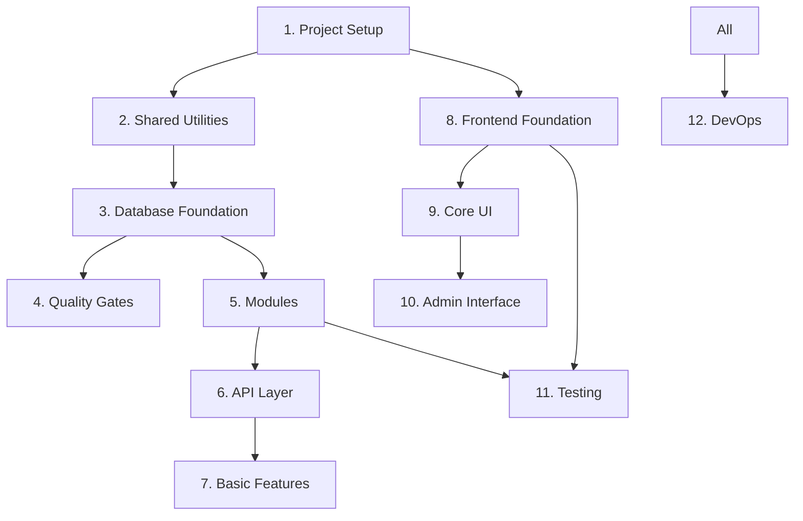

# Implementation Task List - Phase 1 (Simple MVP Architecture)

## Overview

This document breaks down Phase 1 implementation into manageable tasks using a simplified module-based architecture. Each task should be completed with tests before moving to the next.

**Phase 1 Goal**: Basic quiz functionality with authentication and admin features using a simple, module-based structure that can evolve to clean architecture when needed.

## Task Organization

- 🔴 **Blocker**: Must be completed before dependent tasks
- 🟡 **High Priority**: Core functionality
- 🟢 **Normal Priority**: Can be done in parallel
- ⏱️ **Estimated Time**: Rough estimate for completion
- ✅ **Completed**: Task finished

## 1. Core Project Setup Tasks ✅
**Status**: COMPLETED  
**Total Time**: ~17 hours (1.5 planned + 15.5 additional)  
**Completion Date**: June 29, 2025  

### Summary
All foundational setup tasks completed, including:
- ✅ **Monorepo Structure**: Bun workspaces with TypeScript
- ✅ **Docker Environment**: PostgreSQL, KeyCloak, Redis configured
- ✅ **Framework Stack**: Migrated to Hono + node-redis for stability
- ✅ **Code Quality**: Biome 2.x for linting/formatting
- ✅ **CI/CD Pipeline**: GitHub Actions with <5min PR feedback
- ✅ **Branch Protection**: GitHub Rulesets enabled
- ✅ **Test Infrastructure**: 61 tests passing consistently

**Key Achievements**:
- Resolved all technical debt from initial setup
- Established solid foundation for Phase 1 development
- Optimized developer experience with modern tooling

> 📁 **Detailed task breakdown**: [docs/completed/01-core-setup-tasks.md](./completed/01-core-setup-tasks.md)

## 2. Shared Utilities & Configuration ✅
**Status**: COMPLETED  
**Total Time**: ~1.5 hours (1.5 planned + 0 additional)  
**Completion Date**: June 29, 2025  

### Summary
All shared infrastructure components completed, including:
- ✅ **Logger System**: Pino-based structured logging with request correlation
- ✅ **Cache Abstraction**: Redis/Memory dual-mode caching with fallback
- ✅ **Result Types**: Type-safe error handling with Result<T, E> pattern
- ✅ **Error Classes**: Structured error hierarchy with HTTP status codes
- ✅ **Configuration**: Zod-based environment validation with type safety
- ✅ **Test Coverage**: 86 utilities tests + 25 configuration tests = 111 total tests

**Key Achievements**:
- Established robust foundation for database and API layers
- Implemented production-ready caching with graceful degradation
- Created type-safe configuration management with runtime validation

> 📁 **Detailed task breakdown**: [docs/completed/02-shared-utilities-configuration.md](./completed/02-shared-utilities-configuration.md)

## 3. Database Foundation 🔴

### 3.1 Setup Drizzle ORM ✅
**Time**: 30 minutes
**Status**: COMPLETED
```typescript
// Tasks:
- Install Drizzle dependencies
- Create drizzle.config.ts
- Setup database connection pool configuration
- Configure connection pooling options
- Test: Drizzle ORM installed and configured
```

### 3.2 Create Database Connection Wrapper ✅
**Time**: 30 minutes
**Status**: COMPLETED
```typescript
// Tasks:
- Create shared/database.ts with DB connection wrapper
- Setup Drizzle client instantiation
- Add connection pooling configuration
- Add graceful shutdown handling
- Test: Database connection works with Drizzle
```

**Key Achievements**:
- ✅ **Environment-aware Connection Pooling**: Test (1), Dev (5), Prod (20) connections
- ✅ **Graceful Shutdown**: SIGTERM/SIGINT handlers with 5-second timeout
- ✅ **Health Check**: Simple ping() method using `SELECT 1`
- ✅ **Production Ready**: Singleton pattern, proper error handling
- ✅ **Library Update**: postgres v3.4.0 → v3.4.7 (fixed sql.end() issues)
- ✅ **Test Coverage**: 19 test cases covering all functionality
- ✅ **Code Quality**: Passes `bun run check` with Biome 2.x standards

**Technical Details**:
- Type-safe Database interface wrapping Drizzle ORM
- Connection validation with meaningful error messages
- Environment-specific pool configuration
- Automatic cleanup on process signals
- TDD implementation with comprehensive test suite

### 3.3 Review and Improve Database Schema ✅
**Time**: 30 minutes
**Status**: COMPLETED
```typescript
// Tasks:
- Review schema with o3-high for simplicity and extensibility
- Update database-schema.md documentation
- Test: Schema review feedback implemented
```

### 3.4 Implement Core Schema ✅
**Time**: 1 hour  
**Status**: COMPLETED
```typescript
// Tasks:
- Create schema.ts with all tables from database-schema.md
- Create relations.ts with table relationships
- Add proper indexes
- Generate initial migration
- Test: `bun run db:generate` creates migration files
```

**Key Achievements**:
- ✅ **Complete Schema Implementation**: 10 modular schema files (enums, user, exam, question, quiz, community, system, meta)
- ✅ **Full Table Structure**: 18 tables with proper relationships and constraints
- ✅ **Advanced Indexing**: GIN indexes, partial indexes, and composite indexes
- ✅ **Database Migration**: Generated migration with 25+ database objects
- ✅ **Comprehensive Testing**: 11 integration tests covering schema validation, constraints, and performance
- ✅ **PostgreSQL Features**: Enums, JSONB, arrays, foreign key cascades, unique constraints

**Technical Details**:
- Modular schema organization for maintainability
- Production-ready indexing strategy
- Type-safe Drizzle ORM integration
- Full test coverage with transaction isolation

### 3.5 Create Database Query Functions
**Time**: 2 hours
**Status**: IN PROGRESS
```typescript
// Tasks:
- Create modules/user/user.db.ts with user queries
- Create modules/quiz/quiz.db.ts with quiz queries
- Create modules/question/question.db.ts
- Add transaction helpers using shared/database.ts
- Test: All database queries work
```

**Progress Update**:
- ✅ **DB Structure Cleanup** (a85a707): Resolved duplicate db folder structure, moved test files to correct locations
- ✅ **Testcontainers Integration** (243e212): Added testcontainers for PostgreSQL/Redis, replacing CI service containers

### 3.6 Run Migrations and Seed Data
**Time**: 30 minutes
```typescript
// Tasks:
- Create migrate.ts script
- Run migrations on database
- Create comprehensive seed data
- Add badges and initial questions
- Test: Database populated with test data
```

## 4. Quality Gates 🟡

### 4.1 Setup CodeQL Security Scanning (**Moved from 2.3a**)
**Time**: 30 minutes
**Status**: PLANNED
**Reason**: Add static security analysis after implementing business logic
```yaml
# Tasks:
- Create .github/workflows/codeql.yml with minimal configuration
- Configure for JavaScript/TypeScript analysis
- Set up push (main) and weekly schedule triggers only
- Exclude test files and generated code
- Test: CodeQL runs successfully without impacting PR feedback time
```
**Timing**: Implement after database foundation when actual business logic exists to scan.

## 5. Module Implementation 🟡

### 5.1 Implement Auth Module
**Time**: 2 hours
```typescript
// Tasks:
- Create modules/auth/auth.service.ts with business logic
- Create modules/auth/auth.routes.ts with endpoints
- Create modules/auth/auth.middleware.ts
- Integrate KeyCloak authentication
- Test: Auth flow works end-to-end
```

### 5.2 Implement Quiz Module
**Time**: 3 hours
```typescript
// Tasks:
- Create modules/quiz/quiz.service.ts
- Create modules/quiz/quiz.routes.ts
- Create modules/quiz/quiz.db.ts
- Create modules/quiz/quiz.types.ts
- Test: Complete quiz flow tested
```

### 5.3 Implement User Module
**Time**: 2 hours
```typescript
// Tasks:
- Create modules/user/user.service.ts
- Create modules/user/user.routes.ts
- Create modules/user/user.db.ts
- Add progress tracking logic
- Test: User operations work correctly
```

### 5.4 Implement Question Module
**Time**: 2 hours
```typescript
// Tasks:
- Create modules/question/question.service.ts
- Create modules/question/question.routes.ts
- Create modules/question/question.db.ts
- Add caching for question retrieval
- Test: Question operations tested
```

## 6. API Layer Implementation 🟡

### 6.1 Initialize Hono Server
**Time**: 30 minutes
```typescript
// Tasks:
- Setup basic Hono server with proper structure
- Configure CORS and security headers
- Add health check endpoint
- Setup global error handling
- Test: Server starts on port 4000
```

### 6.2 Implement Core Middleware
**Time**: 1.5 hours
```typescript
// Tasks:
- Create authentication middleware
- Implement rate limiting (user and IP based)
- Add request validation middleware
- Implement request logging
- Test: Middleware chain works correctly
```

### 6.3 Wire Up Module Routes
**Time**: 2 hours
```typescript
// Tasks:
- Mount auth routes at /api/auth
- Mount quiz routes at /api/quiz
- Mount user routes at /api/users
- Mount question routes at /api/questions
- Test: All endpoints return expected responses
```

### 6.4 Add Admin Module (Optional)
**Time**: 2 hours
**DEFER TO PHASE 2**
```typescript
// Tasks:
- Create modules/admin/admin.routes.ts
- Add basic admin endpoints
- Implement authorization checks
- Test: Admin endpoints protected
```

## 7. Basic Features Implementation 🟢

### 7.1 Add Caching Layer
**Time**: 1 hour
```typescript
// Tasks:
- Implement caching in quiz.service.ts
- Cache question lists
- Cache user sessions
- Add cache invalidation
- Test: Caching improves performance
```

### 7.2 Add Basic Gamification
**Time**: 1.5 hours
```typescript
// Tasks:
- Implement streak tracking
- Add basic badge unlocking
- Update user progress after quizzes
- Test: Gamification features work
```

## 8. Frontend Foundation Tasks 🟢

### 8.1 Setup SvelteKit Project
**Time**: 30 minutes
```bash
# Tasks:
- Initialize SvelteKit with TypeScript
- Configure TailwindCSS
- Setup routing structure
- Configure API client
- Test: Dev server starts, TailwindCSS works
```

### 8.2 Create Layout Components
**Time**: 1 hour
```svelte
<!-- Tasks: -->
- Root layout with navigation
- Dark/light theme toggle
- Responsive mobile menu
- Loading states
- Test: Layout responsive on all screen sizes
```

### 8.3 Setup State Management
**Time**: 1 hour
**REVISED TASK**
```typescript
// Tasks:
- Create typed Svelte stores
- Implement auth store with caching
- Add quiz session store
- Create progress store
- Test: State management works correctly
```

### 8.4 Implement API Client
**Time**: 1.5 hours
**REVISED TASK**
```typescript
// Tasks:
- Create typed API client using shared types
- Add automatic retry logic
- Implement request/response interceptors
- Add offline queue
- Test: API calls work with proper error handling
```

## 9. Core UI Implementation Tasks 🟢

### 9.1 Authentication Flow
**Time**: 2 hours
```svelte
<!-- Tasks: -->
- Login page with KeyCloak integration
- Token refresh handling
- Protected route guards
- Logout functionality
- Test: Complete auth flow works
```

### 9.2 Quiz Interface
**Time**: 3 hours
```svelte
<!-- Tasks: -->
- Quiz configuration page
- Question display with images
- Answer selection components
- Real-time progress display
- Results page with statistics
- Test: Complete quiz flow in UI
```

### 9.3 Question Browser
**Time**: 2 hours
```svelte
<!-- Tasks: -->
- Question grid/list view
- Advanced filtering
- Pagination with caching
- Search functionality
- Bookmark feature
- Test: Browsing and filtering work smoothly
```

## 10. Admin Interface Tasks 🟢

### 10.1 Admin Dashboard
**Time**: 1 hour
```svelte
<!-- Tasks: -->
- Admin layout and navigation
- Statistics overview
- Recent activity feed
- System health indicators
- Test: Dashboard displays real data
```

### 10.2 Question Management
**Time**: 3 hours
```svelte
<!-- Tasks: -->
- Question CRUD interface
- Rich text editor
- Image upload
- Bulk operations
- Version history viewer
- Test: All admin operations work
```

### 10.3 User Management
**Time**: 2 hours
**NEW TASK**
```svelte
<!-- Tasks: -->
- User list with filters
- Role management
- Subscription management
- Activity monitoring
- Test: User management features work
```

## 11. Testing & Quality Tasks 🟡

### 11.1 Unit Test Setup
**Time**: 1 hour
```typescript
// Tasks:
- Configure Vitest for monorepo
- Setup test utilities
- Create test factories
- Add coverage reporting
- Test: `bun test` runs all tests
```

### 11.2 Integration Test Suite
**Time**: 3 hours
```typescript
// Tasks:
- Setup test database
- Test all service methods
- Test repository operations
- Test API endpoints
- Test: Integration tests pass
```

### 11.3 E2E Test Suite
**Time**: 2 hours
```typescript
// Tasks:
- Setup Playwright
- Test authentication flow
- Test complete quiz flow
- Test admin operations
- Test: E2E tests pass
```

### 11.4 Performance Testing
**Time**: 2 hours
**NEW TASK**
```typescript
// Tasks:
- Setup k6 for load testing
- Test API endpoints under load
- Measure response times
- Identify bottlenecks
- Test: Meets performance targets
```

## 12. DevOps & Deployment Tasks 🟢

### 12.1 CI/CD Pipeline
**Time**: 2 hours
```yaml
# Tasks:
- Setup GitHub Actions
- Configure test matrix
- Add build verification
- Setup deployment stages
- Test: CI runs on every push
```

### 12.2 Container Optimization
**Time**: 2 hours
```dockerfile
# Tasks:
- Create multi-stage Dockerfiles
- Optimize image sizes
- Add health checks
- Configure for production
- Test: Containers run efficiently
```

### 12.3 Kubernetes Deployment
**Time**: 2 hours
```yaml
# Tasks:
- Create K8s manifests
- Add ConfigMaps for config
- Setup Secrets management
- Configure autoscaling
- Test: Deploys to local K8s
```

### 12.4 Monitoring Setup
**Time**: 2 hours
**NEW TASK**
```yaml
# Tasks:
- Deploy Prometheus
- Configure Grafana dashboards
- Setup alerts
- Add log aggregation
- Test: Metrics and logs collected
```

## Task Dependencies



## Definition of Done

Each task is complete when:
1. ✅ Code is implemented following architecture patterns
2. ✅ Tests are written and passing (minimum 80% coverage)
3. ✅ TypeScript has no errors
4. ✅ Code follows project conventions
5. ✅ Performance targets are met
6. ✅ Documentation is updated
7. ✅ Feature works end-to-end

## Revised Timeline

**Note**: Timeline updated to reflect additional setup tasks (1A series) completed during implementation.

- **Week 1**: Tasks 1 + 2 (Core Setup + Shared Utilities)
- **Week 2**: Tasks 3-5 (Database Foundation + Quality Gates + Modules)
- **Week 3**: Tasks 6-7 (API Layer + Basic Features)
- **Week 4**: Tasks 8-9 (Frontend Foundation + Core UI)
- **Week 5**: Tasks 10-11 (Admin Interface + Testing)
- **Week 6**: Task 12 (DevOps & Deployment)

**Actual Setup Phase Summary**:
- Original tasks (1.1-1.4): 1.5 hours (as planned)
- Additional tasks (1.5-1.11): ~12.5 hours (unplanned but valuable)
- Task 1A.1 (CI/CD): ~3 hours (completed)
- Total setup time: ~17 hours vs planned 1.5 hours
- **Key achievements**: 
  - Stable framework migration (Elysia → Hono)
  - Optimal tooling setup (Biome 2.x, node-redis)
  - Proper monorepo test configuration (60 tests consistent)
  - Clean module-based architecture foundation
  - Full CI/CD foundation (lint, test, Docker build, dependency scan)
  - Branch protection enabled via GitHub Rulesets
  - CodeQL moved to Quality Gates section (4.1) for optimal timing

Total estimate: ~90-110 hours of development time (reduced with simpler architecture, but including additional setup tasks)

## Critical Path

The following tasks are on the critical path and block other work:
1. Shared Utilities (blocks module development)
2. Database Foundation (blocks all data operations)
3. Module Implementation (blocks API routes)
4. API Layer (blocks frontend integration)

## Risk Mitigation

- **Performance Risk**: Add caching only where needed
- **Complexity Risk**: Keep modules simple and focused
- **Over-engineering Risk**: Follow YAGNI principle
- **Migration Risk**: Maintain clear module boundaries for Phase 2